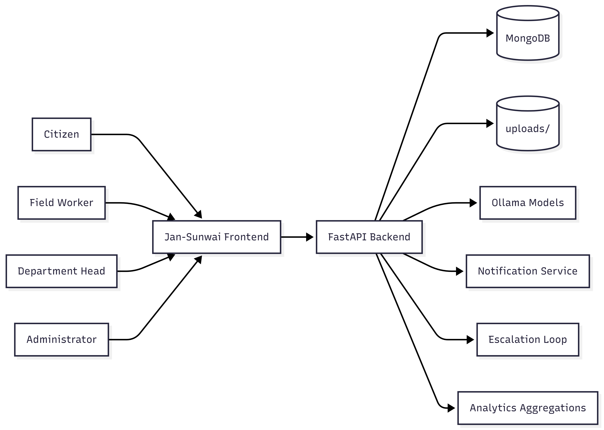
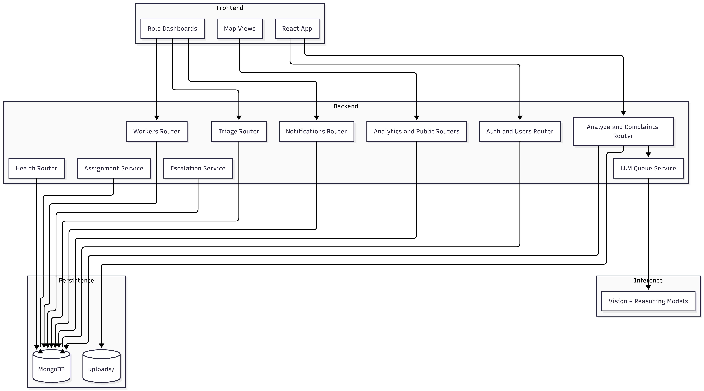
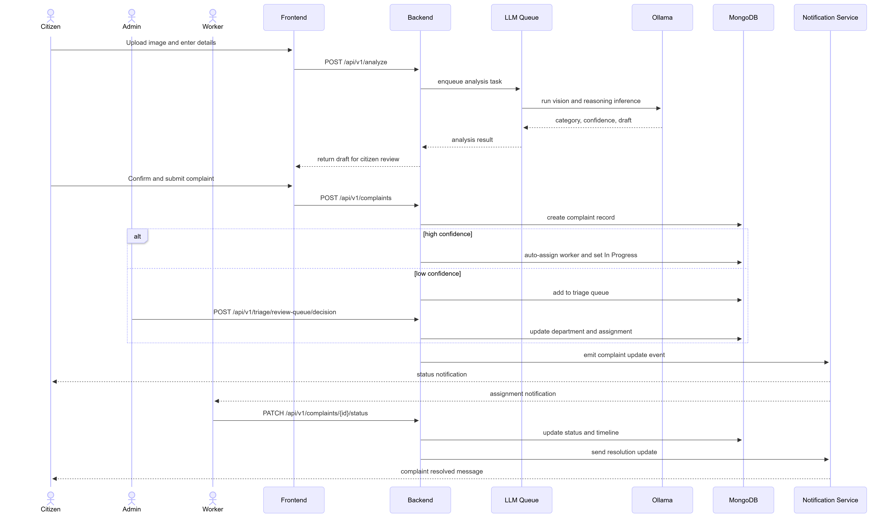

# Jan-Sunwai AI


Automated visual classification, routing, and lifecycle tracking for civic grievances using local Ollama models.

Jan-Sunwai AI is a full-stack platform where a citizen uploads an issue photo, the backend classifies the department, drafts a formal grievance, captures location, and routes it for departmental action. The stack is built for local-first operation with optional production deployment via Docker Compose.

## Core Features & Architecture

**Backend (FastAPI, Python):**
- **Robust Versioning & Structure:** All primary REST API routes are namespaced under `/api/v1` (endpoints cover Complaints, Users, Health, Triage, Notifications, Analytics, Public API, and Workers).
- **AI Asynchronous Queue:** Integrates an in-memory LLM queue referencing local Ollama instances for vision classification/reasoning without blocking web threads.
- **Background Processes:** Includes an asynchronous `escalation_loop` running as a background task mapped dynamically with FastAPI lifespan events for tracking unresolved issues.
- **Security & Integrity:** Advanced runtime security layers including strict CORS policies, configurable Rate Limiting via `slowapi`, enforced strong JWT secrets validation, and rigorous headers (Content-Security-Policy, HSTS, X-Frame-Options).
- **Persistent Data:** Native connections with MongoDB instances along with an NDMC Database instance for triaged data/logs tracking. 

**Frontend (React, Vite):**
- **Current Stack:** React 18, React Router v7, styling exclusively with modern Tailwind CSS v4, optimized and bundled through Vite.
- **Geospatial Implementation:** Deep mapping and visual heatmaps utilizing `react-leaflet`, `leaflet.heat`, and `maplibre-gl` for precision analytics layout.
- **Optimization:** Utilizes local optimizations like `browser-image-compression` to resize visual uploads directly in the client side to preserve bandwidth.

**DevOps & Scripts:**
Docker containers integrated with comprehensive pipeline scripts spanning load testing (Locust), security auditing, resilience checking, automated Lighthouse scores capturing, and triage setups.

## High-Level Architecture



## Screenshots

- Capture checklist: docs/reports/SCREENSHOT_CHECKLIST.md
- Wireframe reference: docs/images/gui_wireframe.png

## AI Pipeline



## Complaint Lifecycle



## Repository Layout

```text
Jan-Sunwai-AI/
|-- backend/
|   |-- app/
|   |   |-- routers/            # complaints, users, workers, triage, analytics, health, notifications, public
|   |   |-- services/           # assignment, llm_queue, escalation, storage, sanitization, email
|   |   |-- classifier.py       # vision + rule engine + reasoning orchestration
|   |   |-- generator.py        # complaint drafting + translation fallback
|   |   |-- schemas.py
|   |   |-- auth.py
|   |   `-- config.py
|   |-- tests/
|   |-- .env
|   `-- main.py
|-- frontend/
|   |-- src/
|   |   |-- pages/
|   |   |-- components/
|   |   |-- layouts/
|   |   |-- context/
|   |   `-- hooks/
|   `-- package.json
|-- docs/
|-- scripts/
|-- docker-compose.yml
|-- setup.ps1
`-- setup.sh
```

## Quick Start

### Windows (Automated)

```powershell
git clone https://github.com/ark5234/Jan-Sunwai-AI.git
cd Jan-Sunwai-AI
Set-ExecutionPolicy -Scope Process -ExecutionPolicy Bypass
.\setup.ps1
```

### Linux (Automated)

```bash
git clone https://github.com/ark5234/Jan-Sunwai-AI.git
cd Jan-Sunwai-AI
chmod +x setup.sh scripts/system/check_gpu.sh
./setup.sh
```

### Manual

1. Create and activate virtual environment.
2. Install backend dependencies.
3. Install frontend dependencies.
4. Ensure `backend/.env` is configured.
5. Start MongoDB.
6. Start Ollama and pull models.

```bash
python -m venv .venv
# Windows: .venv\Scripts\activate
# Linux:   source .venv/bin/activate

pip install -r backend/requirements.txt
# edit backend/.env with local values if needed

docker compose up -d mongodb ndmc_mongodb

ollama pull qwen2.5vl:3b
ollama pull granite3.2-vision:2b
ollama pull llama3.2:1b

cd frontend && npm install
```

## Run Locally

Terminal 1:

```bash
docker compose up -d mongodb ndmc_mongodb
```

Terminal 2:

```bash
# Windows
scripts\run_backend.bat

# Linux
bash scripts/run_backend.sh
```

Terminal 3:

```bash
# Windows
scripts\run_frontend.bat

# Linux
bash scripts/run_frontend.sh
```

Open `http://localhost:5173`.

## Testing Strategy

- Backend tests are host-only by design.
- `backend/tests/` is intentionally excluded from the backend runtime image via `backend/.dockerignore`.
- CI runs backend tests on the runner using `python -m pytest backend/tests -q`.
- For local checks, use `scripts/run_tests.sh` (Linux) or `scripts/run_tests.bat` (Windows).

## Local Docker JWT Configuration

- For Docker Compose local runs, backend JWT configuration is sourced from `backend/.env` through `env_file`.
- `docker-compose.yml` no longer forces `JWT_SECRET_KEY` from shell interpolation, which avoids accidental blank secrets.
- The NDMC comparison flow now uses a separate MongoDB service and stores audit records in `ndmc_analysis_db`.
- Changing `JWT_SECRET_KEY` invalidates existing login sessions/tokens, but does not change user accounts or password hashes.

## Health Checks

| Endpoint | Purpose |
| --- | --- |
| `GET /health/live` | API heartbeat |
| `GET /health/ready` | MongoDB readiness |
| `GET /health/models` | Ollama model listing/availability |
| `GET /health/gpu` | Active model VRAM usage |
| `GET /docs` | Swagger UI |

Versioned aliases are available as `/api/v1/health/*`.

## API Surface (Current)

### Users

- `POST /users/register`
- `POST /users/login`
- `GET /users/me`
- `PATCH /users/me`
- `POST /users/forgot-password`
- `POST /users/reset-password`

### Analyze + Generation

- `POST /analyze`
- `POST /analyze/regenerate`
- `GET /complaints/generation/{job_id}`

### Complaints

- `POST /complaints`
- `GET /complaints`
- `GET /complaints/{complaint_id}`
- `PATCH /complaints/{complaint_id}/status`
- `PATCH /complaints/{complaint_id}/transfer`
- `POST /complaints/{complaint_id}/escalate`
- `POST /complaints/{complaint_id}/feedback`
- `POST /complaints/{complaint_id}/notes`
- `GET /complaints/{complaint_id}/notes`
- `POST /complaints/{complaint_id}/comments`
- `GET /complaints/{complaint_id}/comments`
- `POST /complaints/bulk/status`
- `POST /complaints/bulk/transfer`
- `GET /complaints/export/csv`

### Workers

- `GET /workers/me`
- `PATCH /workers/me/status`
- `PATCH /workers/me/complaints/{complaint_id}/done`
- `GET /workers`
- `GET /workers/my-department`
- `PATCH /workers/{worker_id}/approve`
- `DELETE /workers/{worker_id}/reject`
- `POST /workers/{worker_id}/assign/{complaint_id}`
- `PATCH /workers/{worker_id}/area`
- `GET /workers/assignment-debug`
- `POST /workers/reassign-unassigned`

### Notifications

- `GET /notifications`
- `GET /notifications/unread-count`
- `PATCH /notifications/{notification_id}/read`
- `PATCH /notifications/read-all`

### Triage, Analytics, Public

- `GET /triage/review-queue`
- `POST /triage/review-queue/decision`
- `GET /analytics/overview`
- `GET /analytics/heatmap`
- `GET /public/complaints`

All primary APIs are mirrored under `/api/v1`.

## Roles

| Role | Access |
| --- | --- |
| `citizen` | Submit complaints, track status, feedback, comments |
| `worker` | View assigned tasks, update availability, mark tasks done |
| `dept_head` | Department queue management, status updates, notes, transfer |
| `admin` | Global oversight, worker approval, triage, bulk actions, exports, analytics |

## Canonical Department Taxonomy

1. Health Department
2. Civil Department
3. Horticulture
4. Electrical Department
5. IT Department
6. Commercial
7. Enforcement
8. VBD Department
9. EBR Department
10. Fire Department
11. Uncategorized

## Environment Variables

Use the unified template, then edit values as needed:

- Use `backend/.env` as the single environment file.

| Variable | Default | Description |
| --- | --- | --- |
| `APP_ENV` | `development` | Runtime mode (`development` or `production`) |
| `RATE_LIMIT_ENABLED` | `false` (dev), auto-`true` in production if unset | Enable request rate limiting |
| `MONGODB_URL` | `mongodb://localhost:27017` | Main MongoDB connection string |
| `MONGO_URL` | `mongodb://localhost:27017` | Legacy MongoDB URL alias fallback |
| `DB_NAME` | `jan_sunwai_db` | Main MongoDB database name |
| `NDMC_MONGODB_URL` | `mongodb://localhost:27019` | NDMC audit MongoDB connection string |
| `NDMC_DB_NAME` | `ndmc_analysis_db` | NDMC audit database name |
| `NDMC_ANALYSIS_COLLECTION` | `ndmc_analysis` | NDMC audit collection name |
| `JWT_SECRET_KEY` | `change-me-in-production` | Secret used to sign JWTs |
| `JWT_ALGORITHM` | `HS256` | JWT signing algorithm |
| `ACCESS_TOKEN_EXPIRE_MINUTES` | `1440` in dev, `480` in prod if unset | Access token TTL in minutes |
| `VISION_MODEL` | `qwen2.5vl:3b` | Primary vision model |
| `MID_VISION_MODEL` | `granite3.2-vision:2b` | Mid-tier vision fallback if primary times out |
| `FALLBACK_VISION_MODEL` | `granite3.2-vision:2b` | Final fallback for vision step |
| `REASONING_MODEL` | `llama3.2:1b` | Reasoning model for ambiguous classification and drafting |
| `ALLOWED_ORIGINS` | `http://localhost:5173,http://127.0.0.1:5173` | CORS allowlist |
| `OLLAMA_BASE_URL` | `http://localhost:11434` | Ollama API endpoint |
| `VISION_TIMEOUT_SECONDS` | `240` | Per-tier vision timeout (seconds) |
| `LLM_INLINE_TIMEOUT_SECONDS` | `15` | Timeout for synchronous LLM calls before queue fallback |
| `LLM_QUEUE_WORKERS` | `2` | Background LLM worker count |
| `RULE_ENGINE_ONLY` | `false` | Set `true` to skip reasoning model |
| `AMBIGUITY_THRESHOLD` | `2.0` | Rule engine confidence threshold |
| `UNLOAD_AFTER_REASONING` | `true` | Unload reasoning model after use |
| `COMPLAINT_OUTPUT_MODE` | `email` | Draft format (`email` or `paragraph`) |
| `MODEL_UNLOAD_TIMEOUT_SECONDS` | `30` | Max wait before model unload timeout |
| `MODEL_UNLOAD_POLL_INTERVAL_SECONDS` | `0.1` | Poll interval during unload checks |
| `KEEP_REASONING_MODEL_WARM` | `false` | Keep reasoning model loaded between requests |
| `SMTP_HOST` | *(empty)* | SMTP relay host |
| `SMTP_PORT` | `587` | SMTP relay port |
| `SMTP_FROM` | `noreply@jan-sunwai.local` | Sender email for notification relay |
| `DEFAULT_PAGE_SIZE` | `25` | Default pagination size |
| `MAX_PAGE_SIZE` | `100` | Maximum pagination size |

Frontend environment variables (`frontend/.env`):

| Variable | Default | Description |
| --- | --- | --- |
| `VITE_API_URL` | `http://localhost:8000` | Backend API base URL (use `/api/v1` behind reverse proxy in production) |
| `VITE_MAPPLS_API_KEY` | *(unset)* | Optional Mappls key for official India map tiles. Without it, CARTO Voyager tiles are used |

## Hardware Requirements

| Component | Minimum | Recommended |
| --- | --- | --- |
| GPU VRAM | 4 GB (models run sequentially) | 6+ GB |
| System RAM | 12 GB free | 16 GB |
| Storage | 10 GB free (models + images) | 20 GB |
| OS | Windows 10+ or Ubuntu 20.04+ | Windows 11 or Ubuntu 22.04 |

Models run sequentially, never simultaneously, so each model fits within 4 GB VRAM on its own.

## Testing and QA

### Backend smoke/integration

```bash
# Linux
bash scripts/run_tests.sh

# Windows
scripts\run_tests.bat
```

### Security/resilience tests

```bash
# Linux
bash scripts/run_security_test.sh
bash scripts/run_resilience_test.sh

# Windows
scripts\run_security_test.bat
scripts\run_resilience_test.bat
```

### Frontend performance audit (Lighthouse)

```bash
# Linux
bash scripts/run_lighthouse.sh

# Windows
scripts\run_lighthouse.bat
```

### Load testing

```bash
# Linux
bash scripts/run_load_test.sh http://localhost:8000

# Windows
scripts\run_load_test.bat http://localhost:8000
```

## Offline Dataset Tools

```bash
# Pull configured models
python backend/download_models.py

# Automated triage + sorting
python backend/automated_triage.py --dataset-dir <input_dir> --output-dir <output_dir>

# Evaluate triaged output
python backend/evaluate_sorted_dataset.py --sample 20
```

## Production Compose

```bash
# set APP_ENV=production and other production values in backend/.env
docker compose --profile prod up --build -d
python backend/create_indexes.py
```

The production frontend serves on port `5173` and proxies API routes to backend, with primary backend path compatibility under `/api/v1`.

## Production Verification

```bash
# Linux
bash scripts/verify_prod_stack.sh
bash scripts/simulate_clean_deploy.sh

# Windows
scripts\verify_prod_stack.bat
scripts\simulate_clean_deploy.bat
```

See docs/PRODUCTION_VERIFICATION.md for expected outputs.

## Contribution

Contribution workflow and quality gates are documented in CONTRIBUTING.md.

## Documentation Index

- `docs/API_REFERENCE.md`
- `docs/CODE_FREEZE.md`
- `docs/DEPARTMENT_HIERARCHY.md`
- `docs/FINAL_SUBMISSION_CHECKLIST.md`
- `docs/GUI_WIREFRAMES.md`
- `docs/LOAD_TESTING.md`
- `docs/NDMC_DEPLOYMENT.md`
- `docs/PRODUCTION_VERIFICATION.md`
- `docs/PRODUCTION_DEPLOYMENT_PLAN.md`
- `docs/SECURITY_TESTING.md`
- `docs/UAT_PLAN.md`
- `docs/USER_MANUAL.md`
- `docs/reports/README.md`
