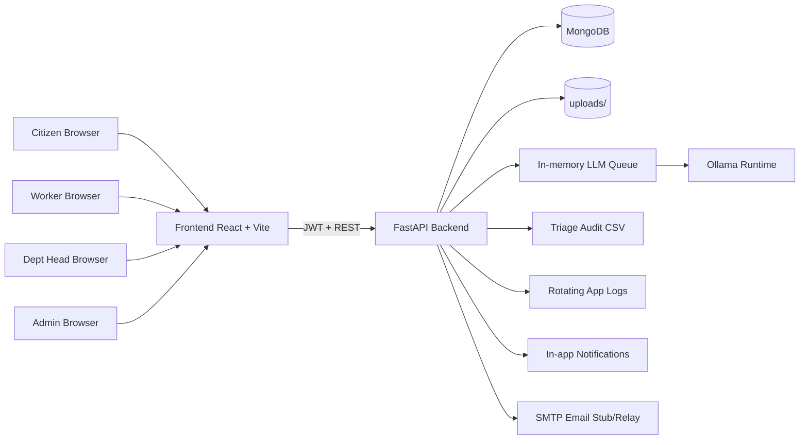
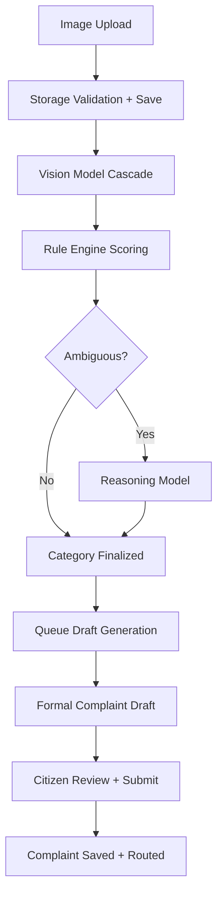
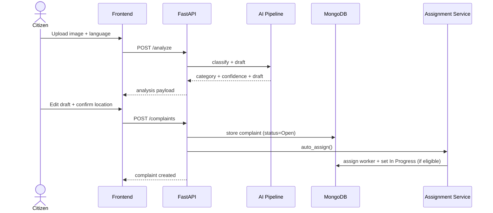

# Jan-Sunwai AI

Automated visual classification, routing, and lifecycle tracking for civic grievances using local Ollama models.

Jan-Sunwai AI is a full-stack platform where a citizen uploads an issue photo, the backend classifies the department, drafts a formal grievance, captures location, and routes it for departmental action. The stack is built for local-first operation with optional production deployment via Docker Compose.

## What Is Implemented

- FastAPI backend with JWT auth, role-aware access control, and MongoDB persistence.
- React frontend with dedicated flows for citizen, worker, department head, and admin.
- Hybrid AI pipeline: Vision -> Rule Engine -> Optional Reasoning -> Draft Writer.
- Worker auto-assignment using department + service-area distance logic.
- Triage queue for low-confidence complaints.
- Status history, feedback, comments, notes, notifications, escalation loop, analytics, and public transparency endpoint.
- API version aliases under `/api/v1` for all major routes.

## High-Level Architecture



## AI Pipeline



## Complaint Lifecycle



## Repository Layout

```text
Jan-Sunwai-AI/
├── backend/
│   ├── app/
│   │   ├── routers/            # complaints, users, workers, triage, analytics, health, notifications, public
│   │   ├── services/           # assignment, llm_queue, escalation, storage, sanitization, email
│   │   ├── classifier.py       # Vision + rule engine + reasoning orchestration
│   │   ├── generator.py        # complaint drafting + translation fallback
│   │   ├── schemas.py
│   │   ├── auth.py
│   │   └── config.py
│   ├── tests/
│   ├── env.local
│   ├── env.production
│   └── main.py
├── frontend/
│   ├── src/
│   │   ├── pages/
│   │   ├── components/
│   │   ├── layouts/
│   │   ├── context/
│   │   └── hooks/
│   └── package.json
├── docs/
├── scripts/
├── docker-compose.yml
├── docker-compose.prod.yml
├── setup.ps1
└── setup.sh
```

## Quick Start

### Windows (Automated)

```powershell
git clone https://github.com/ark5234/Jan-Sunwai-AI.git
cd Jan-Sunwai-AI
Set-ExecutionPolicy -Scope Process -ExecutionPolicy Bypass
.\setup.ps1
```

### Linux (Automated)

```bash
git clone https://github.com/ark5234/Jan-Sunwai-AI.git
cd Jan-Sunwai-AI
chmod +x setup.sh scripts/system/check_gpu.sh
./setup.sh
```

### Manual

1. Create and activate virtual environment.
2. Install backend dependencies.
3. Install frontend dependencies.
4. Copy `backend/env.local` to `backend/.env`.
5. Start MongoDB.
6. Start Ollama and pull models.

```bash
python -m venv .venv
# Windows: .venv\Scripts\activate
# Linux:   source .venv/bin/activate

pip install -r backend/requirements.txt
cp backend/env.local backend/.env

docker compose up -d mongodb

ollama pull qwen2.5vl:3b
ollama pull granite3.2-vision:2b
ollama pull llama3.2:1b

cd frontend && npm install
```

## Run Locally

Terminal 1:

```bash
docker compose up -d mongodb
```

Terminal 2:

```bash
# Windows
scripts\run_backend.bat

# Linux
bash scripts/run_backend.sh
```

Terminal 3:

```bash
# Windows
scripts\run_frontend.bat

# Linux
bash scripts/run_frontend.sh
```

Open `http://localhost:5173`.

## Health Checks

| Endpoint | Purpose |
| --- | --- |
| `GET /health/live` | API heartbeat |
| `GET /health/ready` | MongoDB readiness |
| `GET /health/models` | Ollama model listing/availability |
| `GET /health/gpu` | Active model VRAM usage |
| `GET /docs` | Swagger UI |

Versioned aliases are available as `/api/v1/health/*`.

## API Surface (Current)

### Users

- `POST /users/register`
- `POST /users/login`
- `GET /users/me`
- `PATCH /users/me`
- `POST /users/forgot-password`
- `POST /users/reset-password`

### Analyze + Generation

- `POST /analyze`
- `POST /analyze/regenerate`
- `GET /complaints/generation/{job_id}`

### Complaints

- `POST /complaints`
- `GET /complaints`
- `GET /complaints/{complaint_id}`
- `PATCH /complaints/{complaint_id}/status`
- `PATCH /complaints/{complaint_id}/transfer`
- `POST /complaints/{complaint_id}/escalate`
- `POST /complaints/{complaint_id}/feedback`
- `POST /complaints/{complaint_id}/notes`
- `GET /complaints/{complaint_id}/notes`
- `POST /complaints/{complaint_id}/comments`
- `GET /complaints/{complaint_id}/comments`
- `POST /complaints/bulk/status`
- `POST /complaints/bulk/transfer`
- `GET /complaints/export/csv`

### Workers

- `GET /workers/me`
- `PATCH /workers/me/status`
- `PATCH /workers/me/complaints/{complaint_id}/done`
- `GET /workers`
- `GET /workers/my-department`
- `PATCH /workers/{worker_id}/approve`
- `DELETE /workers/{worker_id}/reject`
- `POST /workers/{worker_id}/assign/{complaint_id}`
- `PATCH /workers/{worker_id}/area`
- `GET /workers/assignment-debug`
- `POST /workers/reassign-unassigned`

### Notifications

- `GET /notifications`
- `GET /notifications/unread-count`
- `PATCH /notifications/{notification_id}/read`
- `PATCH /notifications/read-all`

### Triage, Analytics, Public

- `GET /triage/review-queue`
- `POST /triage/review-queue/decision`
- `GET /analytics/overview`
- `GET /analytics/heatmap`
- `GET /public/complaints`

All primary APIs are mirrored under `/api/v1`.

## Roles

| Role | Access |
| --- | --- |
| `citizen` | Submit complaints, track status, feedback, comments |
| `worker` | View assigned tasks, update availability, mark tasks done |
| `dept_head` | Department queue management, status updates, notes, transfer |
| `admin` | Global oversight, worker approval, triage, bulk actions, exports, analytics |

## Canonical Department Taxonomy

1. Health Department
2. Civil Department
3. Horticulture
4. Electrical Department
5. IT Department
6. Commercial
7. Enforcement
8. VBD Department
9. EBR Department
10. Fire Department
11. Uncategorized

## Configuration

Copy `backend/env.local` to `backend/.env` and adjust as needed.

| Variable | Purpose |
| --- | --- |
| `APP_ENV` | `development` or `production` |
| `RATE_LIMIT_ENABLED` | Enable/disable slowapi rate limiting |
| `MONGODB_URL`, `MONGO_URL` | MongoDB connection string |
| `DB_NAME` | Database name |
| `JWT_SECRET_KEY`, `JWT_ALGORITHM` | Auth signing config |
| `ACCESS_TOKEN_EXPIRE_MINUTES` | Token TTL |
| `OLLAMA_BASE_URL` | Ollama host URL |
| `VISION_MODEL`, `MID_VISION_MODEL`, `FALLBACK_VISION_MODEL` | Vision model cascade |
| `REASONING_MODEL` | Reasoning/writer model |
| `VISION_TIMEOUT_SECONDS` | Per-tier vision timeout |
| `LLM_INLINE_TIMEOUT_SECONDS` | Sync wait timeout before queued response |
| `LLM_QUEUE_WORKERS` | Queue worker count |
| `RULE_ENGINE_ONLY` | Skip reasoning model when true |
| `AMBIGUITY_THRESHOLD` | Rule-engine ambiguity threshold |
| `UNLOAD_AFTER_REASONING` | Unload reasoning model after draft generation |
| `MODEL_UNLOAD_TIMEOUT_SECONDS` | Wait timeout for unload |
| `MODEL_UNLOAD_POLL_INTERVAL_SECONDS` | Poll interval for unload checks |
| `KEEP_REASONING_MODEL_WARM` | Keep reasoning model loaded |
| `COMPLAINT_OUTPUT_MODE` | `email` or `paragraph` drafting style |
| `SMTP_HOST`, `SMTP_PORT`, `SMTP_FROM` | Notification email relay settings |
| `ALLOWED_ORIGINS` | CORS allowlist |
| `DEFAULT_PAGE_SIZE`, `MAX_PAGE_SIZE` | Pagination config |

Frontend:

| Variable | Purpose |
| --- | --- |
| `VITE_API_URL` | API base URL (default `http://localhost:8000`) |
| `VITE_MAPPLS_API_KEY` | Optional Mappls key for official India map tiles |

## Testing and QA

### Backend smoke/integration

```bash
# Linux
bash scripts/run_tests.sh

# Windows
scripts\run_tests.bat
```

### Security/resilience tests

```bash
cd backend
pytest tests/test_resilience_security.py tests/test_notification_chain.py -q
```

### Load testing

```bash
# Linux
bash scripts/run_load_test.sh http://localhost:8000

# Windows
scripts\run_load_test.bat http://localhost:8000
```

## Offline Dataset Tools

```bash
# Pull configured models
python backend/download_models.py

# Automated triage + sorting
python backend/automated_triage.py --dataset-dir <input_dir> --output-dir <output_dir>

# Evaluate triaged output
python backend/evaluate_sorted_dataset.py --sample 20
```

## Production Compose

```bash
cp backend/env.production backend/.env
docker compose -f docker-compose.prod.yml up --build -d
python backend/create_indexes.py
```

The production frontend serves on port `5173` and proxies API routes to backend, with primary backend path compatibility under `/api/v1`.

## Documentation Index

- `docs/API_REFERENCE.md`
- `docs/DEPARTMENT_HIERARCHY.md`
- `docs/GUI_WIREFRAMES.md`
- `docs/LOAD_TESTING.md`
- `docs/NDMC_DEPLOYMENT.md`
- `docs/PRODUCTION_DEPLOYMENT_PLAN.md`
- `docs/SECURITY_TESTING.md`
- `docs/reports/README.md`
