# Jan-Sunwai AI API Reference

This document reflects the current FastAPI implementation in `backend/main.py` and `backend/app/routers/*`.

## Base URLs and Versioning

- Primary API base: `http://localhost:8000`
- Versioned alias base: `http://localhost:8000/api/v1`
- Swagger UI: `/docs`

Every major router is exposed both unversioned and under `/api/v1`.

## Authentication Model

- Auth scheme: Bearer JWT
- Login endpoint uses OAuth2 password form fields (`username`, `password`).
- Self-registration is allowed for:
  - `citizen`
  - `worker` (pending admin approval)

## Route Map

```mermaid
flowchart LR
  Client["Frontend or API Consumer"]

  Client --> U
  Client --> A
  Client --> C
  Client --> W
  Client --> N
  Client --> T
  Client --> X

  subgraph Users
    direction TB
    U["/users"] --> U1["POST /users/register"]
    U --> U2["POST /users/login"]
    U --> U3["GET /users/me"]
    U --> U4["PATCH /users/me"]
    U --> U5["POST /users/forgot-password"]
    U --> U6["POST /users/reset-password"]
  end

  subgraph Analyze
    direction TB
    A["/analyze"] --> A1["POST /analyze"]
    A --> A2["POST /analyze/regenerate"]
    A --> A3["GET /complaints/generation/{job_id}"]
  end

  subgraph Complaints
    direction TB
    C["/complaints"] --> C1["POST /complaints"]
    C --> C2["GET /complaints"]
    C --> C3["GET /complaints/{complaint_id}"]
    C --> C4["PATCH /complaints/{complaint_id}/status"]
    C --> C5["PATCH /complaints/{complaint_id}/transfer"]
    C --> C6["POST /complaints/{complaint_id}/escalate"]
    C --> C7["POST /complaints/{complaint_id}/feedback"]
    C --> C8["POST /complaints/{complaint_id}/notes"]
    C --> C9["GET /complaints/{complaint_id}/notes"]
    C --> C10["POST /complaints/{complaint_id}/comments"]
    C --> C11["GET /complaints/{complaint_id}/comments"]
    C --> C12["POST /complaints/bulk/status"]
    C --> C13["POST /complaints/bulk/transfer"]
    C --> C14["GET /complaints/export/csv"]
  end

  subgraph Workers
    direction TB
    W["/workers"] --> W1["GET /workers/me"]
    W --> W2["PATCH /workers/me/status"]
    W --> W3["PATCH /workers/me/complaints/{complaint_id}/done"]
    W --> W4["GET /workers"]
    W --> W5["GET /workers/my-department"]
    W --> W6["PATCH /workers/{worker_id}/approve"]
    W --> W7["DELETE /workers/{worker_id}/reject"]
    W --> W8["POST /workers/{worker_id}/assign/{complaint_id}"]
    W --> W9["PATCH /workers/{worker_id}/area"]
    W --> W10["GET /workers/assignment-debug"]
    W --> W11["POST /workers/reassign-unassigned"]
  end

  subgraph Notifications
    direction TB
    N["/notifications"] --> N1["GET /notifications"]
    N --> N2["GET /notifications/unread-count"]
    N --> N3["PATCH /notifications/{notification_id}/read"]
    N --> N4["PATCH /notifications/read-all"]
  end

  subgraph Triage
    direction TB
    T["/triage"] --> T1["GET /triage/review-queue"]
    T --> T2["POST /triage/review-queue/decision"]
  end

  subgraph AnalyticsPublicHealth
    direction TB
    X["/analytics, /public, /health"] --> X1["GET /analytics/overview"]
    X --> X2["GET /analytics/heatmap"]
    X --> X3["GET /public/complaints"]
    X --> X4["GET /health/live"]
    X --> X5["GET /health/ready"]
    X --> X6["GET /health/models"]
    X --> X7["GET /health/gpu"]
  end
```



## Endpoint Reference

## Users

| Method | Endpoint | Auth | Notes |
| --- | --- | --- | --- |
| `POST` | `/users/register` | No | Registers `citizen` or `worker` only |
| `POST` | `/users/login` | No | OAuth2 form login |
| `GET` | `/users/me` | Yes | Returns current user profile |
| `PATCH` | `/users/me` | Yes | Updates `full_name` and/or `phone_number` |
| `POST` | `/users/forgot-password` | No | Always generic response; no account enumeration |
| `POST` | `/users/reset-password` | No | Uses reset token |

## Analyze + Draft

| Method | Endpoint | Auth | Notes |
| --- | --- | --- | --- |
| `POST` | `/analyze` | Yes | Upload image + optional language; returns classification + location + draft status |
| `POST` | `/analyze/regenerate` | Yes | Re-queues draft generation for existing analyzed image |
| `GET` | `/complaints/generation/{job_id}` | Yes | Poll queued generation result |

## Complaints

| Method | Endpoint | Auth | Notes |
| --- | --- | --- | --- |
| `POST` | `/complaints` | Yes | Creates complaint from analyzed payload |
| `GET` | `/complaints` | Yes | Role-filtered listing |
| `GET` | `/complaints/{complaint_id}` | Yes | Complaint details |
| `PATCH` | `/complaints/{complaint_id}/status` | Admin/Dept Head | Appends `status_history` and triggers notification/email |
| `PATCH` | `/complaints/{complaint_id}/transfer` | Admin/Dept Head | Department override transfer |
| `POST` | `/complaints/{complaint_id}/escalate` | Admin/Dept Head | Escalates authority level |
| `POST` | `/complaints/{complaint_id}/feedback` | Citizen owner | One-time post-resolution feedback |
| `POST` | `/complaints/{complaint_id}/notes` | Admin/Dept Head | Internal department notes |
| `GET` | `/complaints/{complaint_id}/notes` | Admin/Dept Head | Fetch internal notes |
| `POST` | `/complaints/{complaint_id}/comments` | Yes | Shared complaint thread |
| `GET` | `/complaints/{complaint_id}/comments` | Yes | Shared complaint thread |
| `POST` | `/complaints/bulk/status` | Admin | Bulk status update |
| `POST` | `/complaints/bulk/transfer` | Admin | Bulk department transfer |
| `GET` | `/complaints/export/csv` | Admin | CSV export |

## Workers

| Method | Endpoint | Auth | Notes |
| --- | --- | --- | --- |
| `GET` | `/workers/me` | Worker | Profile + active + resolved history |
| `PATCH` | `/workers/me/status` | Worker | Only `available`/`offline` allowed manually |
| `PATCH` | `/workers/me/complaints/{complaint_id}/done` | Worker | Marks complaint resolved and frees slot |
| `GET` | `/workers` | Admin | Lists workers; supports `pending_only` |
| `GET` | `/workers/my-department` | Admin/Dept Head | Department-scoped workers |
| `PATCH` | `/workers/{worker_id}/approve` | Admin | Approves worker account |
| `DELETE` | `/workers/{worker_id}/reject` | Admin | Rejects pending worker registration |
| `POST` | `/workers/{worker_id}/assign/{complaint_id}` | Admin | Manual assignment override |
| `PATCH` | `/workers/{worker_id}/area` | Admin | Updates worker service area |
| `GET` | `/workers/assignment-debug` | Admin | Assignment diagnostics |
| `POST` | `/workers/reassign-unassigned` | Admin | Bulk auto-assignment retry |

## Notifications

| Method | Endpoint | Auth | Notes |
| --- | --- | --- | --- |
| `GET` | `/notifications` | Yes | List notifications (`skip`, `limit`, `unread_only`) |
| `GET` | `/notifications/unread-count` | Yes | Badge counter |
| `PATCH` | `/notifications/{notification_id}/read` | Yes | Mark single as read |
| `PATCH` | `/notifications/read-all` | Yes | Mark all as read |

## Triage

| Method | Endpoint | Auth | Notes |
| --- | --- | --- | --- |
| `GET` | `/triage/review-queue` | Admin | Live low-confidence complaints from MongoDB |
| `POST` | `/triage/review-queue/decision` | Admin | Decision payload fields: `image`, `decision`, optional `corrected_label`, `note` |

## Analytics + Public + Health

| Method | Endpoint | Auth | Notes |
| --- | --- | --- | --- |
| `GET` | `/analytics/overview` | Admin | Status, department, trend, resolution stats |
| `GET` | `/analytics/heatmap` | Admin/Dept Head | Geospatial aggregate points |
| `GET` | `/public/complaints` | No | Anonymized public complaint feed |
| `GET` | `/health/live` | No | Liveness probe |
| `GET` | `/health/ready` | No | DB readiness probe |
| `GET` | `/health/models` | No | Ollama model readiness |
| `GET` | `/health/gpu` | No | Active model GPU/VRAM status |

## Request Examples

### Login

```http
POST /users/login
Content-Type: application/x-www-form-urlencoded

username=citizen_demo&password=citizen123
```

### Analyze

```http
POST /analyze
Authorization: Bearer <jwt>
Content-Type: multipart/form-data

file=<image>
language=en
```

### Create Complaint

```json
{
  "description": "Streetlight is non-functional and the area is dark at night.",
  "department": "Electrical Department",
  "image_url": "uploads/xxxxx.jpg",
  "location": {
    "lat": 28.6139,
    "lon": 77.2090,
    "address": "Connaught Place, New Delhi",
    "source": "manual"
  },
  "ai_metadata": {
    "model_used": "qwen2.5vl:3b",
    "confidence_score": 0.88,
    "detected_department": "Electrical Department",
    "labels": ["street light", "dark road"]
  }
}
```

### Triage Decision

```json
{
  "image": "<complaint_id_or_image_path>",
  "decision": "approved",
  "corrected_label": "Civil Department",
  "note": "Manual override after review"
}
```

## Analyze Response Notes

`POST /analyze` includes:

- `classification`: department decision + confidence + model metadata
- `location`: EXIF-derived or fallback result
- `generated_complaint`: drafted text, queued placeholder, or fallback text
- `generation_status`: `completed`, `queued`, `failed`, or `skipped`
- `generation_job_id`: poll key for queued generation
- `timings`: `vision_ms`, `rule_engine_ms`, `reasoning_ms`, `total_analyze_ms`

## Error Semantics

| Status | Typical Cases |
| --- | --- |
| `400` | Validation errors, invalid ID format, malformed payload |
| `401` | Missing/invalid token or bad login |
| `403` | Role not permitted or worker pending approval |
| `404` | Missing resource or job ID |
| `409` | Conflict (for example duplicate feedback or already-approved worker) |
| `413` | Upload exceeds max allowed size |
| `429` | Rate-limited endpoint |
| `503` | AI pipeline temporarily unavailable |

## Notes for Integrators

- Set `VITE_API_URL=/api/v1` in production frontend to use versioned routes.
- Nginx must proxy `/api/*` to backend service.
- Worker registration does not auto-login; worker must be approved by admin first.
