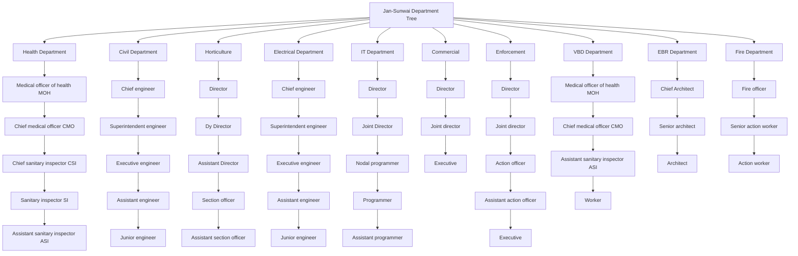
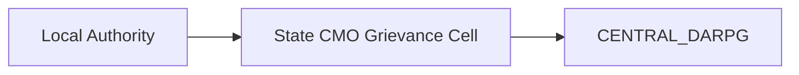
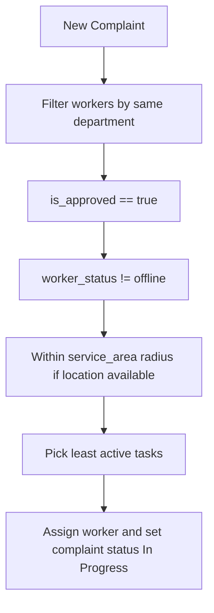

# Department and Role Hierarchy

This document defines the active department taxonomy and role hierarchy used by Jan-Sunwai AI.

## Canonical Department Taxonomy

The backend classifier and routing logic use these department labels:

1. Health Department
2. Civil Department
3. Horticulture
4. Electrical Department
5. IT Department
6. Commercial
7. Enforcement
8. VBD Department
9. EBR Department
10. Fire Department
11. Uncategorized

## Organizational Hierarchy (Operational)

## System Role Mapping

In seeded accounts (`backend/create_test_users.py`):

- First title in each department hierarchy is created as `dept_head`.
- Remaining titles in that department are created as `worker`.
- Separate global accounts exist for `citizen` and `admin`.

## Routing to Authority IDs

Classifier categories are routed to authority IDs in `backend/app/authorities.py`.

| Department Label | Authority ID | Escalation Parent |
| --- | --- | --- |
| Health Department | `MUNI_SANITATION` | `STATE_CMO` |
| Civil Department | `MUNI_PWD` | `STATE_CMO` |
| Horticulture | `MUNI_HORTICULTURE` | `STATE_CMO` |
| Electrical Department | `UTIL_DISCOM` | `STATE_CMO` |
| IT Department | `STATE_CMO` | `CENTRAL_DARPG` |
| Commercial | `STATE_CMO` | `CENTRAL_DARPG` |
| Enforcement | `POLICE_TRAFFIC` | `STATE_CMO` |
| VBD Department | `MUNI_SANITATION` | `STATE_CMO` |
| EBR Department | `MUNI_PWD` | `STATE_CMO` |
| Fire Department | `POLICE_LOCAL` | `STATE_CMO` |
| Uncategorized | keyword fallback/unmapped | nullable |

## Escalation Ladder

## Worker Assignment Hierarchy in Runtime

This hierarchy is enforced by `backend/app/services/assignment.py`.
