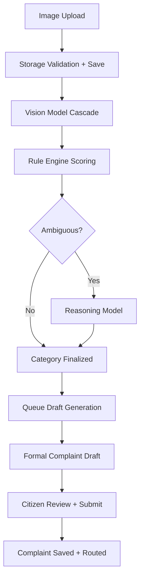
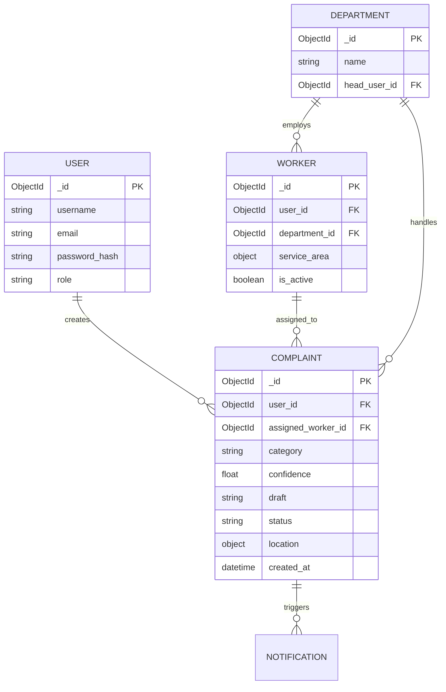
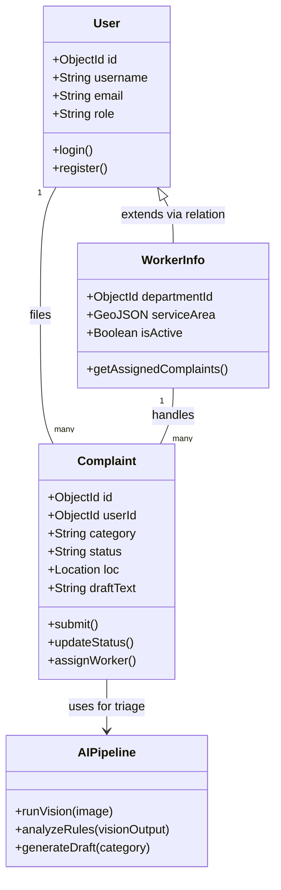
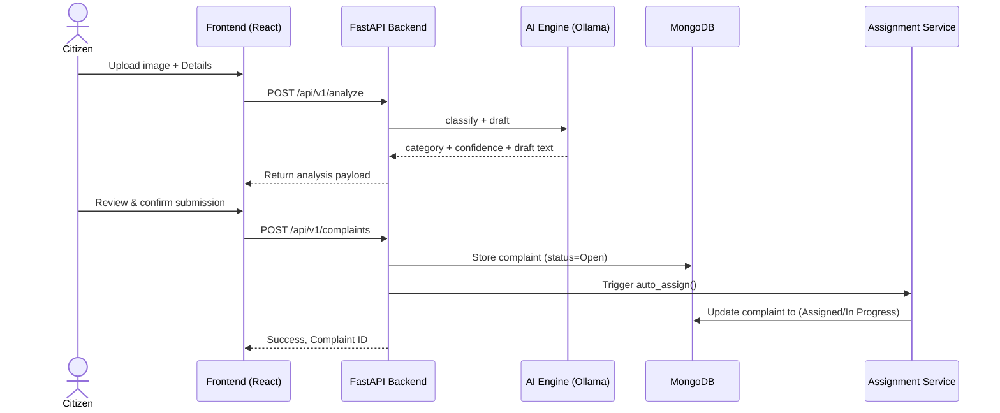
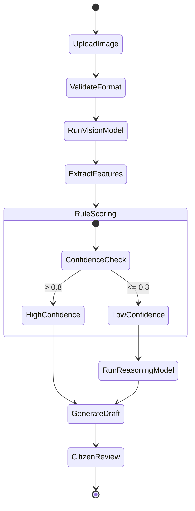
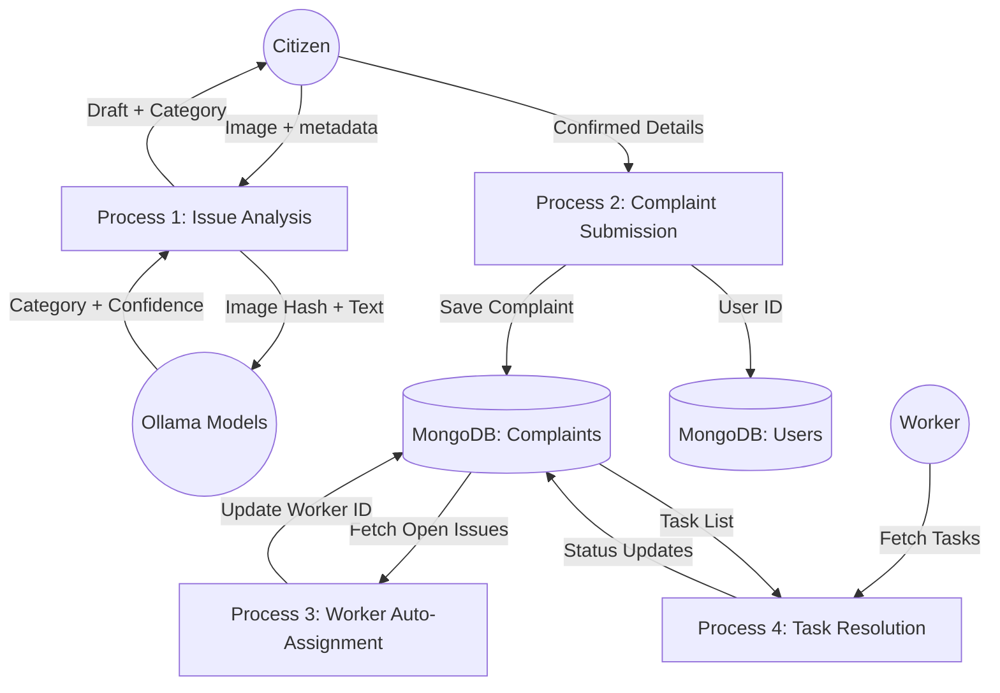

# Chapter 5: System Architecture and Design Diagrams

This document contains the detailed system architecture, UML, and Database diagrams reflecting the exact specifications of the Jan-Sunwai AI project.

## 5.1 System Architecture Design

### 5.1.1 Architectural Style
Jan-Sunwai AI follows a **Client-Server architecture** with a clear separation of concerns:
- **Client Tier**: A React/Vite Single Page Application (SPA) serving different roles (Citizen, Worker, Dept Head, Admin).
- **Service Tier**: A FastAPI backend adhering to RESTful principles (`/api/v1` routes) handling business logic, authentication (JWT), and AI orchestration.
- **Data Tier**: MongoDB stores users, complaints, assignments, and audit logs (NDMC MongoDB).
- **AI Processing Tier**: Local Ollama runtime used for vision classification, reasoning, and drafting.

### 5.1.2 Key Architectural Decisions
- **Local-First AI Execution**: Chosen to ensure data privacy and reduce dependency on external APIs.
- **Asynchronous AI Queue**: In-memory worker queue in FastAPI ensures that long-running LLM generation tasks do not block incoming HTTP requests.
- **Role-Based Access Control (RBAC)**: Strict segregation between Admin, Department Head, Worker, and Citizen spaces.
- **Containerization**: Use of Docker Compose to bundle the React frontend, FastAPI backend, and MongoDB instances for predictable deployments.

### 5.1.3 AI Classification Pipeline



## 5.2 UML Diagrams

### 5.2.1 E-R Diagram (Entity-Relationship)



### 5.2.2 Use Case Diagram

```mermaid
usecaseDiagram
    actor Citizen
    actor Worker
    actor DeptHead as "Department Head"
    actor Admin
    
    Citizen --> (Upload Issue Photo)
    Citizen --> (Review Generated Draft)
    Citizen --> (Track Complaint Status)
    
    Worker --> (View Assigned Tasks)
    Worker --> (Resolve Complaints)
    Worker --> (Update Status)
    
    DeptHead --> (Monitor Department Queue)
    DeptHead --> (Handle Escalations)
    DeptHead --> (View Analytics)
    
    Admin --> (Manage Users & Roles)
    Admin --> (Triage Low-Confidence Issues)
    Admin --> (System Configurations)
    
    (Upload Issue Photo) ..> (AI Classification) : <<includes>>
```
*(Note: Mermaid flowchart can also depict use case functionality if actual Use Case UML is not fully supported in your renderer, standard UML boundaries apply)*

### 5.2.3 Class Diagram



### 5.2.4 Sequence Diagram
(Complaint Lifecycle Sequence)



### 5.2.5 Activity Diagram
(Image Analysis & Triage Activity)



### 5.2.6 DFD Diagram (Data Flow Diagram - Level 1)



### 5.2.7 Deployment Diagram

```mermaid
flowchart TD
    subgraph "Docker Host (Production / Local)"
        subgraph Frontend_Container
            Nginx[Nginx HTTP Server]
            React[React/Vite Static Files]
            Nginx --> React
        end
        
        subgraph Backend_Container
            Uvicorn[Uvicorn / FastAPI]
            PyLogic[Routing & Queues]
            Uvicorn --> PyLogic
        end
        
        subgraph Database_Containers
            MongoDB[(Primary MongoDB)]
            NDMCDB[(Audit MongoDB)]
        end
        
        subgraph AI_Container
            Ollama[Ollama Server]
        end
    end
    
    Client Browser -->|HTTPS| Frontend_Container
    Client Browser -->|API/REST| Backend_Container
    
    Backend_Container -->|Python Motor| Database_Containers
    Backend_Container -->|HTTP/REST| AI_Container
```

## 5.3 Database Design

### 5.3.1 Table Design and Relationships
Because Jan-Sunwai AI uses **MongoDB** (a NoSQL document database), "Tables" map to **Collections** and "Rows" map to **Documents**. 
- **Users Collection**: Core user identity.
- **Workers Collection**: Operational metadata for worker roles linking back to ``user_id``.
- **Complaints Collection**: The central entity linking `user_id`, `category`, and `worker_id`. Contains nested structures for `location` (GeoJSON) and arrays for `status_history`.
- **Departments Collection**: Organizational divisions linking to `head_user_id`.

### 5.3.2 Normalization
Instead of strict 3NF (Third Normal Form) typical of Relational DBs, MongoDB relies on a hybrid approach:
- **References (Normalization)**: `user_id` and `worker_id` are kept as `ObjectId` references within `Complaint` documents to ensure updates to user names/roles propagate easily.
- **Embedding (Denormalization)**: Timestamps, small arrays like `status_history`, and coordinates are embedded directly in the `Complaint` document for extremely fast read-query performance during dashboard rendering.

### 5.3.3 Indexing Strategy
To meet the high-performance demands of location-based sorting and massive audit queues:
1. **Geospatial Index**: `2dsphere` index on `location.coordinates` in the Complaints collection for fast auto-assignment querying (e.g., "$near" queries).
2. **Compound Index**: `{ status: 1, created_at: -1 }` on Complaints to optimize the heavy load of dashboard rendering where Dept Heads and Workers view recent active issues.
3. **Unique Index**: `{ email: 1 }` and `{ username: 1 }` on Users collection to enforce constraint uniqueness natively.
4. **Text Index**: Free-text index on the `draft` and `category` fields to support Admin full-text searches.