# Chapter 5: System Architecture and Design Diagrams

This document contains the detailed system architecture, UML, and Database diagrams reflecting the exact specifications of the Jan-Sunwai AI project.

## 5.1 System Architecture Design

### 5.1.1 Architectural Style
Jan-Sunwai AI follows a **Client-Server architecture** with a clear separation of concerns:
- **Client Tier**: A React/Vite Single Page Application (SPA) serving different roles (Citizen, Worker, Dept Head, Admin).
- **Service Tier**: A FastAPI backend adhering to RESTful principles (`/api/v1` routes) handling business logic, authentication (JWT), and AI orchestration.
- **Data Tier**: MongoDB stores users, complaints, assignments, and audit logs (NDMC MongoDB).
- **AI Processing Tier**: Local Ollama runtime used for vision classification, reasoning, and drafting.

### 5.1.2 Key Architectural Decisions
- **Local-First AI Execution**: Chosen to ensure data privacy and reduce dependency on external APIs.
- **Asynchronous AI Queue**: In-memory worker queue in FastAPI ensures that long-running LLM generation tasks do not block incoming HTTP requests.
- **Role-Based Access Control (RBAC)**: Strict segregation between Admin, Department Head, Worker, and Citizen spaces.
- **Containerization**: Use of Docker Compose to bundle the React frontend, FastAPI backend, and MongoDB instances for predictable deployments.

### 5.1.3 AI Classification Pipeline

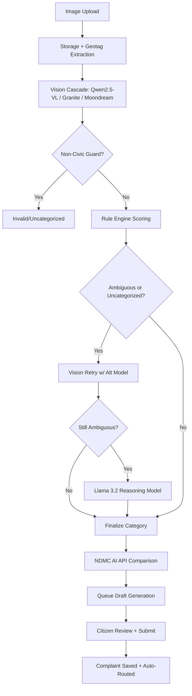

## 5.2 UML Diagrams

### 5.2.1 E-R Diagram (Entity-Relationship)

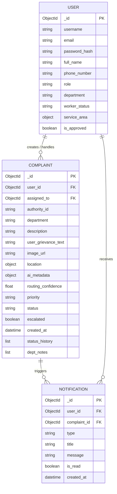
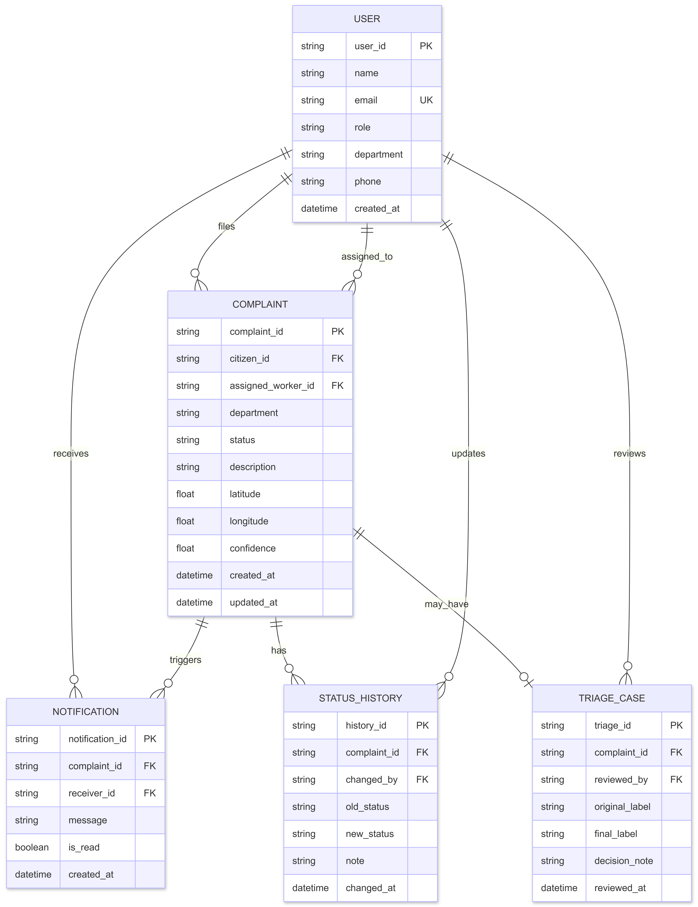

### 5.2.2 Use Case Diagram

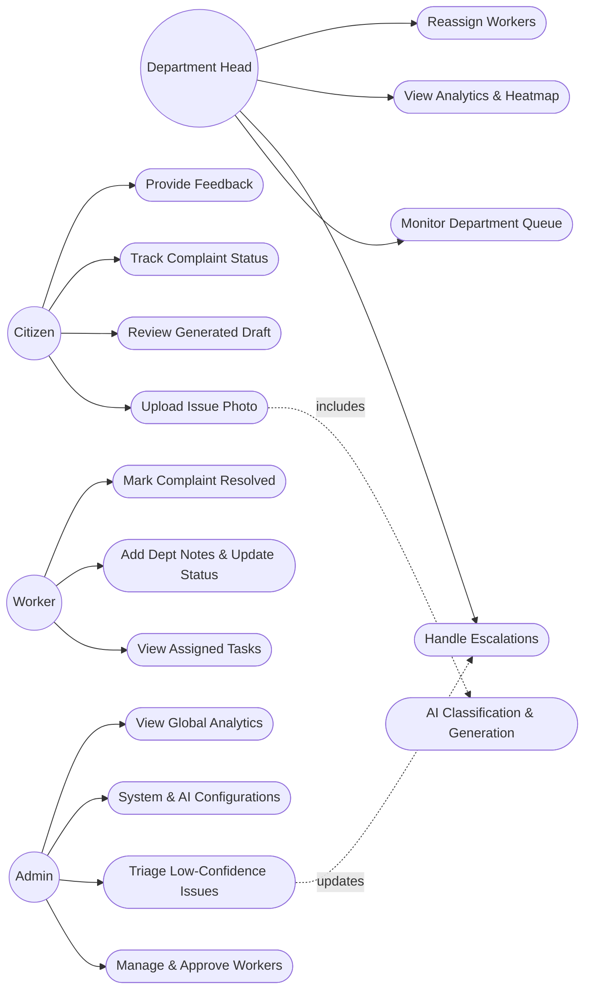
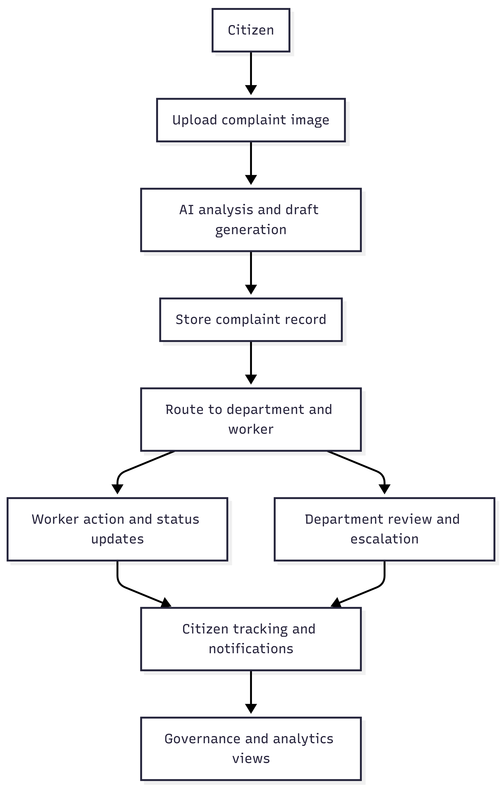
*(Note: Mermaid flowchart can also depict use case functionality if actual Use Case UML is not fully supported in your renderer, standard UML boundaries apply)*

### 5.2.3 Class Diagram

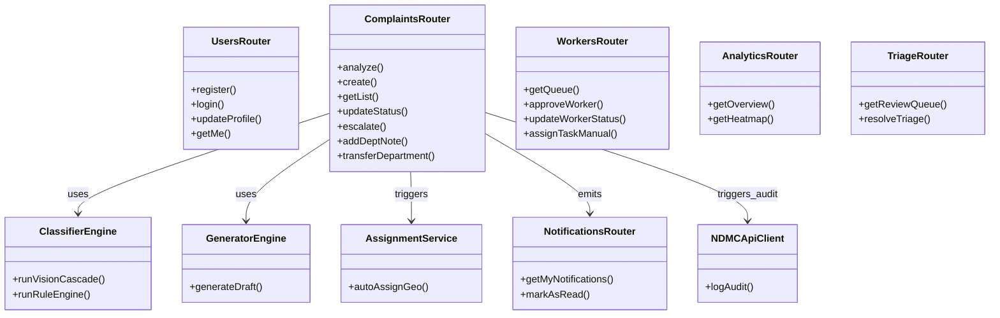
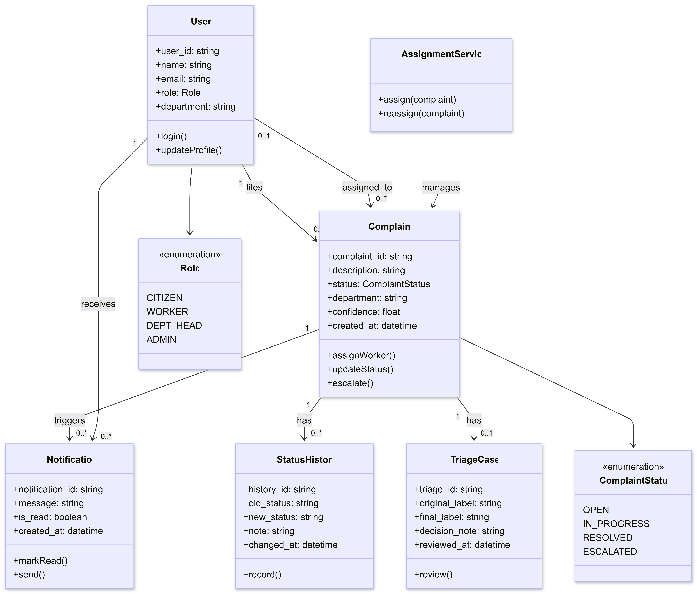

### 5.2.4 Sequence Diagram
(Complaint Lifecycle Sequence)

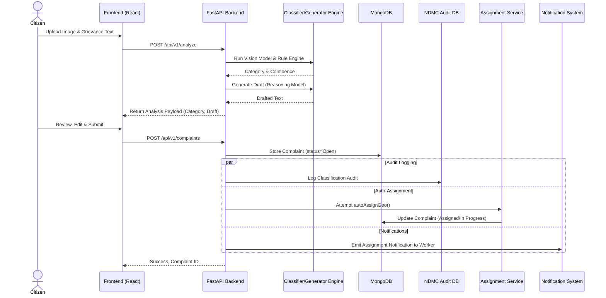

### 5.2.5 Activity Diagram
(Image Analysis & Triage Activity)

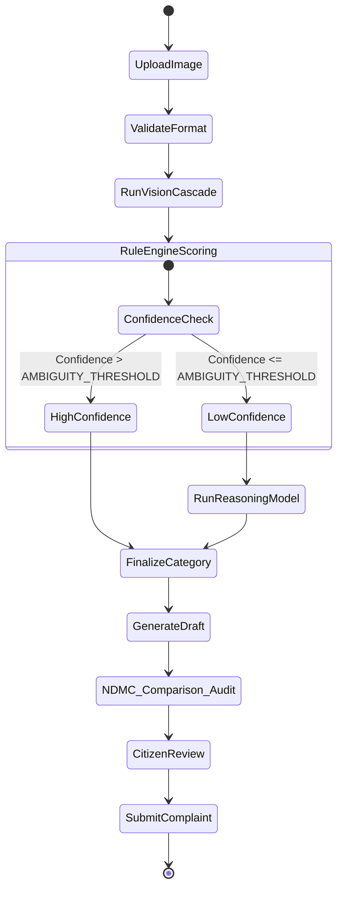
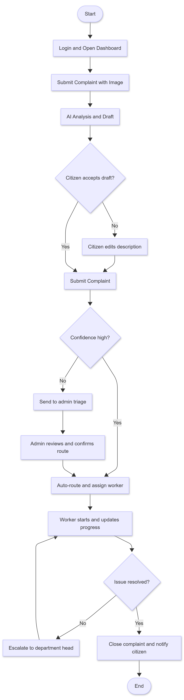

### 5.2.6 DFD Diagram (Data Flow Diagram - Context & Level 1)

#### Level 0 DFD (Context Diagram)

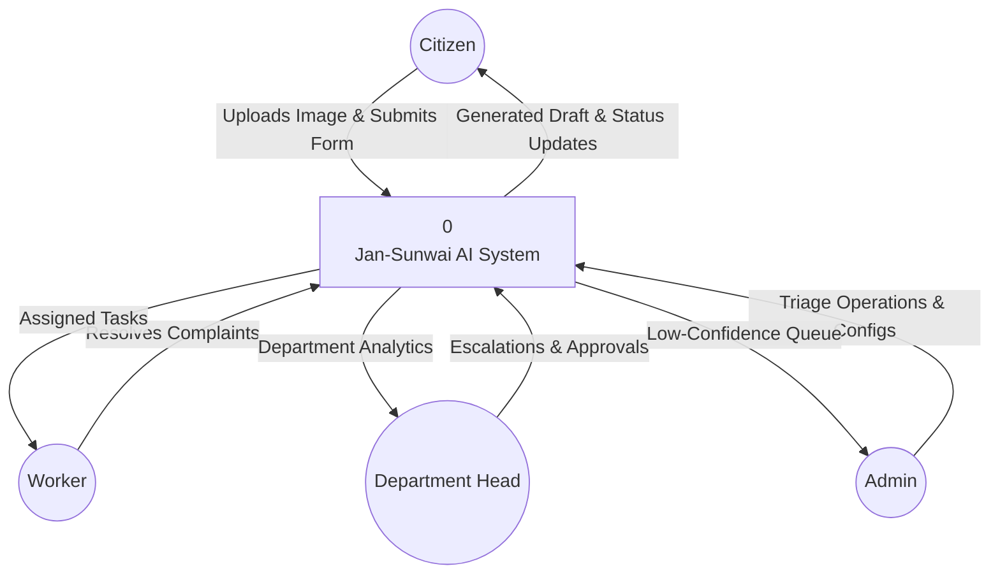

#### Level 1 DFD

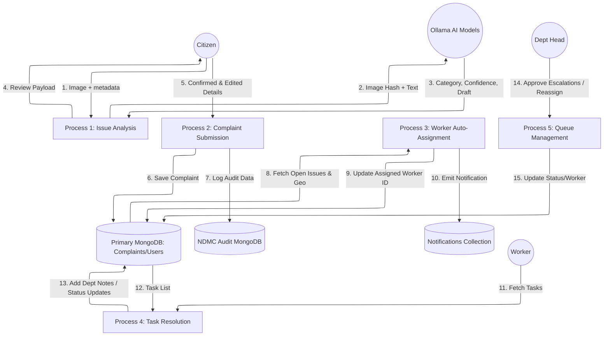

### 5.2.7 Deployment Diagram

The system's infrastructure scales between local development and production via Docker Compose environment configurations (`APP_ENV=production` vs `local`), utilizing distinct `.env` loading and build profiles.

- **Production Environment (`Dockerfile.prod`)**: The React frontend is built statically and served via an Nginx container. The FastAPI backend runs via Uvicorn workers. MongoDB enforces strict authentication using Docker secrets.
- **Local Environment**: The frontend relies on the Vite development server with Hot Module Replacement (HMR). The backend runs Uvicorn with `--reload` enabled.

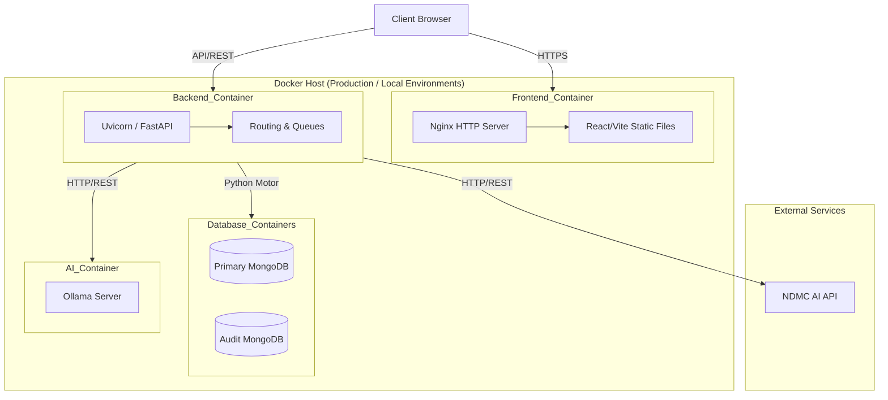
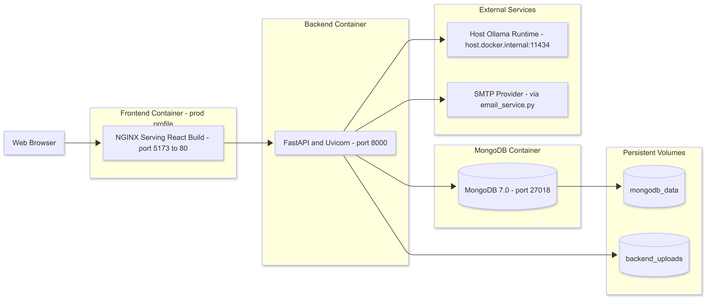

## 5.3 Database Design

### Database Schema & Indexing Architecture

Because Jan-Sunwai AI uses **MongoDB** (a NoSQL document database), strict relational mapping is replaced by references and embedding. The diagram below illustrates how collections interlock, where data is embedded for read-performance, and which fields are heavily indexed:

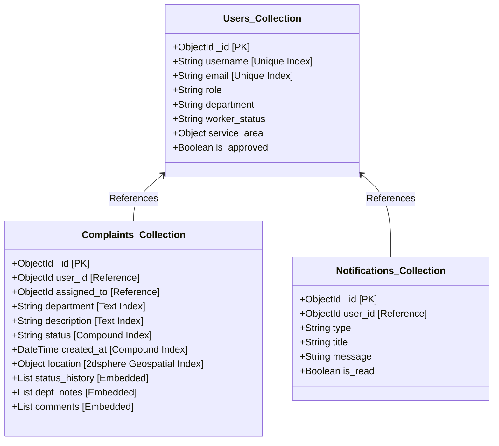

### 5.3.1 Collection Design and Relationships
Because Jan-Sunwai AI uses **MongoDB** (a NoSQL document database), "Tables" map to **Collections** and "Rows" map to **Documents**. 
- **Users Collection**: Core identity and role metadata. Citizens, Workers, Dept Heads, and Admins are all stored here.
- **Complaints Collection**: The central entity linking `user_id`, `department`, and `assigned_to` (worker). Contains nested structures for `location` (GeoJSON), `status_history`, `dept_notes`, and `comments`.
- **Notifications Collection**: Tracks alerts for status changes, assignments, and escalations.
- **Audit Logs (NDMC MongoDB)**: A secondary database used for recording AI classification agreement between local models and NDMC's API.

### 5.3.2 Normalization
Instead of strict 3NF (Third Normal Form) typical of Relational DBs, MongoDB relies on a hybrid approach:
- **References (Normalization)**: `user_id` and `worker_id` are kept as `ObjectId` references within `Complaint` documents to ensure updates to user names/roles propagate easily.
- **Embedding (Denormalization)**: Timestamps, small arrays like `status_history`, and coordinates are embedded directly in the `Complaint` document for extremely fast read-query performance during dashboard rendering.

### 5.3.3 Indexing Strategy
To meet the high-performance demands of location-based sorting and massive audit queues:
1. **Geospatial Index**: `2dsphere` index on `location.coordinates` in the Complaints collection for fast auto-assignment querying (e.g., "$near" queries).
2. **Compound Index**: `{ status: 1, created_at: -1 }` on Complaints to optimize the heavy load of dashboard rendering where Dept Heads and Workers view recent active issues.
3. **Unique Index**: `{ email: 1 }` and `{ username: 1 }` on Users collection to enforce constraint uniqueness natively.
4. **Text Index**: Free-text index on the `draft` and `category` fields to support Admin full-text searches.

### 5.3.4 Data Dictionary

#### **Users Collection (`users`)**
| Field Name | Type | Constraints | Description |
| :--- | :--- | :--- | :--- |
| `_id` | ObjectId | Primary Key | Unique identifier for the user. |
| `username` | String | Unique, Min 3, Max 50 | The user's login name. |
| `email` | String | Unique, Valid Email | The user's contact email. |
| `password_hash` | String | Required | Bcrypt hashed password. |
| `full_name` | String | Max 100 | The user's full display name. |
| `phone_number` | String | Max 20 | Contact number. |
| `role` | Enum | citizen, dept_head, admin, worker | Defines RBAC permissions. |
| `department` | String | Optional | The department assignment for Dept Heads and Workers. |
| `worker_status` | Enum | available, busy, offline | Status indicating if a worker can take new assignments. |
| `service_area` | Object | Optional | Geospatial data (`lat`, `lon`, `radius_km`) defining a worker's operational range. |
| `is_approved` | Boolean | Default: True | False for pending worker registrations until Admin approval. |

#### **Complaints Collection (`complaints`)**
| Field Name | Type | Constraints | Description |
| :--- | :--- | :--- | :--- |
| `_id` | ObjectId | Primary Key | Unique identifier for the complaint. |
| `user_id` | ObjectId | Foreign Key (users) | The citizen who filed the grievance. |
| `assigned_to` | ObjectId | Foreign Key (users) | The worker currently assigned to the issue. |
| `department` | String | Required | The assigned civic department (e.g., Civil, Health). |
| `description` | String | Min 10 chars | The AI-generated or user-edited description of the issue. |
| `user_grievance_text` | String | Max 1200 | Optional original text provided by the citizen. |
| `image_url` | String | Required | Path/URL to the uploaded evidentiary photo. |
| `location` | Object | Required | `GeoLocation` containing `lat`, `lon`, `address`, and `source` (exif/device/manual). |
| `ai_metadata` | Object | Required | AI analysis results including `confidence_score` and `detected_department`. |
| `priority` | Enum | Low, Medium, High, Critical | System-assigned urgency level. |
| `status` | Enum | Open, In Progress, Resolved, Rejected | Current state of the grievance lifecycle. |
| `created_at` | DateTime | Auto-generated | UTC timestamp of submission. |
| `status_history` | Array | Embedded Docs | Audit trail of all status changes with timestamps and user IDs. |

#### **Notifications Collection (`notifications`)**
| Field Name | Type | Constraints | Description |
| :--- | :--- | :--- | :--- |
| `_id` | ObjectId | Primary Key | Unique notification identifier. |
| `user_id` | ObjectId | Foreign Key (users) | Recipient of the notification. |
| `complaint_id` | ObjectId | Foreign Key (complaints) | Associated complaint. |
| `type` | Enum | status_change, escalation, assignment, system | Category of the alert. |
| `title` | String | Required | Short summary. |
| `message` | String | Required | Full notification body. |
| `is_read` | Boolean | Default: False | Read status for the UI badge. |
| `created_at` | DateTime | Auto-generated | UTC timestamp. |

## 5.4 GUI Design

The Jan-Sunwai AI user interface is a responsive Single Page Application (SPA) built with React. It is divided into distinct role-based experiences.

### 5.4.1 Interface Areas and Purpose

- **Citizen Portal**: Focuses on frictionless complaint filing. Includes the Image Upload wizard, AI Draft Review, and a personal Status Tracker.
- **Worker Dashboard**: Optimized for mobile usage. Shows a map/list of assigned tasks, allows status updates, and uploading proof of resolution.
- **Department Head View**: A queue management interface allowing re-assignment, priority adjustment, and viewing department-specific analytics.
- **Admin Dashboard**: The overarching control center. Features a high-level analytics overview, the Triage Queue for low-confidence AI routing, and User Management.

### 5.4.2 Visual References

*The following are references to the actual implementation screenshots located in the `docs/images/` directory:*

1. **Citizen Experience**:
   - *Home Page / Filing*: ``
   - *Reviewing AI Analysis*: ``
   - *Tracking Dashboard*: ``

2. **Admin & Department Management**:
   - *Admin Dashboard Overview*: ``
   - *Triage Queue (Low Confidence)*: ``
   - *Analytics & Heatmap*: ``

3. **System Wide**:
   - *Login & Registration*: ``
   - *Map Visualization*: ``