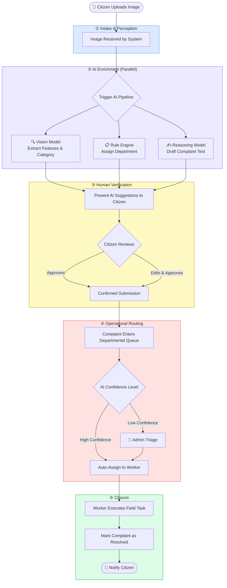
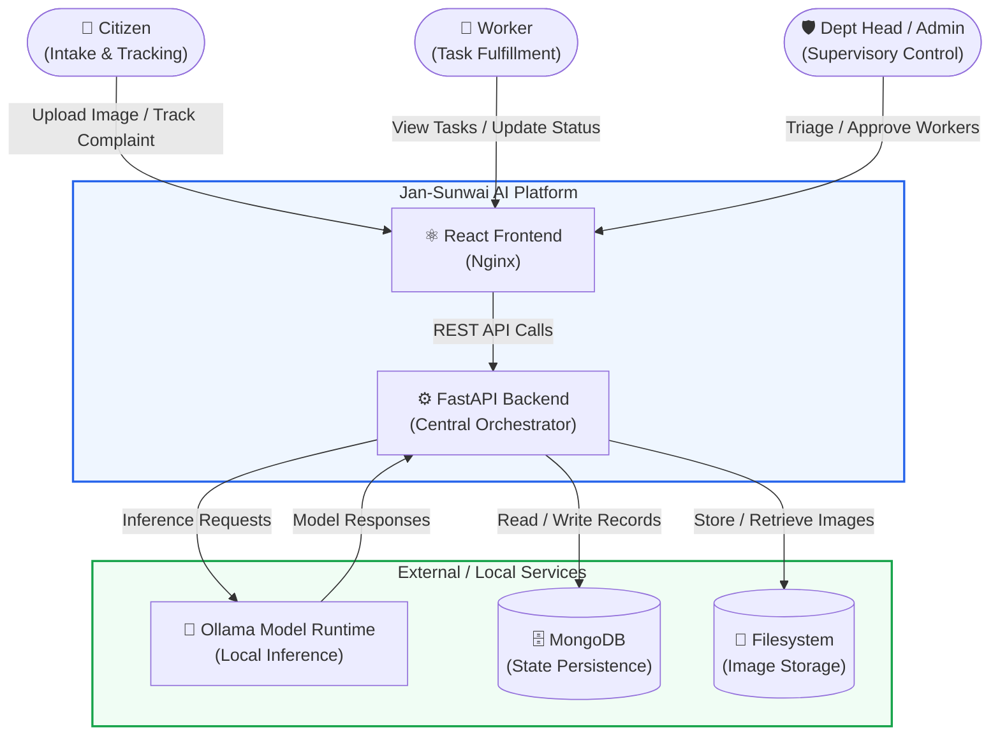
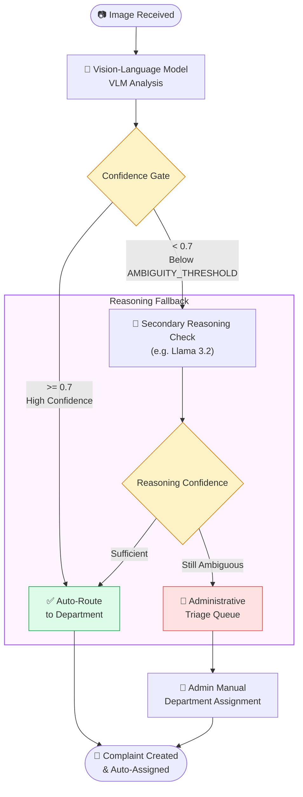
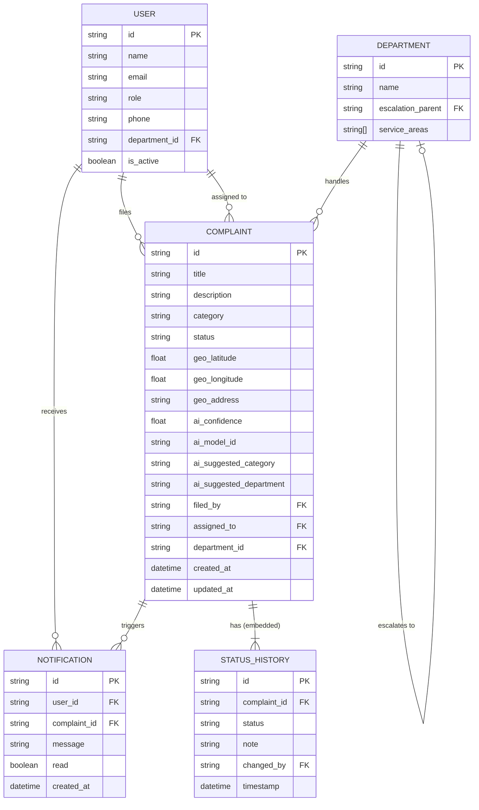
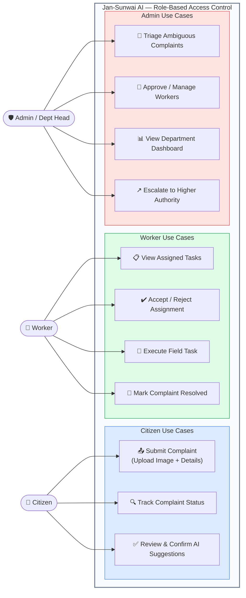
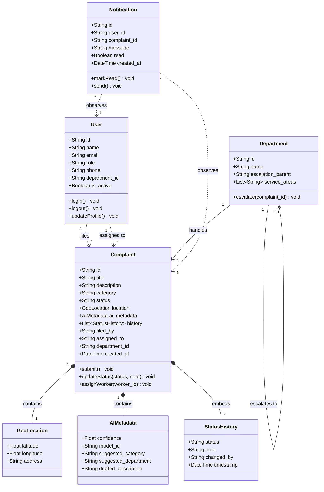
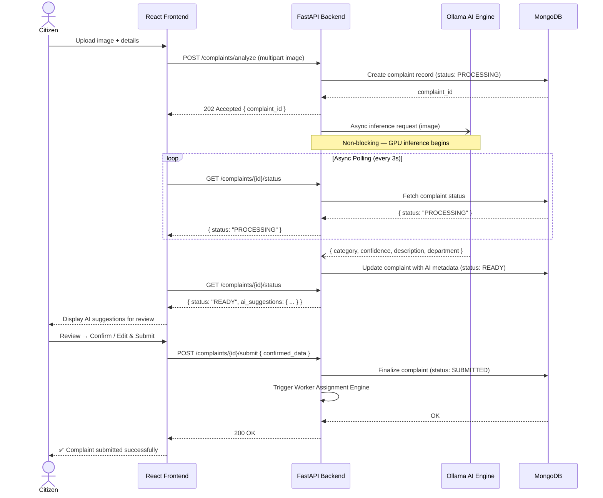
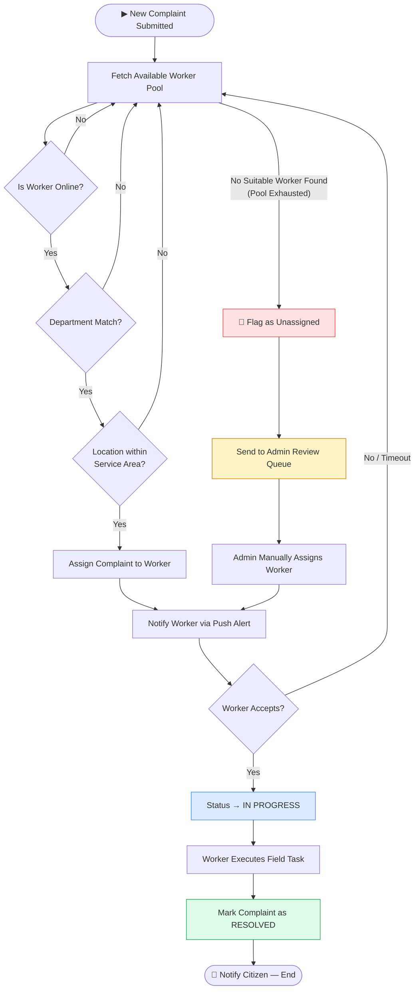
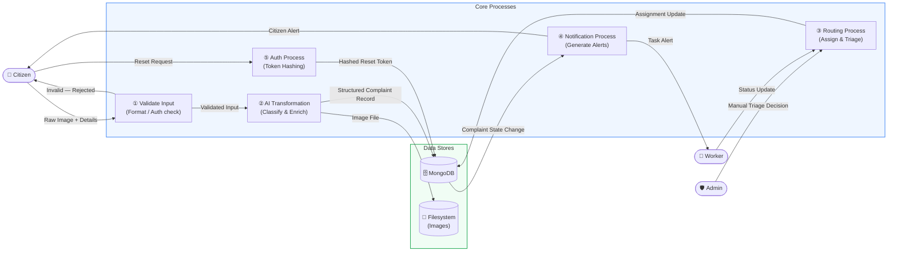
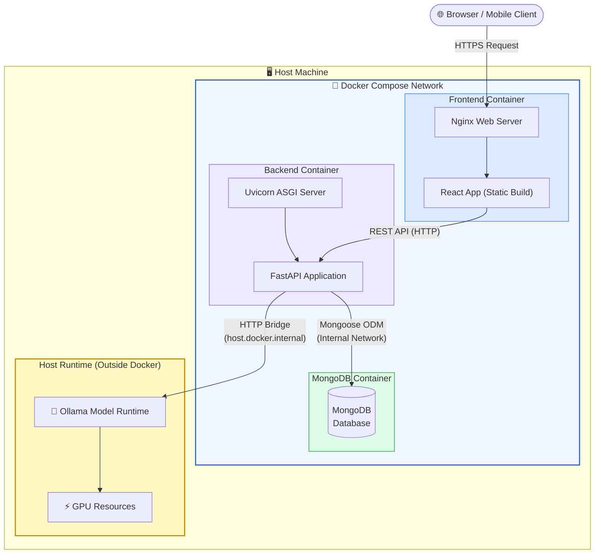

# Jan-Sunwai AI — System Diagrams

---

## 4.1 Proposed End-to-End Workflow

---

## 5.1 Overall System Context Diagram

---

## 5.2 AI Pipeline and Classification Flow

---

## 5.3 E-R Diagram

---

## 5.5 Use Case Diagram (System Flow)

---

## 5.6 Class Diagram

---

## 5.7 Sequence Diagram

---

## 5.8 Activity Diagram — Worker Assignment Engine

---

## 5.9 Data Flow Diagram (DFD)

---

## 5.10 Deployment Diagram

