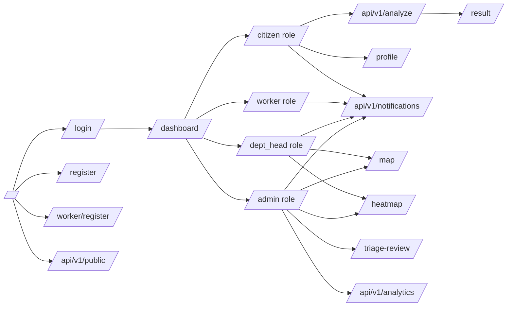
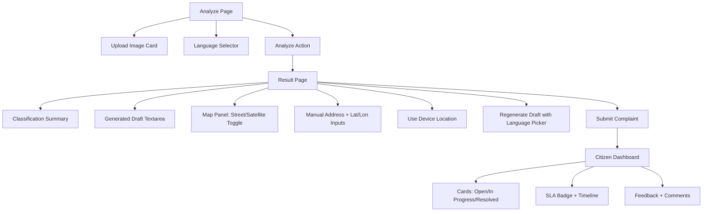
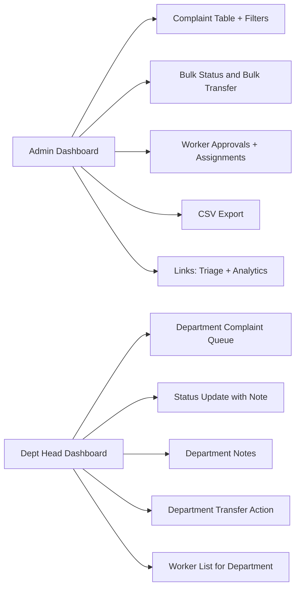
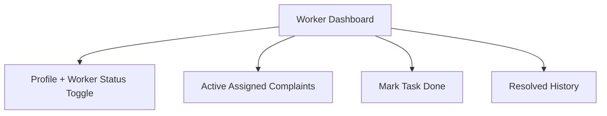
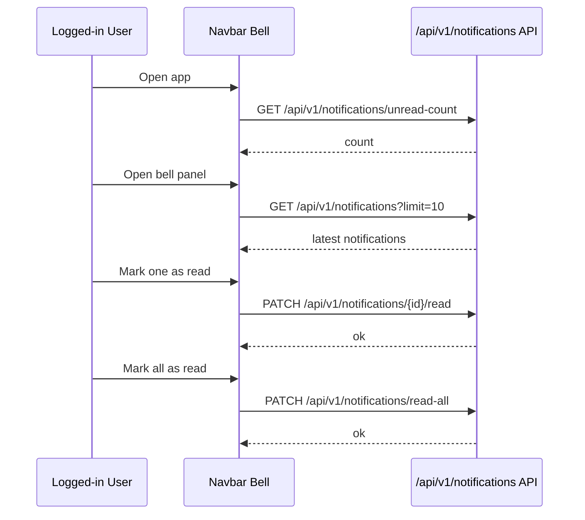

# GUI Wireframes (Mermaid Canonical)

This document is the canonical wireframe source for the current UI. 

Mermaid diagrams below provide the functional logic and flow for the wireframes.

## App Navigation Map

## Citizen Submission Wireframe

## Admin and Department Head Wireframe

## Worker Wireframe

## Notification UX Flow

## Layout Notes

- Frontend routes are role-gated in `frontend/src/App.jsx`.
- Public transparency board is available at `/api/v1/public` without authentication.
- Primary complaint map uses MapLibre via `react-map-gl`; grievance heatmap page currently uses Leaflet.
- Mobile responsiveness is supported across dashboard and submission flows.
