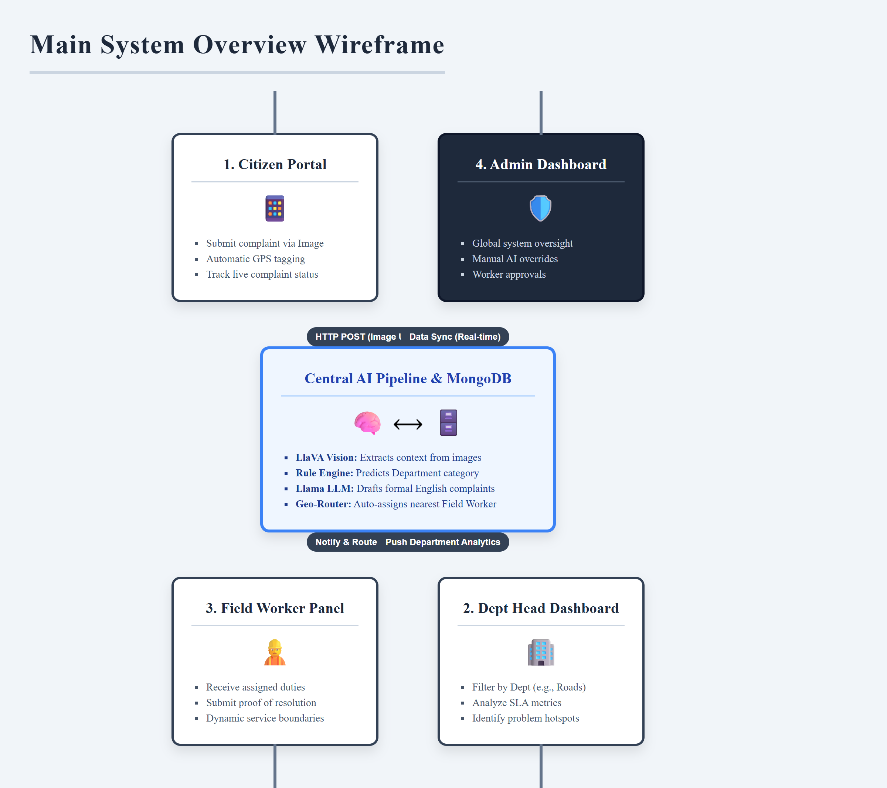
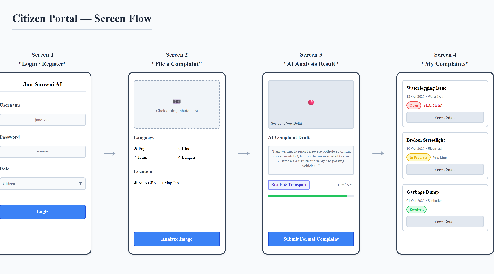
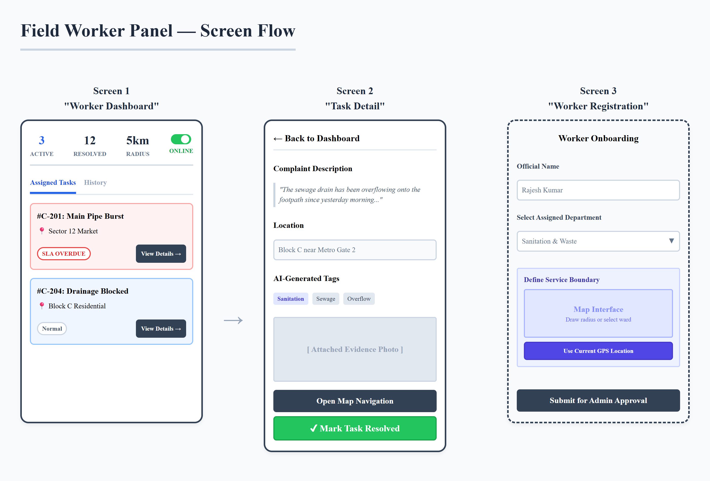
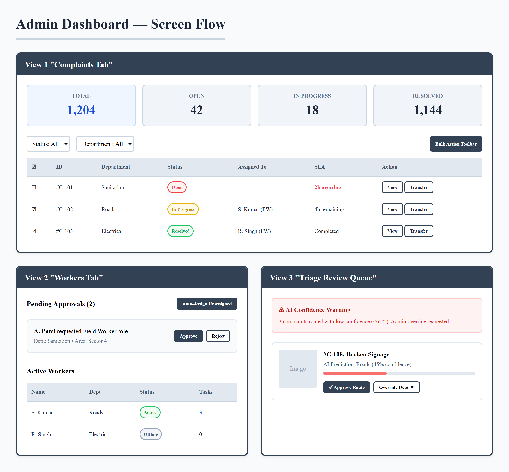
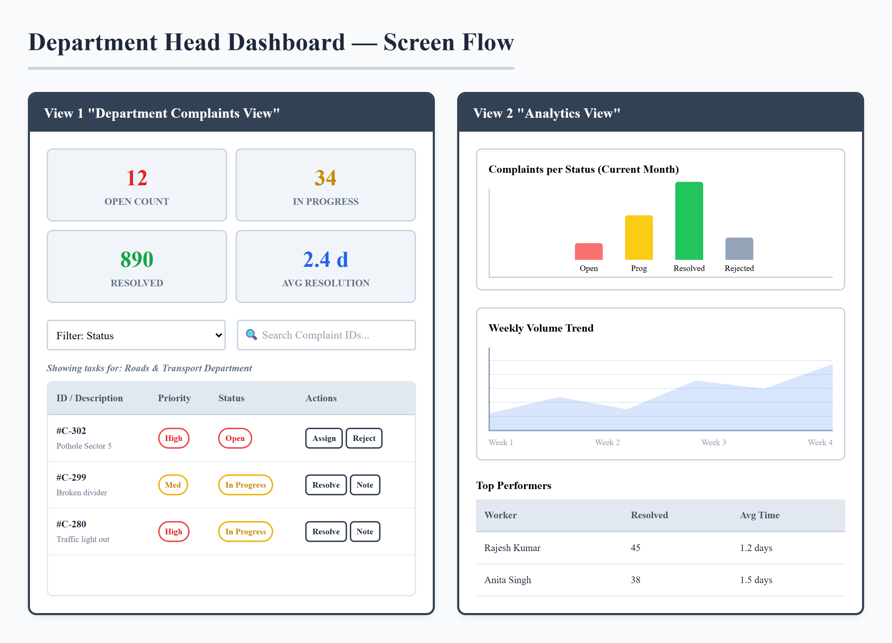

# Jan-Sunwai AI — GUI Wireframes

> **Font:** Times New Roman throughout all printed / PDF versions of this document.
> **Last Updated:** 24 March 2026
> **Wireframe Status:** Complete — 1 main overview + 4 user-role sub-wireframes

---

## Overview

This document contains the full GUI wireframe set for the Jan-Sunwai AI platform.
The wireframes are organised as:

| Wireframe | File | Description |
|---|---|---|
| Main Overview | `wireframe_main_overview.png` | System-level navigation map showing all 4 portals and the AI pipeline |
| Citizen Portal | `wireframe_citizen.png` | Complete citizen user flow: login → upload → AI result → track |
| Field Worker Panel | `wireframe_worker.png` | Worker flow: dashboard → task detail → registration form |
| Admin Dashboard | `wireframe_admin.png` | Admin views: complaints, workers tab, triage queue |
| Dept Head Dashboard | `wireframe_depthead.png` | Dept head views: complaints filtered by dept + analytics |

---

## Main Wireframe — System Overview

The main wireframe shows how all four user portals connect to the shared AI pipeline and MongoDB backend.

**Key flows shown:**
- Citizen submits photo → AI Pipeline → MongoDB → routes to Dept Head + Worker
- Admin sees everything: all portals, triage queue, heatmap, analytics
- Worker receives auto-assigned tasks via geo-aware assignment engine
- Notifications connect all user roles on every status change

---

## Sub-Wireframe 1 — Citizen Portal

Covers the complete citizen journey from registration to complaint tracking.

**Screens shown (left → right):**
1. **Login / Register** — username, password, role dropdown
2. **File a Complaint** — drag-drop upload zone, language selector, location options (GPS auto / map pin)
3. **AI Analysis Result** — map with pin, editable complaint draft textarea, department badge, confidence score bar, Submit button
4. **My Complaints** — complaint cards with status pills (Open / In Progress / Resolved), SLA countdown badges, View Details

---

## Sub-Wireframe 2 — Field Worker Panel

Covers the worker registration form (new — now collects department and service area) and the dashboard task management screens.

**Screens shown:**
1. **Worker Dashboard** — stat cards (Active Tasks, Resolved, Service Radius, Status toggle), tabbed task list with Mark Done buttons and SLA badges
2. **Task Detail** — full complaint info, AI tags, location, photo thumbnail, Mark Resolved button
3. **Worker Registration** — form with department dropdown, service area fields (locality, lat/lon, radius, Use GPS button)

---

## Sub-Wireframe 3 — Admin Dashboard

Covers the three primary admin views: complaints management, worker management, and the AI triage queue.

**Views shown:**
1. **Complaints Tab** — stat cards row, filter bar, complaint table with checkboxes, status/department/SLA badges, bulk action toolbar
2. **Workers Tab** — "Re-assign All Unassigned Complaints" button, Pending Approvals section, Active Workers table with manual Assign Task dropdown
3. **Triage Review Queue** — AI-uncertain complaints with confidence score bars, Approve / Override Department buttons

---

## Sub-Wireframe 4 — Department Head Dashboard

Covers department-scoped complaint management and analytics.

**Views shown:**
1. **Department Complaints** — stat cards (Open / In Progress / Resolved / Avg Resolution Days), filtered complaint list with status actions (Mark In Progress, Mark Resolved, Reject, Add Note)
2. **Analytics View** — department bar chart, weekly trend line chart, metrics table

---

## Design Notes

- **Font:** Times New Roman is used throughout all wireframe labels for consistency with academic and government document standards.
- **Color Scheme:** Blue and indigo primary palette; gray for secondary UI elements; red for overdue SLA indicators.
- **Wireframe Style:** Medium-fidelity — shows layout, component relationships, and key labels without pixel-perfect styling detail.
- **Responsiveness:** All pages are designed for both desktop (1280px+) and tablet (768px) breakpoints. Mobile responsiveness is scheduled for Week 13.

---

## Component Legend

| Symbol / Pattern | Meaning |
|---|---|
| Dashed box | File upload / drag-drop zone |
| Pill badge (colored) | Status indicator (Open = blue, In Progress = yellow, Resolved = green) |
| Clock icon badge | SLA countdown |
| Red badge | Overdue — past SLA deadline |
| Map pin icon | Geo-tagged complaint location |
| Shield icon | Admin-only feature |
| Hard hat icon | Field Worker feature |
