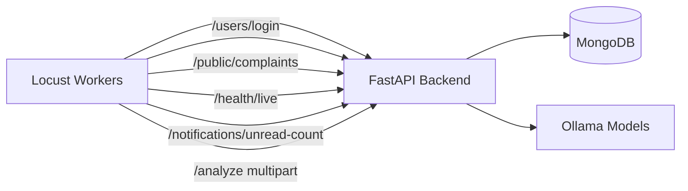
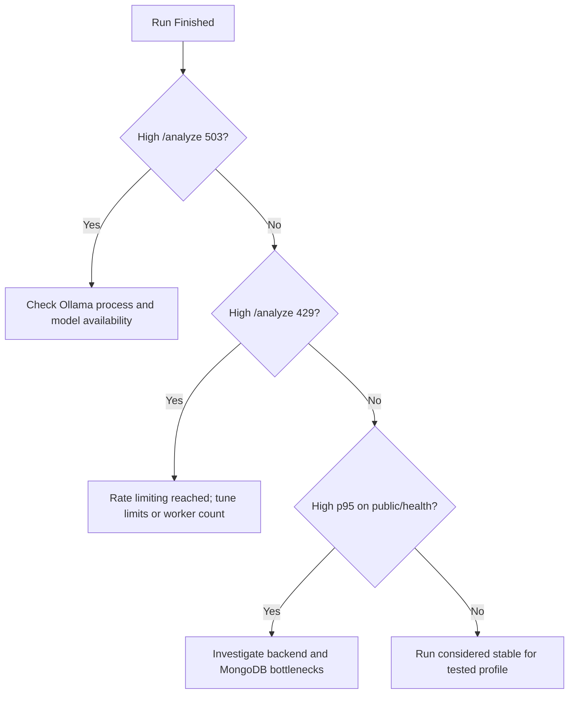

# Load Testing Guide

This runbook is aligned with `backend/locustfile.py` and `scripts/run_load_test.*`.

## Objective

Validate the behavior of:

- Public feed endpoint under read-heavy load.
- Health endpoint baseline responsiveness.
- Notification badge endpoint with auth.
- Analyze endpoint behavior under inference pressure.

## Scenario Topology



## Endpoint Mix (Current Locust Tasks)

Task weights in `locustfile.py`:

- `4` -> `GET /public/complaints`
- `3` -> `GET /health/live`
- `2` -> `GET /notifications/unread-count` (with bearer token)
- `1` -> `POST /analyze` (multipart image upload)

## Acceptance Rules in Locust Script

- `GET /public/complaints` must return `200`.
- `GET /health/live` must return `200`.
- `GET /notifications/unread-count` accepts `200` or `401`.
- `POST /analyze` accepts `200`, `429`, or `503`.

`429` and `503` on `/analyze` are treated as controlled degradation under pressure.

## Prerequisites

1. Backend and MongoDB running.
2. Ollama running with configured models.
3. At least one test citizen account available for login.
4. Python dependencies for load testing installed.

## Run Commands

### Linux/macOS

```bash
bash scripts/run_load_test.sh http://localhost:8000
```

### Windows

```bat
scripts\run_load_test.bat http://localhost:8000
```

### Direct Locust command

```bash
cd backend
python -m pip install -r requirements-loadtest.txt
locust -f locustfile.py --host http://localhost:8000
```

Open Locust UI at `http://localhost:8089`.

## Optional Credentials

Set environment variables if default credentials are different:

- `LOCUST_CITIZEN_USERNAME`
- `LOCUST_CITIZEN_PASSWORD`

Example:

```bash
export LOCUST_CITIZEN_USERNAME=citizen_demo
export LOCUST_CITIZEN_PASSWORD=citizen123
```

## Suggested Test Matrix

| Profile | Users | Spawn Rate | Duration | Purpose |
| --- | --- | --- | --- | --- |
| Smoke | 20 | 5/s | 5 min | Quick baseline verification |
| Baseline | 70 | 10/s | 15 min | Typical stress profile |
| Peak | 120 | 20/s | 20 min | Degradation and recovery behavior |

## Capture Checklist

For each run, record:

1. P95 and P99 latency per endpoint.
2. Request throughput (req/s).
3. Failure rate by endpoint and status code.
4. `/analyze` distribution of `200`, `429`, `503`.
5. CPU/RAM for backend and MongoDB.
6. Model response behavior (slow vs unavailable windows).

## Result Interpretation



## Notes

- Production and local runs can differ significantly depending on `APP_ENV` and `RATE_LIMIT_ENABLED`.
- If using production frontend with `VITE_API_URL=/api/v1`, test host should still point to backend gateway where `/api/*` is proxied correctly.
