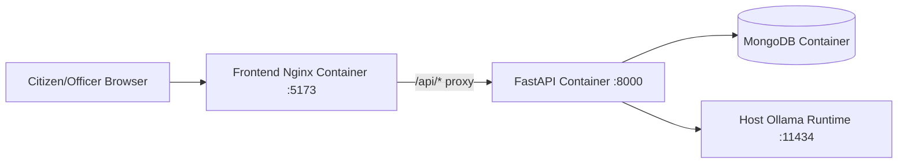
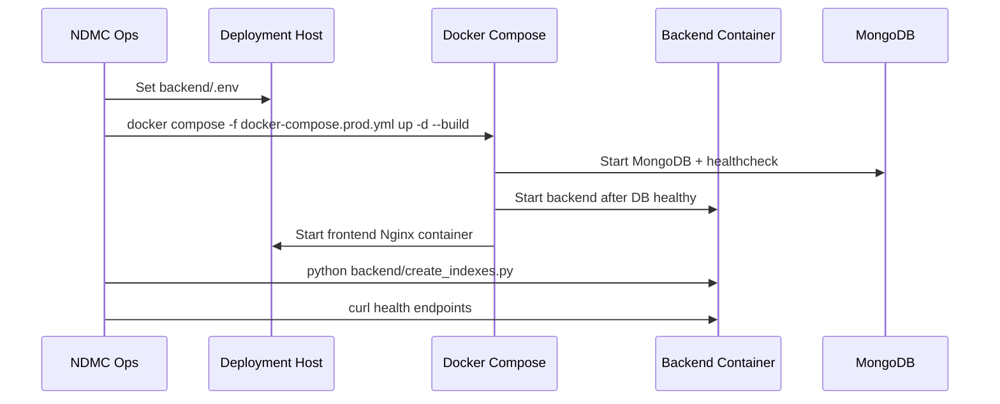

# NDMC Deployment Runbook

This runbook documents the current production-style deployment path using `docker-compose.prod.yml`.

## Deployment Architecture (Current)



## Prerequisites

1. Ubuntu 22.04+ (or compatible Linux host).
2. Docker 24+ and Docker Compose v2.
3. NVIDIA drivers if GPU inference is expected.
4. Ollama installed and reachable from containers at `host.docker.internal:11434`.
5. Repository checked out on deployment host.

## Environment Setup

1. Copy production template:

```bash
cp backend/env.production backend/.env
```

1. Edit required values in `backend/.env`:

- `JWT_SECRET_KEY` (must be strong and unique)
- `ALLOWED_ORIGINS` (production domain)
- `MONGODB_URL` if non-default
- `OLLAMA_BASE_URL` if host routing differs
- `SMTP_HOST`, `SMTP_PORT`, `SMTP_FROM` if email relay is used

1. Ensure `APP_ENV=production` and `RATE_LIMIT_ENABLED=true`.

## Start Production Stack

```bash
docker compose -f docker-compose.prod.yml up --build -d
```

## NDMC Network Configuration (Container -> Ollama)

- Default container route uses `host.docker.internal:11434`.
- On Linux hosts, ensure compose uses:

```yaml
extra_hosts:
    - "host.docker.internal:host-gateway"
```

- If NDMC uses a separate Ollama host, set `OLLAMA_BASE_URL` to the internal reachable URL.

Connectivity check from backend container:

```bash
docker compose -f docker-compose.prod.yml exec -T backend \
    python -c "import os,urllib.request;u=os.getenv('OLLAMA_BASE_URL').rstrip('/')+'/api/tags';print(urllib.request.urlopen(u, timeout=5).status)"
```

Services started:

- `mongodb`
- `backend` (gunicorn + uvicorn worker class)
- `frontend` (Nginx serving built React app)

## Initialize Database Indexes

Run once after first deployment or schema-related updates:

```bash
python backend/create_indexes.py
```

## Optional: Seed Demo Accounts

```bash
python backend/create_test_users.py
```

## Health Verification

```bash
curl http://localhost:8000/health/live
curl http://localhost:8000/health/ready
curl http://localhost:8000/health/models
curl http://localhost:8000/health/gpu
```

UI verification:

- Frontend: `http://<host>:5173`
- Swagger: `http://<host>:8000/docs`

## Deployment Sequence



## Backup and Restore

### Backup

```bash
# Linux
bash scripts/backup_db.sh

# Windows
powershell -ExecutionPolicy Bypass -File scripts/backup_db.ps1
```

### Restore

```bash
mongorestore --uri="<mongodb-uri>" /path/to/backup-folder
```

Recommended schedule:

- Daily backup at off-peak hour (for example 02:00).
- Retention: last 30 snapshots.

## Common Troubleshooting

| Problem | Check |
| --- | --- |
| API responds but analyze fails | Verify Ollama service and `OLLAMA_BASE_URL` |
| Auth/login issues | Check `JWT_SECRET_KEY` consistency and token TTL |
| Frontend API 404 | Ensure Nginx `/api/` proxy is active and `VITE_API_URL=/api/v1` at build time |
| CORS errors | Verify `ALLOWED_ORIGINS` includes actual frontend URL |
| Rate limiter import warnings | Ensure `slowapi` is installed when rate limiting is enabled |

## Operational Notes

- `docker-compose.prod.yml` already includes healthchecks and restart policies.
- Frontend Nginx performs SPA fallback routing to `index.html`.
- API version aliases (`/api/v1`) are active in backend and should be used for external integrations.
