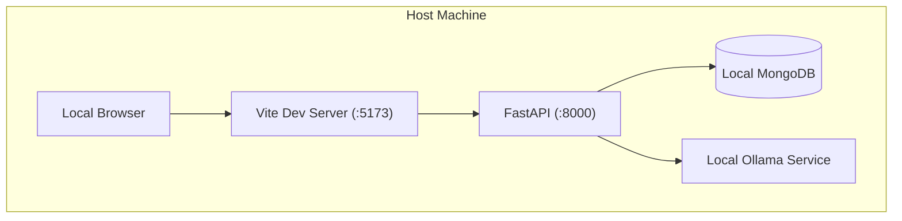
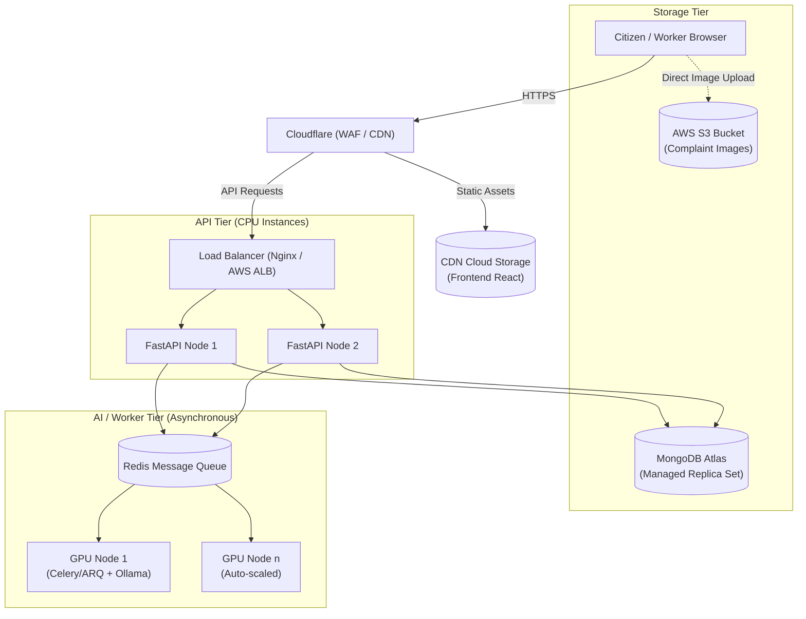
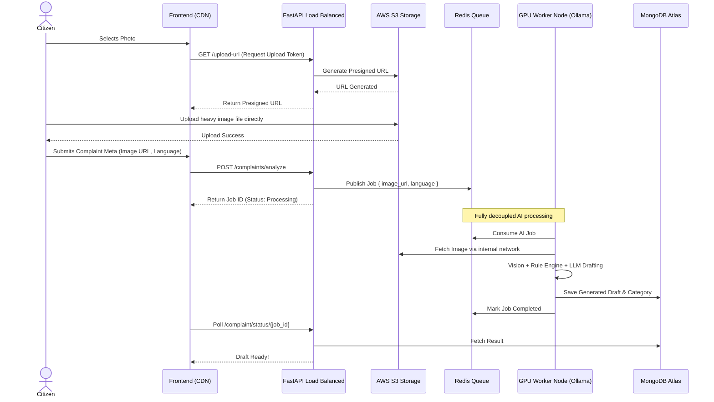
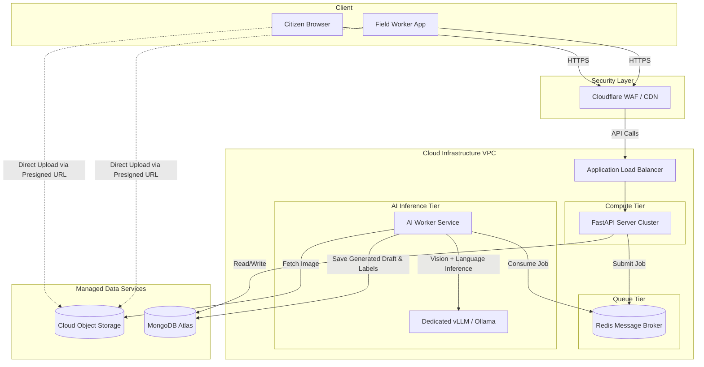

# Jan-Sunwai AI: Production Deployment Plan

## 1. Introduction
Currently, Jan-Sunwai AI operates as a **fully localized system**. The frontend (Vite), backend (FastAPI), database (MongoDB), and AI inference (Ollama) all run on a single host machine. While this is excellent for development, privacy, and cost-control, taking this system "live" for thousands of citizens requires significant architectural changes to ensure **scalability, high availability, security, and data persistence**.

This document outlines the changes required to transition from the current local environment to a production-grade live deployment.

---

## 2. Key Architectural Changes for Production

### 2.1. Frontend Hosting
*   **Current:** Served locally via Vite Dev Server (`npm run dev` at `localhost:5173`).
*   **Production:** The React code will be compiled into static HTML/CSS/JS (`npm run build`) and hosted on a **Global CDN** (e.g., Vercel, AWS S3 + CloudFront, or Nginx). This ensures fast loading times for citizens across different geographic locations.

### 2.2. Backend API Server
*   **Current:** Runs via Uvicorn on a single terminal process (`localhost:8000`).
*   **Production:**
    *   Deploy on cloud compute instances (AWS EC2, DigitalOcean Droplets, or Kubernetes).
    *   Run multiple worker processes using **Gunicorn** with Uvicorn worker classes.
    *   Place a **Reverse Proxy / Application Load Balancer** (Nginx, Traefik, AWS ALB) in front of the backend to distribute incoming traffic, handle SSL termination (HTTPS), and defend against DDoS attacks.

### 2.3. Image Storage
*   **Current:** Images are saved directly to the host machine's local file system (e.g., an `uploads/` folder).
*   **Production:** 
    *   Migrate to **Cloud Object Storage** (e.g., AWS S3, Cloudinary, or DigitalOcean Spaces).
    *   Instead of sending images through the backend, the backend will generate a *Presigned URL*, allowing the citizen's browser to upload the heavy image directly to the cloud bucket, saving backend bandwidth and storage space.

### 2.4. Database Management
*   **Current:** Local Dockerized MongoDB instance without persistent volume backups or replication.
*   **Production:** Use a managed database service like **MongoDB Atlas**. This provides automated daily backups, horizontal scaling, multi-region replica sets (ensuring the system stays up if one server crashes), and encrypted data at rest.

### 2.5. AI Inference & Queueing (The Heaviest Modification)
*   **Current:** FastAPI utilizes `asyncio.Queue` in memory and directly queries a local `Ollama` instance on the same machine. If the server restarts, the queue is lost.
*   **Production:**
    *   **Message Broker:** Introduce a persistent queue system like **Redis (via Celery/ARQ)** or **RabbitMQ**. When a citizen submits an issue, the task is safely stored in the broker.
    *   **GPU Worker Nodes:** Separate the API servers from the AI servers. Deploy dedicated GPU instances (e.g., AWS EC2 `g5.xlarge`, RunPod) running Ollama or `vLLM`. These instances will consume jobs from the Redis queue. If traffic spikes, auto-scaling groups can spin up multiple GPU nodes to drain the queue faster.

### 2.6. Security and Domain
*   **Current:** Running on unencrypted `http://localhost`.
*   **Production:** Purchase a domain (e.g., `www.jansunwai.gov`). Enforce strict HTTPS using SSL certificates (Let's Encrypt). Implement Cloudflare WAF (Web Application Firewall) to block malicious traffic.

---

## 3. Diagrammatic Differences

The structural diagrams evolve heavily from a simple, tightly-coupled monolithic box into a distributed, decoupled microservices network.

### 3.1. Current vs. Production Deployment Diagram

**Current Local Deployment:**


**Production Deployment Diagram:**


### 3.2. Production Sequence Diagram: Complaint Submission

In the local environment, the API blocks or uses a local background task. In production, the workflow becomes truly asynchronous computing.



### 3.3. Production DFD Level 0 (Context Diagram)
The boundaries of the system expand to represent reliance on enterprise managed services.

```
                                    Jan-Sunwai AI (Production Cloud)
                  ┌────────────────────────────────────────────────────────┐
                  │                                                        │
Citizen ─────────►│  App Request                                           │
        ◄─────────│  React Frontend served via Global CDN                  │
                  │                                                        │
Citizen ─────────►│  Complaint Image (Sent Directed to Cloud Storage)      │
        ◄─────────│  AI Draft generated by GPU Cluster via Message Queue   │
                  │                                                        │
Workers/Admins ──►│  Access via Role-Based Load Balanced Gateways          │
               ◄──│  Real-time Sync via Cloud Replica Databases            │
                  │                                                        │
                  └─────────────┬──────────────────────────┬───────────────┘
                                │                          │
                      ┌─────────┴────────┐        ┌────────┴────────┐
                      ▼                  ▼        ▼                 ▼
                  Cloudflare          AWS S3     Redis          MongoDB Atlas
                    (WAF)            (Media)    (Queue)         (Managed DB)
```

### 3.4. Production System Architecture Diagram
A high-level view of how the decoupled modules interact.



## 4. Summary

Taking the system live transitions Jan-Sunwai AI from a "research and development" profile to an "enterprise-grade" topology. By decoupling system components (separating the API from the heavy AI processing) and utilizing cloud-managed services (Cloud Object Storage, MongoDB Atlas, Redis message broker, and CDNs), the platform guarantees that thousands of citizens can concurrently report civic issues without dropping data, crashing models, or overwhelming the backend architecture.
