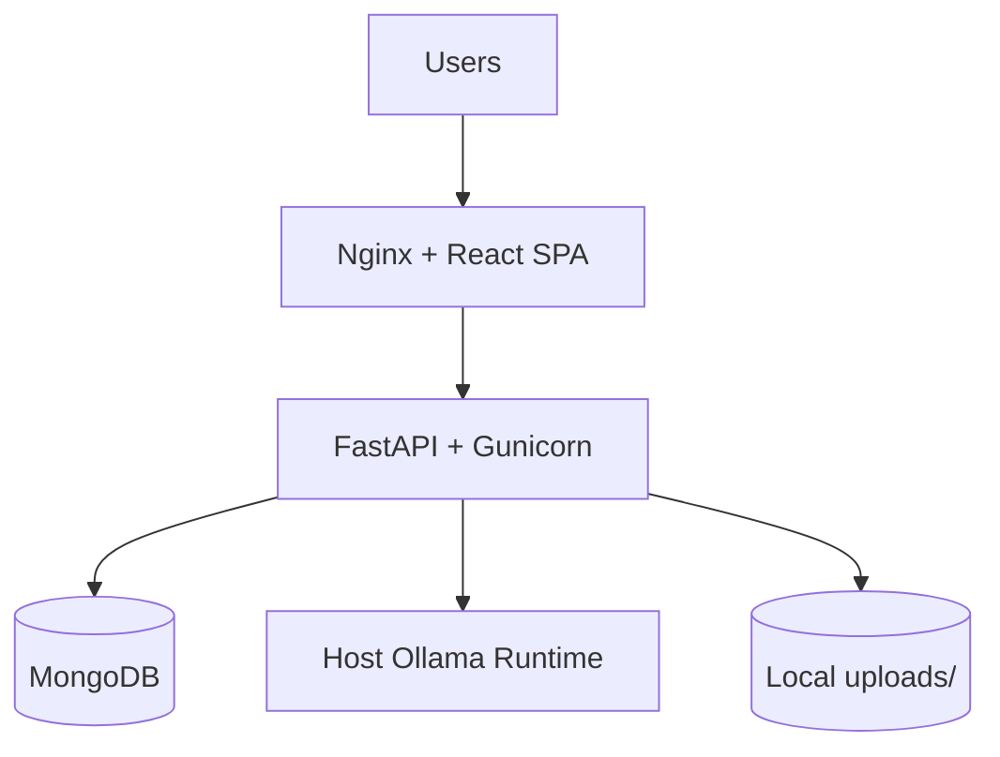
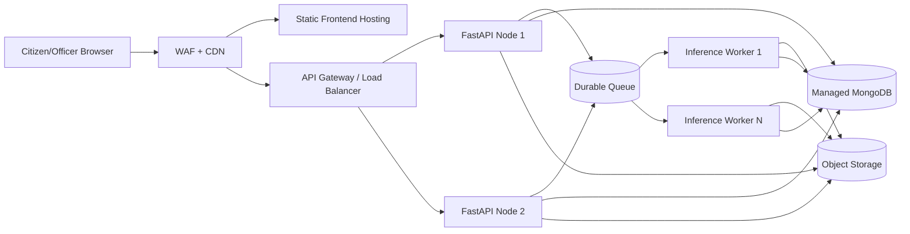
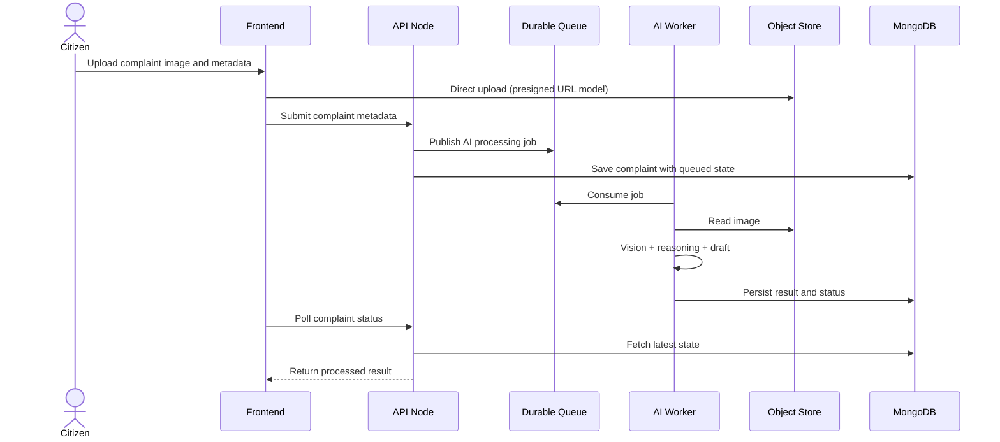

# Production Deployment Plan

This plan describes the path from the current deployment model to a larger-scale production architecture.

## Current Production-Style Baseline

The repository already supports a production Compose profile with:

- Frontend static build served by Nginx.
- Backend served via Gunicorn/Uvicorn workers.
- MongoDB container with healthchecks.
- API version aliasing (`/api/v1`).
- Host Ollama integration via `host.docker.internal`.

## Baseline Architecture

## Why Further Hardening Is Needed

As citizen traffic grows, the following constraints become critical:

- In-memory LLM queue is not durable across backend restarts.
- Uploaded files are local filesystem dependent.
- Single backend service limits horizontal scaling.
- Ollama inference and API share close coupling.

## Target Architecture (Scale-Oriented)

## Evolution Path

## Phase 1: Harden Current Stack (Immediate)

1. Enforce production secrets and CORS allowlist.
2. Add centralized log collection.
3. Validate backup/restore regularly.
4. Use `/api/v1` for all external integration contracts.

## Phase 2: Decouple Heavy Inference

1. Move generation jobs from in-memory queue to Redis/RabbitMQ.
2. Introduce dedicated worker process for AI jobs.
3. Keep backend API responsive during model pressure.

## Phase 3: Storage and Data Reliability

1. Shift image persistence from local disk to object storage.
2. Move MongoDB to managed or replicated topology.
3. Add disaster recovery drills and retention policy.

## Phase 4: Horizontal Scale

1. Run multiple backend replicas behind load balancer.
2. Autoscale inference workers based on queue depth.
3. Add synthetic probes for health and latency SLOs.

## Runtime Sequence (Target)

## Operational KPIs for Production Readiness

| KPI | Target |
| --- | --- |
| API p95 (non-analyze) | < 500 ms |
| Analyze success ratio | >= 95% (excluding controlled 429 policy) |
| Queue durability | No job loss on API restart |
| Daily backup success | 100% |
| Security regression suite | Passing on every release |

## Risks and Mitigation

| Risk | Mitigation |
| --- | --- |
| Ollama host not reachable from containers | Validate host gateway and explicit `OLLAMA_BASE_URL` |
| Queue backlog during peaks | Scale workers and tune job timeout |
| Local disk growth from uploads | Move to object storage with lifecycle policy |
| Misconfigured origin policy | Strict environment-specific `ALLOWED_ORIGINS` validation |

## Decision Summary

Current Compose production mode is suitable for controlled institutional rollout. For city-scale traffic, prioritize durable queueing, decoupled GPU workers, and managed persistence as the next major architecture step.
