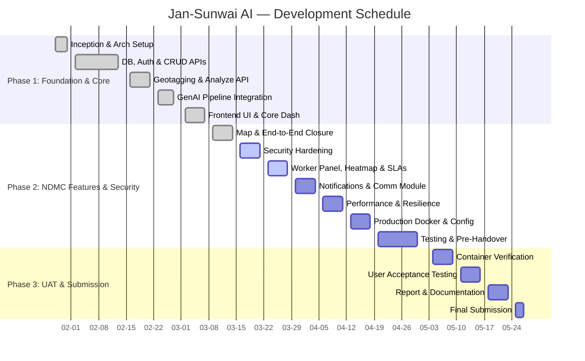
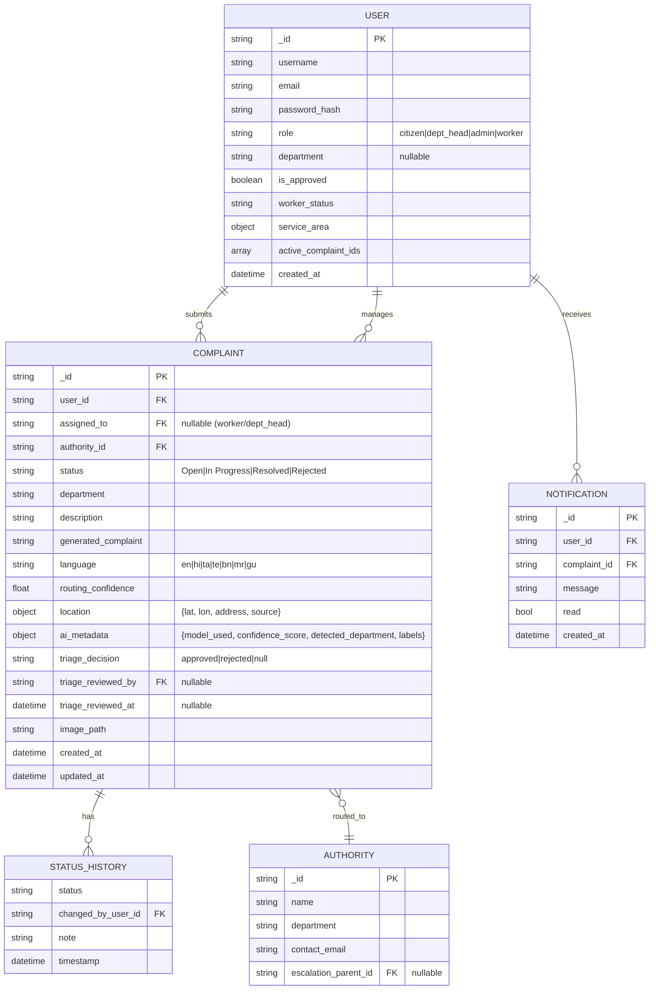
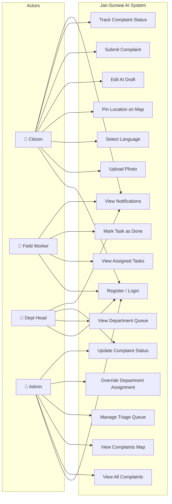
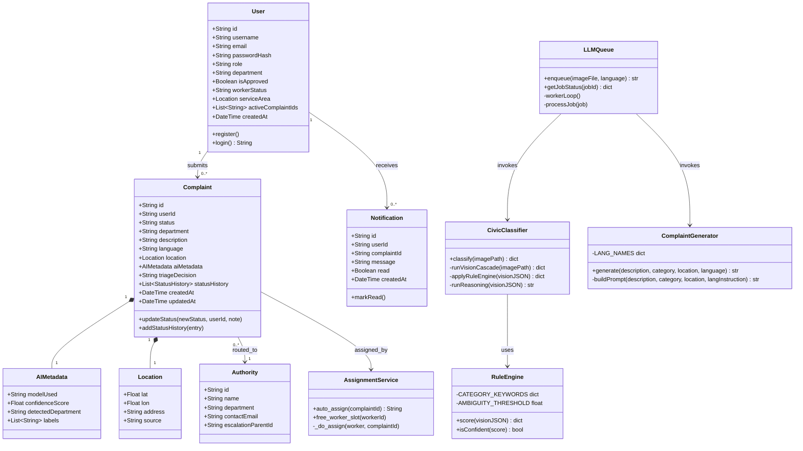
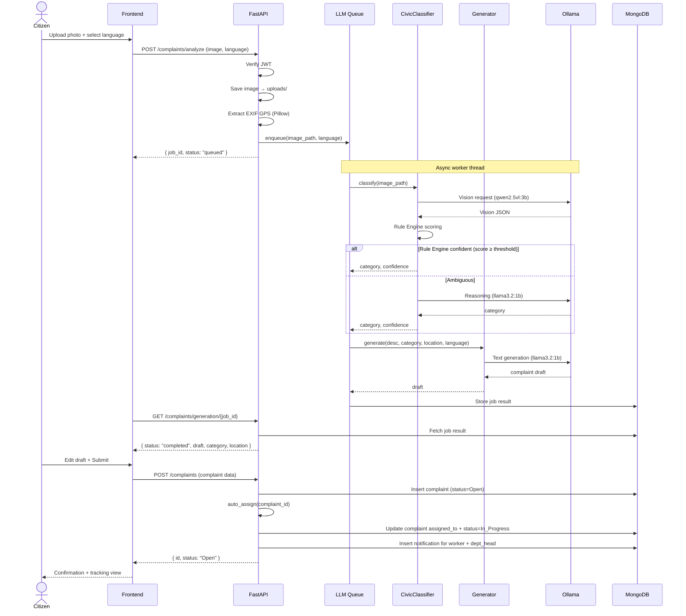
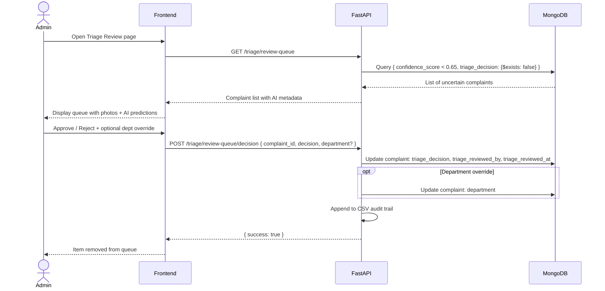
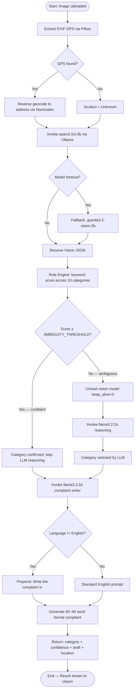
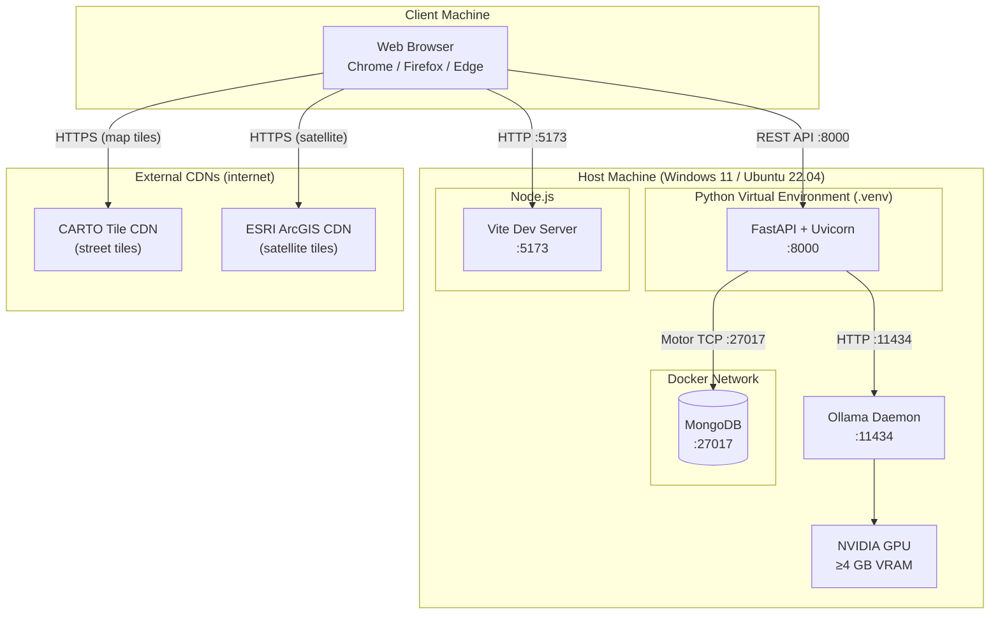

# Jan-Sunwai AI — Project Report

> **Automated Visual Classification & Routing of Civic Grievances using Local Vision-Language Models**

---

## Table of Contents

- [List of Figures](#list-of-figures)
- [List of Tables](#list-of-tables)
- [List of Abbreviations](#list-of-abbreviations)
- [List of Definitions](#list-of-definitions)
- [List of Screenshots](#list-of-screenshots)
- [Introduction](#introduction)
1. [Project Details](#1-project-details)
2. [Project Management](#2-project-management)
3. [System Requirement Study](#3-system-requirement-study)
4. [Proposed System Requirements](#4-proposed-system-requirements)
5. [System Design](#5-system-design)
6. [Database Design](#6-database-design)
7. [Implementation Planning](#7-implementation-planning)
8. [Testing](#8-testing)
9. [Limitations and Future Scope](#9-limitations-and-future-scope)
10. [Conclusion and References](#10-conclusion-and-references)
11. [Appendices](#11-appendices)
12. [Report Verification Procedure](#12-report-verification-procedure)

---

## List of Figures
- Figure 1: Jan-Sunwai AI — Development Schedule (Gantt Chart)
- Figure 2: System Architecture Design
- Figure 3: E-R Diagram
- Figure 4: Use Case Diagram
- Figure 5: Class Diagram
- Figure 6: Sequence Diagram — Complaint Submission
- Figure 7: Sequence Diagram — Admin Triage Decision
- Figure 8: Activity Diagram — AI Classification Pipeline
- Figure 9: DFD — Level 0 (Context Diagram)
- Figure 10: DFD — Level 1
- Figure 11: Deployment Diagram

## List of Tables
- Table 1: Objectives
- Table 2: Technology Stack Used
- Table 3: Existing Civic Grievance Systems in India
- Table 4: Technical Feasibility
- Table 5: Time Schedule Feasibility
- Table 6: Milestones & Deliverables
- Table 7: Roles & Responsibilities
- Table 8: Existing System Overview
- Table 9: User Characteristics
- Table 10: Functional Requirements
- Table 11: Non-Functional Requirements
- Table 12: Hardware & Software Requirements
- Table 13: Constraints
- Table 14: System Features mapping
- Table 15: Application Database Schema
- Table 16: Users Collection Data Dictionary
- Table 17: Complaints Collection Data Dictionary
- Table 18: Implementation Environment
- Table 19: Tools & Technologies Used
- Table 20: Unit Testing Coverage
- Table 21: Integration Testing Cases
- Table 22: System Testing Cases
- Table 23: User Acceptance Testing (UAT)
- Table 24: Defect Logging

## List of Abbreviations
- **AI**: Artificial Intelligence
- **API**: Application Programming Interface
- **CPGRAMS**: Centralized Public Grievance Redress and Monitoring System
- **DFD**: Data Flow Diagram
- **EXIF**: Exchangeable Image File Format
- **GPS**: Global Positioning System
- **GUI**: Graphical User Interface
- **JWT**: JSON Web Token
- **LLM**: Large Language Model
- **MoHUA**: Ministry of Housing and Urban Affairs
- **PII**: Personally Identifiable Information
- **SLA**: Service Level Agreement
- **UAT**: User Acceptance Testing
- **UI**: User Interface
- **ULB**: Urban Local Body
- **VLM**: Vision-Language Model

## List of Definitions
- **Civic Grievance**: A formal complaint raised by a citizen concerning public infrastructure or services.
- **Geotagging**: The process of adding geographical identification metadata to a photograph.
- **Triage Queue**: A system feature where complaints with borderline or low-confidence AI classifications are sent for manual human review and assignment.
- **Self-Hosted Deployment**: Hosting the application and AI models entirely on private or local infrastructure rather than relying on third-party cloud APIs.

## List of Screenshots
*(See GUI Design section (#64) or `docs/GUI_WIREFRAMES.md` for full references)*
- Screenshot 1: Citizen Upload & Result Interface
- Screenshot 2: Interactive Geolocation Map View
- Screenshot 3: Department Head Dashboard
- Screenshot 4: Administrator Triage Queue
- Screenshot 5: Multilingual Complaint Draft

## Introduction

Jan-Sunwai AI is a full-stack civic grievance management platform designed to simplify the reporting of public infrastructure and civic service problems such as potholes, garbage accumulation, waterlogging, broken street lights, unsafe electrical wiring, drainage blockage, traffic obstructions, and other public safety issues.

Traditional grievance systems are generally form-driven. They depend heavily on manual input from the citizen and assume that the user understands administrative boundaries such as whether the issue belongs to municipal sanitation, road maintenance, electricity distribution, transport authorities, or law enforcement. Because of this, many complaints are either incomplete or routed to the wrong authority. Such delays reduce the effectiveness of grievance redressal and discourage public participation in civic reporting.

The proposed system addresses this challenge by allowing a citizen to upload a photograph of the civic issue through a web-based interface. The uploaded image is analyzed using locally running vision-language models that generate a structured understanding of the scene. The system then applies rule-based category mapping to identify the most appropriate civic department. After classification, the platform extracts geolocation details, generates a formal complaint draft in the selected language, stores the complaint in the database, and routes it to the appropriate authority for review and action.

An important characteristic of the project is that the complete AI pipeline is designed to run locally through Ollama rather than relying on remote cloud APIs. This reduces operational cost, improves privacy, and keeps citizen data under local administrative control. By converting an image into a structured civic complaint workflow, the system reduces user effort while also improving the quality of information received by officials.

---

## 1. Project Details

### 1.1 Purpose

Jan-Sunwai AI addresses a critical gap in India's civic grievance redressal ecosystem. Citizens frequently struggle to identify:
- **Which government department** handles their specific problem
- **How to formally articulate** their complaint in written language

This platform solves both challenges using locally-running Vision-Language Models (VLMs) and a deterministic rule engine — requiring no cloud API keys, no paid subscriptions, and no external data transmission.

A citizen photographs a broken streetlight, a pothole, or garbage dumping. The system:
1. Identifies the issue from the photo
2. Selects the correct government department
3. Extracts GPS location from the photo's EXIF data
4. Drafts a formal complaint letter in the citizen's preferred language
5. Routes it to the appropriate department authority

---

### 1.2 Scope

- Citizens anywhere in India can submit civic complaints by photographing the issue
- System covers **10 civic categories** spanning Municipal, Police, Utility, and State Transport departments
- Multilingual complaint generation in **7 Indian languages** (English, Hindi, Tamil, Telugu, Bengali, Marathi, Gujarati)
- **Role-based access** for Citizens, Department Heads, and Administrators
- **Interactive map** for geotagging complaints with street and satellite view
- **Human triage queue** for low-confidence AI classifications (confidence < 0.65)
- Fully **self-hosted** — no external API dependencies for core functionality

---

### 1.3 Objectives

| # | Objective | Target |
|---|---|---|
| O-1 | Reduce complaint filing time | From ~30 minutes (manual) to under 2 minutes |
| O-2 | AI classification accuracy | > 80% mean confidence on real civic images |
| O-3 | Eliminate misrouting | Automated department assignment via AI + rule engine |
| O-4 | Real-time tracking | Status updates with SLA countdown per complaint |
| O-5 | Language accessibility | Multilingual drafts for non-English-speaking citizens |
| O-6 | Human oversight | Triage queue for admin review of uncertain AI decisions |
| O-7 | Privacy | All AI inference local; no citizen data sent to external servers |

---

### 1.4 Technology Stack Used

| Layer | Technology | Version |
|---|---|---|
| Backend Framework | FastAPI + Uvicorn | 0.110+ |
| Language | Python | 3.13 |
| Frontend Framework | React | 18.x |
| Build Tool | Vite | 4.4 |
| CSS Framework | Tailwind CSS | v4 |
| Map Library | react-map-gl + MapLibre GL | v7 + v3 |
| Database | MongoDB | 7.x (Docker) |
| Async DB Driver | Motor | 3.x |
| Auth | JWT — OAuth2 Password Flow | — |
| AI Runtime | Ollama | latest |
| Vision Model (primary) | qwen2.5vl:3b | 3 billion params |
| Vision Model (fallback) | granite3.2-vision:2b | 2 billion params |
| Reasoning + Writer Model | llama3.2:1b | 1 billion params |
| Containerization | Docker + Docker Compose | latest |
| Version Control | Git + GitHub | — |

---

### 1.5 Literature Review

#### 1.5.1 Existing Civic Grievance Systems in India

| System | Strengths | Weaknesses |
|---|---|---|
| **CPGRAMS** (national unified portal) | Covers all central ministries | Manual form-filling; no image upload; no AI routing |
| **MyGov** | Large citizen base | Engagement platform, not complaint routing |
| **Swachhata App** (MoHUA) | Sanitation-specific; geolocation support | Narrow scope; no vision AI; English-only |
| **State-specific apps** (e.g. BBMP, Chennai Corporation) | City-optimised | Siloed per city; no AI; no cross-department routing |
| **WhatsApp Chatbots** (some ULBs) | Accessible interface | Manual routing by human operators; not scalable |

None of the above systems use computer vision to automatically identify and classify civic issues from photos.

#### 1.5.2 Related Technical Research

- **Vision-Language Models for scene understanding**: Qwen2.5-VL, LLaVA, and InternVL demonstrate strong civic scene understanding — recognising potholes, drainage overflow, electrical hazards, and garbage from a single image without fine-tuning.
- **Hybrid classification (rules + LLM)**: For well-defined, low-cardinality categories (10 civic departments), deterministic keyword scoring outperforms neural classifiers in speed and explainability. The hybrid approach (vision context → rule engine → LLM fallback) is novel for the civic domain.
- **Multilingual instruction-following**: Small models (1–3B params) show acceptable instruction-following in Hindi, Bengali, and Tamil when explicitly prompted with language directives. Quality degrades for lower-resource languages (Gujarati, Telugu) but remains usable.
- **On-device inference for government applications**: Cloud-based Vision APIs (GPT-4V, Gemini Vision) raise data sovereignty concerns for applications handling citizen PII. Local Ollama inference eliminates this risk, with no per-call cost at scale.
- **EXIF Geolocation**: Smartphone photos embed GPS coordinates in EXIF metadata (ISO 14495 / JEITA EXIF 2.3). PIL/Pillow provides reliable extractor cross-platform.

---

## 2. Project Management

### 2.1 Feasibility Study

#### 2.1.1 Technical Feasibility

| Aspect | Assessment |
|---|---|
| AI models run on 4 GB GPU | ✅ qwen2.5vl:3b (3.2 GB) and llama3.2:1b (1.3 GB) run sequentially; never simultaneously |
| MongoDB document model fits complaint structure | ✅ Nested `location`, `ai_metadata`, `status_history` map naturally |
| React + MapLibre GL with Vite 4 | ✅ maplibre-gl v3 (CJS build) is Vite 4 compatible; v5 is not |
| FastAPI async performance | ✅ Motor + asyncio handles concurrent complaint submissions without blocking |
| **Risk**: 4 GB VRAM exhaustion | ⚠️ Mitigated by sequential model loading and `keep_alive=0` unloading after inference |

#### 2.1.2 Time Schedule Feasibility

The project was scoped for an 8-week development cycle:

| Week | Activities |
|---|---|
| 1–2 | Architecture design, AI model benchmarking, MongoDB schema |
| 3–4 | FastAPI backend, auth, complaint CRUD, routing |
| 5–6 | Frontend pages, map integration, dashboards |
| 7 | Triage queue, multilingual support, SLA badges, notifications |
| 8 | Testing, bug fixes, documentation |

All milestones completed within the planned schedule.

#### 2.1.3 Operational Feasibility

- **Citizens** need only a modern smartphone browser and a camera — no app installation
- **Department heads** require no technical training; dashboard is designed for non-technical staff
- **Self-hosted deployment** eliminates per-query cloud costs; total infrastructure cost is a single server/workstation
- **Maintenance**: Ollama model updates are optional; MongoDB and Vite updates follow standard procedures

#### 2.1.4 Implementation Feasibility

- All components are open-source with active community support and permissive licenses
- Docker isolates MongoDB from the host OS — no manual database installation
- One-command setup scripts (`setup.ps1` / `setup.sh`) automate the full environment
- No vendor lock-in: tile providers, AI models, and the database can all be swapped via environment variables

---

### 2.2 Development Approach & Justification

**Chosen Approach: Iterative Incremental Development**

Each feature was developed, integrated, and tested before the next feature began. Rationale:

1. The AI pipeline required empirical tuning (model selection, timeout values, confidence thresholds) that could not be fully designed upfront
2. The map library required a mid-project migration (Leaflet → MapLibre GL) when performance issues emerged with 500+ complaint markers
3. The triage queue design changed from static CSV to live MongoDB queries after integration testing revealed the original approach never surfaced API-submitted complaints
4. Confidence threshold (0.65) was derived empirically from the 200-image dataset evaluation, not from initial design

Iterative development allowed each of these discoveries to be acted on without derailing the overall schedule.

---

### 2.3 Milestones & Deliverables

| # | Milestone | Deliverable | Status |
|---|---|---|---|
| M1 | AI Pipeline prototype | Vision + Rule Engine + Writer working end-to-end | ✅ Complete |
| M2 | Backend API | Auth, complaints, routing, health endpoints | ✅ Complete |
| M3 | Frontend core | Login, upload, result, complaint submission | ✅ Complete |
| M4 | Interactive map | MapLibre + EXIF GPS + manual pin-drop + satellite toggle | ✅ Complete |
| M5 | Role dashboards | Citizen, Dept Head, Admin dashboards | ✅ Complete |
| M6 | Multilingual output | Language param through full pipeline | ✅ Complete |
| M7 | Live triage queue | MongoDB-backed human review queue | ✅ Complete |
| M8 | SLA + notifications | SLA countdown, resolution date, in-app alerts | ✅ Complete |
| M9 | Documentation | README, schema, architecture, project report | ✅ Complete |

---

### 2.4 Roles & Responsibilities

| Role | Responsibilities |
|---|---|
| Full-Stack Developer | FastAPI API design, React component development, MongoDB schema design, Docker configuration |
| AI/ML Engineer | Ollama pipeline architecture, vision model selection and benchmarking, rule engine tuning, language support |
| DevOps | Setup scripts (Windows + Linux), Docker Compose, environment configuration, deployment documentation |
| QA Engineer | Integration tests (pytest), schema validation, triage queue testing, dataset evaluation |

---

### 2.5 Group Dependencies

```
MongoDB container must be running  ──► Backend can start
Ollama daemon must be running      ──► /complaints/analyze endpoint works
Backend API at :8000               ──► Frontend can function
Internet connectivity              ──► Map tiles render (CARTO/ESRI CDNs)
NVIDIA GPU + drivers               ──► GPU-accelerated inference (CPU fallback available)
```

---

### 2.6 Project Scheduling (Gantt Chart)



---

## 3. System Requirement Study

### 3.1 Existing System Overview

Current civic grievance mechanisms in India:

| Mechanism | How It Works | Typical Turnaround |
|---|---|---|
| Paper complaint boxes | Physical form at office; manually routed by clerk | Days to weeks |
| CPGRAMS web portal | Citizen fills online form; manually selects ministry | 30 days (mandated); often longer |
| Department phone hotlines | Spoken complaint; logged by operator | Varies |
| WhatsApp chatbots (ULBs) | Message photo/text; human operator routes | Hours to days |
| State mobile apps | Department-specific apps; citizen picks category | Varies |

---

### 3.2 Limitations of the Existing System

1. **Manual department identification**: Citizens must know that a broken streetlight is "Municipal - Street Lighting" and not "Utility - DISCOM" — this is non-obvious
2. **No image evidence**: Most portals accept only text; photographic evidence must be attached separately and is rarely analysed
3. **Language barrier**: Government portals are predominantly English; regional language support is inconsistent
4. **No real-time tracking**: Citizens receive acknowledgment numbers but rarely receive status updates
5. **No GPS integration**: Location is described in free text ("near City Bus Stand"), leading to ambiguity for field workers
6. **High effort barrier**: Filing a complaint on CPGRAMS takes 20–40 minutes including department selection and formal writing
7. **Siloed portals**: Water, roads, electricity, and police each have separate portals/apps
8. **No AI quality control**: Misfiled complaints sit unactioned in the wrong department's queue for months

---

### 3.3 User Characteristics

| User Type | Technical Skill | Primary Device | Language Preference | Usage Pattern |
|---|---|---|---|---|
| Citizen (urban) | Medium | Smartphone + Desktop | English / Regional | 1–5 complaints per year |
| Citizen (semi-urban/rural) | Low | Smartphone only | Regional language | Occasional |
| Field Worker | Low to Medium | Smartphone only | Regional language | Daily, resolving assigned tasks |
| Department Head | Medium | Desktop/Laptop | English | Daily, queue management |
| Administrator | High | Desktop/Laptop | English | Daily, triage + oversight |

---

### 3.4 Functional Requirements

| ID | Requirement | Priority |
|---|---|---|
| FR-01 | Citizen shall register and log in with email and password | Must Have |
| FR-02 | Citizen shall upload a photo of a civic issue | Must Have |
| FR-03 | System shall extract GPS from image EXIF data when available | Must Have |
| FR-04 | System shall classify the civic issue using a Vision-Language Model | Must Have |
| FR-05 | System shall skip LLM reasoning when the rule engine is confident | Must Have |
| FR-06 | System shall generate a formal complaint letter in the selected language | Must Have |
| FR-07 | Citizen shall edit the AI-generated draft before submission | Must Have |
| FR-08 | Citizen shall manually pin a location on an interactive map | Must Have |
| FR-09 | System shall save the complaint with status "Open" and route to the appropriate department | Must Have |
| FR-10 | Citizen shall track the status of their complaints in real time | Must Have |
| FR-11 | Department head shall view and update complaints assigned to their department | Must Have |
| FR-12 | Admin shall view all complaints across all departments | Must Have |
| FR-13 | System shall present a triage queue for complaints with AI confidence < 0.65 | Must Have |
| FR-14 | Admin shall approve/reject triage items and optionally override department | Must Have |
| FR-15 | System shall send in-app notifications to citizens on status changes | Should Have |
| FR-16 | System shall display SLA countdown for active complaints; resolution date for resolved ones | Should Have |
| FR-17 | System shall display complaints on an interactive map with street/satellite toggle | Should Have |
| FR-18 | System shall support complaint regeneration in a different language | Could Have |

---

### 3.5 Non-Functional Requirements

| ID | Category | Requirement | Target |
|---|---|---|---|
| NFR-01 | Performance | AI classification response time | < 60 seconds on 4 GB VRAM GPU |
| NFR-02 | Availability | Uptime during working hours | 99% (excluding planned maintenance) |
| NFR-03 | Security | Password storage | bcrypt hashed; never plaintext |
| NFR-04 | Security | API access | JWT authentication on all protected endpoints |
| NFR-05 | Security | CORS | Restricted to configured `ALLOWED_ORIGINS` |
| NFR-06 | Scalability | LLM queue workers | Configurable via `LLM_QUEUE_WORKERS` env var |
| NFR-07 | Usability | Complaint submission | Completable in under 3 minutes |
| NFR-08 | Usability | Mobile responsiveness | Full functionality on smartphone browsers |
| NFR-09 | Maintainability | AI model swap | Via environment variable, no code changes |
| NFR-10 | Localization | Language support | 7 languages (en, hi, ta, te, bn, mr, gu) |
| NFR-11 | Privacy | Data sovereignty | All AI inference local; no PII to external APIs |
| NFR-12 | Accuracy | Classification confidence | > 80% mean confidence on civic image dataset |
| NFR-13 | Logging | Error tracking | Rotating log file (5 MB max, `backend/logs/app.log`) |

---

### 3.6 Hardware & Software Requirements

**Server / Development Machine:**

| Component | Minimum | Recommended |
|---|---|---|
| GPU | NVIDIA 4 GB VRAM | NVIDIA 6+ GB VRAM |
| RAM | 12 GB | 16 GB |
| Storage | 10 GB free | 20 GB free |
| OS | Windows 10+ / Ubuntu 20.04+ | Windows 11 / Ubuntu 22.04 |
| CPU | Any modern x64 | 6+ cores |

**Client (Citizen's Browser):**

- Chrome 90+, Firefox 88+, or Edge 90+
- Internet connection (for map tile rendering; not required for complaint submission itself)
- Smartphone camera (for photo capture)

**Software Prerequisites:**

| Software | Purpose |
|---|---|
| Python 3.11+ | Backend runtime |
| Node.js 18+ | Frontend build + dev server |
| Docker Desktop / Docker Compose | MongoDB container |
| Ollama | Local LLM inference daemon |
| NVIDIA GPU drivers | GPU-accelerated model inference |

---

### 3.7 Constraints

#### 3.7.1 UI Constraints

- Map is locked to India's geographic bounds (`[[67°E, 6°N], [98°E, 38°N]]`) — cannot pan outside India
- Photo upload accepts JPEG, PNG, and WEBP only
- Language selector is limited to 7 supported languages

#### 3.7.2 Communication Interface

| Interface | Protocol | Endpoint |
|---|---|---|
| Frontend ↔ Backend | HTTP REST (JSON + multipart/form-data) | `http://localhost:8000` |
| Backend ↔ MongoDB | Motor async TCP | `mongodb://localhost:27017` |
| Backend ↔ Ollama | HTTP REST | `http://localhost:11434` |
| Browser ↔ Map tiles | HTTPS | CARTO / ESRI CDNs (internet) |

#### 3.7.3 Hardware Interface

- EXIF GPS extraction requires photos taken on GPS-enabled devices (all modern smartphones qualify)
- NVIDIA CUDA drivers required for GPU inference; CPU fallback is automatic but ~10× slower
- Minimum screen resolution: 375×667 px (iPhone SE equivalent)

#### 3.7.4 Criticality of Application

- **Severity of incorrect routing**: Medium — misfiled complaint is delayed, not lost; admin can override via triage queue
- **Safety**: No life-safety decisions are automated; all AI outputs are human-reviewable before submission; the triage queue provides a safety net for uncertain classifications
- **Data sensitivity**: Citizen contact details and complaint photos are stored; GDPR/PDPB-equivalent discretion applies

#### 3.7.5 Safety & Security Considerations

- JWT tokens have configurable expiry; no long-lived tokens
- Passwords stored as bcrypt hashes (cost factor 12); never logged or returned in API responses
- MongoDB accessed via Motor (parameterised queries); no raw string interpolation in queries
- CORS restricted to `ALLOWED_ORIGINS`; rejects cross-origin requests from unlisted domains
- Uploaded filenames are sanitised server-side before saving to disk
- No user PII or image data transmitted to any external service; all AI inference runs on `localhost:11434`
- Input validation via Pydantic on all API request bodies

#### 3.7.6 Assumptions & Dependencies

- Ollama daemon is installed and running before backend startup
- NVIDIA GPU drivers are installed for GPU-accelerated inference (CPU fallback exists)
- MongoDB is reachable at the configured URL at backend startup
- Internet connectivity is available for map tile rendering (CARTO/ESRI)
- Python 3.11+ and Node.js 18+ are present on the host machine

---

## 4. Proposed System Requirements

### 4.1 Overview of Proposed System

Jan-Sunwai AI is a locally-hosted, AI-powered civic grievance platform with three layers:

1. **Citizen layer**: Photo upload → AI classification + draft letter → submission → status tracking
2. **Department layer**: Queue of assigned complaints → status update → SLA monitoring
3. **Admin layer**: All complaints + triage queue + full map view + department override

The AI pipeline runs entirely on the local machine using Ollama. No complaint data, photos, or citizen PII leave the server hosting the application.

---

### 4.2 Module Descriptions

| Module | Files | Description |
|---|---|---|
| **Auth** | `app/auth.py`, `routers/users.py` | JWT-based registration, login, token verification; role-based access control |
| **Image Analysis** | `app/classifier.py`, `app/geotagging.py` | EXIF GPS extraction; 4-step AI pipeline (Vision → Rule Engine → Reasoning → Writer) |
| **LLM Queue** | `app/services/llm_queue.py` | Async job queue with configurable workers; decouples HTTP response from slow LLM inference; job polling |
| **Complaint Management** | `routers/complaints.py`, `app/schemas.py` | CRUD; status lifecycle; status history log; role-filtered list views |
| **Worker Assignment** | `app/services/assignment.py`, `routers/workers.py` | Geo-aware auto-assignment engine; worker approval; bulk re-assignment |
| **Authority Routing** | `app/authorities.py`, `app/category_utils.py` | Maps AI category → authority record; sets `authority_id` and `routing_confidence` |
| **Triage** | `routers/triage.py` | Live MongoDB queue (confidence < 0.65); admin decision stamping; CSV audit trail |
| **Notifications** | `routers/notifications.py` | In-app alerts on status changes; mark-read endpoint |
| **Map** | `pages/ComplaintsMap.jsx` | Complaint density map; GeoJSON source; street/satellite toggle; India bounds |
| **Pin-drop Map** | `pages/Result.jsx` | Submission-time map; manual GPS pin-drop; EXIF auto-fill; street/satellite toggle |
| **Language** | `app/generator.py`, `app/services/llm_queue.py` | Language code propagated from API → job → prompt; `_LANG_NAMES` dict; language instruction prepended |
| **Dashboard** | `pages/CitizenDashboard.jsx`, `AdminDashboard.jsx`, `DeptHeadDashboard.jsx` | Role-specific views with stats, SLA badges, and resolution dates |

---

### 4.3 System Features

1. **AI-Powered Classification**: Vision model reads scene context; rule engine confirms clear cases instantly (zero VRAM); LLM reasoning invoked only when ambiguous
2. **Multilingual Complaint Drafting**: Formal 60–90 word letters in 7 languages; editable before submission; regeneration with different language
3. **Automatic GPS Extraction**: EXIF coordinates parsed from uploaded photo; Nominatim reverse geocoding to street address; map pin-drop as fallback
4. **Geo-Aware Field Worker Assignment**: Complaints are automatically distributed to field workers based on department match, minimal task load, and Haversine geo-distance to the worker's service area.
4. **Real-time Status Tracking**: Complaint lifecycle (Open → In Progress → Resolved/Rejected); SLA countdown badge; resolution date on closed complaints
5. **Human-in-the-Loop Triage**: Low-confidence complaints (< 0.65) surface to admin review queue; admin can approve, reject, or override department; decisions stamped on MongoDB document + CSV audit
6. **Interactive Map**: Street and satellite view toggle; complaint density via GeoJSON layer; click-to-popup with department and status; filtered by status or priority; India bounds enforced
7. **Role-Based Access Control**: Three distinct interfaces — no role can access another's endpoints

---

### 4.4 Advantages of Proposed System

| Limitation of Existing System | How Jan-Sunwai AI Addresses It |
|---|---|
| Citizen must identify department | Automated by AI — citizen never picks a department |
| No image evidence | Photo is the primary input; stored as immutable evidence |
| Language barrier | Formal draft generated in 7 Indian languages |
| No real-time tracking | Live status with SLA countdown and lifecycle log |
| No GPS integration | EXIF extraction + interactive map pin-drop; reverse geocoded to address |
| High filing effort (~30 min) | End-to-end under 2 minutes |
| Siloed department portals | Single unified platform for all 10 civic categories |
| No AI quality control | Triage queue with human review for uncertain classifications |
| Cloud data sovereignty risk | 100% local inference; no citizen data leaves the server |

---

## 5. System Design

### 5.1 System Architecture Design

```
┌─────────────────────────────────────────────────────────────────┐
│  CITIZEN BROWSER  (http://localhost:5173)                        │
│                                                                   │
│  React 18 + Vite 4 + Tailwind CSS v4 + react-map-gl v7          │
│  • Login / Register            • Upload photo + select language  │
│  • Pin location on map         • Review + edit AI draft          │
│  • Submit complaint            • Track status + SLA badge        │
│  • Street / Satellite toggle   • In-app notifications            │
└────────────────────────────┬────────────────────────────────────┘
                              │  HTTP REST  (JSON + multipart)
                              ▼  http://localhost:8000
┌─────────────────────────────────────────────────────────────────┐
│  FASTAPI BACKEND  (Python 3.13 + Motor + JWT)                   │
│                                                                   │
│  Routers:                                                         │
│  POST /complaints/analyze         ← classify + draft            │
│  POST /complaints/analyze/regenerate ← new draft + language     │
│  GET|POST /complaints/            ← CRUD (role-filtered)        │
│  PATCH /complaints/{id}/status    ← lifecycle update            │
│  GET /triage/review-queue         ← low-confidence queue        │
│  POST /triage/review-queue/decision ← admin triage decision     │
│  GET|PATCH /notifications/        ← in-app alerts               │
│  POST /users/register|login       ← auth                        │
│  GET /health | /health/gpu        ← system status               │
└──────────────┬──────────────────────────┬───────────────────────┘
               │                          │
     ┌─────────▼──────────┐   ┌──────────▼──────────────────────┐
     │  MongoDB :27017    │   │  Ollama  :11434                  │
     │  (Docker)          │   │                                  │
     │  • users           │   │  Step 1 — Vision Cascade        │
     │  • complaints      │   │    qwen2.5vl:3b  (3.2 GB)       │
     │  • notifications   │   │    granite3.2-vision:2b          │
     └────────────────────┘   │    → structured JSON             │
                               │                                  │
                               │  Step 2 — Rule Engine (0 VRAM) │
                               │    keyword scoring               │
                               │    → skip LLM if confident      │
                               │                                  │
                               │  Step 3 — Reasoning (optional) │
                               │    llama3.2:1b                   │
                               │    → category selection          │
                               │                                  │
                               │  Step 4 — Writer               │
                               │    llama3.2:1b (multilingual)   │
                               │    → formal complaint draft      │
                               └──────────────────────────────────┘
```

---

### 5.2 UML Diagrams

#### 5.2.1 E-R Diagram



---

#### 5.2.2 Use Case Diagram



---

#### 5.2.3 Class Diagram



---

#### 5.2.4 Sequence Diagram — Complaint Submission



---

#### 5.2.5 Sequence Diagram — Admin Triage Decision



---

#### 5.2.6 Activity Diagram — AI Classification Pipeline



---

#### 5.2.7 DFD — Level 0 (Context Diagram)

```
                                     Jan-Sunwai AI
                    ┌────────────────────────────────────────┐
                    │                                        │
  Citizen ─────────►│  Photo + Language Selection            │
          ◄─────────│  AI Draft + Category + Location        │
          ◄─────────│  Status Updates + Notifications        │
                    │                                        │
  Dept Head ────────►│  Login + Status Update Actions        │
            ◄───────│  Assigned Complaint Queue              │
                    │                                        │
 Field Worker ──────►│  Login + View Active Tasks            │
              ◄─────│  Geo-assigned Complaints               │
                    │                                        │
  Admin ────────────►│  Login + Triage Decisions             │
         ◄──────────│  All Complaints + Triage Queue         │
                    │                                        │
                    └──────────────┬─────────────────────────┘
                                   │
                       ┌───────────┴────────────┐
                       ▼                        ▼
                   MongoDB                  Ollama
                (complaint store)      (local AI inference)
```

---

#### 5.2.8 DFD — Level 1

```
  Citizen ──[image + language]──────────► ┌──────────────────────┐
                                           │  Process 1           │
  Citizen ◄──[draft + classification]────  │  Analyse & Classify  │ ──[vision req]──► Ollama
                                           │  (classifier.py +    │ ◄──[JSON]──────── Ollama
                                           │   generator.py)      │
                                           └──────────┬───────────┘
                                                      │ [job result]
                                           ┌──────────▼───────────┐
  Citizen ──[edited draft + submit]────►   │  Process 2           │ ──[insert]──► MongoDB
  Citizen ◄──[complaint ID]─────────────   │  Submit Complaint    │
                                           └──────────────────────┘

  Dept Head ──[login + status update]──► ┌──────────────────────┐
  Dept Head ◄──[department queue]───────  │  Process 3           │ ──[query/update]──► MongoDB
                                           │  Review & Update     │
                                           └──────────────────────┘

  Worker ─────[mark task done]─────────► ┌──────────────────────┐
  Worker ◄────[assigned tasks]──────────  │  Process 4           │ ──[query/update]──► MongoDB
                                           │  Worker Assignment   │
                                           └──────────────────────┘

  Admin ──[login + triage decision]──►   ┌──────────────────────┐
  Admin ◄──[low-confidence queue]──────   │  Process 5           │ ──[query/stamp]──► MongoDB
                                           │  Triage Queue        │
                                           └──────────────────────┘
```

---

#### 5.2.9 Deployment Diagram



---

## 6. Database Design

### 6.1 Table Design & Relationships

**Collection: `users`**

| Field | Type | Constraints | Description |
|---|---|---|---|
| `_id` | ObjectId | PK, auto-generated | MongoDB document identifier |
| `username` | String | Unique, required | Display name |
| `email` | String | Unique, required, lowercase | Login credential |
| `password_hash` | String | Required | bcrypt hash (never stored plaintext) |
| `role` | String | Enum | `citizen` / `dept_head` / `admin` / `worker` |
| `department` | String | Nullable | Set for `dept_head` and `worker` users |
| `is_approved` | Boolean | Default: `true` | Admins must approve new workers manually (`false` until approved) |
| `worker_status` | String | Nullable | Enum: `available` / `busy` / `offline` |
| `service_area` | Object | Nullable | Geo boundary for assignment: `{ lat, lon, radius_km, locality }` |
| `active_complaint_ids` | Array | Default: `[]` | List of complaint IDs currently handled by worker |
| `created_at` | DateTime | Auto, UTC | Registration timestamp |

---

**Collection: `complaints`**

| Field | Type | Constraints | Description |
|---|---|---|---|
| `_id` | ObjectId | PK, auto | |
| `user_id` | ObjectId | FK → users, required | Submitting citizen |
| `assigned_to` | ObjectId | FK → users, nullable | Admin/dept_head handling the complaint |
| `authority_id` | String | FK → authorities | Routed government authority |
| `status` | String | Enum, required | `Open` / `In Progress` / `Resolved` / `Rejected` |
| `department` | String | Required | Civic category (e.g. "Municipal - PWD (Roads)") |
| `description` | String | Required | Citizen's brief description |
| `generated_complaint` | String | | AI-drafted formal letter text |
| `language` | String | Default: `"en"` | Language code for the draft |
| `routing_confidence` | Float | 0.0–1.0 | Authority routing confidence score |
| `location` | Object | | `{lat, lon, address, source}` |
| `ai_metadata` | Object | | `{model_used, confidence_score, detected_department, labels}` |
| `triage_decision` | String | Nullable | `"approved"` / `"rejected"` — absent if not yet triaged |
| `triage_reviewed_by` | ObjectId | FK → users, nullable | Admin who made the triage decision |
| `triage_reviewed_at` | DateTime | Nullable | When triage decision was recorded |
| `status_history` | Array | | Append-only log of status transitions |
| `image_path` | String | | Server-relative path to the uploaded photo |
| `created_at` | DateTime | Auto | |
| `updated_at` | DateTime | Auto, updated on status change | |

---

**Collection: `notifications`**

| Field | Type | Constraints | Description |
|---|---|---|---|
| `_id` | ObjectId | PK, auto | |
| `user_id` | ObjectId | FK → users | Notification recipient |
| `complaint_id` | ObjectId | FK → complaints | Related complaint |
| `message` | String | Required | Human-readable notification text |
| `read` | Boolean | Default: `false` | Read/unread state |
| `created_at` | DateTime | Auto | |

---

### 6.2 Normalization

MongoDB is a document database; standard RDBMS normal forms do not directly apply. Design decisions and their rationale:

| Design Decision | Rationale |
|---|---|
| **Embed** `location`, `ai_metadata`, `status_history` in complaint | These have no independent existence; always fetched with the complaint; embedding avoids extra round-trips |
| **Reference** `user_id`, `assigned_to`, `authority_id` as ObjectIds | These entities have independent existence; avoids data duplication; allows user records to be updated without touching all complaints |
| **Denormalize** `department` string on complaint | Enables fast filtering by department without a join/lookup on `authority_id` |
| **Separate** `notifications` collection | Notifications grow independently of complaints; different access pattern (user reads all their notifications, not just one) |

The schema is effectively in **"3NF for documents"** — no transitive dependencies within embedded objects; references used for cross-document relationships.

---

### 6.3 Data Dictionary

| Term | Type | Definition |
|---|---|---|
| `confidence_score` | Float 0.0–1.0 | AI pipeline's certainty of the department classification. Values < 0.65 trigger the human triage queue. Values ≥ 0.65 are routed directly. |
| `triage_decision` | String or null | Admin's verdict: `"approved"` (AI classification correct, keep routing), `"rejected"` (wrong department or invalid complaint). Null/absent = not yet triaged. |
| `language` | ISO 639-1 code | Target language for the AI-generated complaint draft. Supported: `en` (English), `hi` (Hindi), `ta` (Tamil), `te` (Telugu), `bn` (Bengali), `mr` (Marathi), `gu` (Gujarati). |
| `status_history` | Array of objects | Immutable append-only audit trail of all status transitions. Each entry: `{status, changed_by_user_id, note, timestamp}`. Never deleted or modified. |
| `authority_id` | String | Reference to the government Authority record in `authorities.py`. Determines which dept_head sees the complaint. |
| `location.source` | Enum string | How GPS coordinates were obtained: `exif` (photo EXIF metadata), `device` (browser geolocation API), `manual` (user pin-drop on map). |
| `routing_confidence` | Float 0.0–1.0 | Confidence of the authority routing step — separate from `ai_metadata.confidence_score` (which is the classification confidence). |
| `ai_metadata.labels` | Array of strings | Keywords detected by the vision model and rule engine that contributed to the classification decision. Used for explainability and triage review. |
| `model_used` | String | Which AI model ultimately produced the classification (e.g. `"ollama/qwen2.5vl:3b"`, `"rule_engine"`, `"ollama/llama3.2:1b"`). |

---

## 7. Implementation Planning

### 7.1 Implementation Environment

| Item | Details |
|---|---|
| Primary OS | Windows 11 (development), Ubuntu 22.04 (tested) |
| IDE | VS Code with Python, Pylance, ESLint, Tailwind CSS IntelliSense |
| Version Control | Git + GitHub (`ark5234/Jan-Sunwai-AI`) |
| Python Package Management | pip + `requirements.txt` inside `.venv` virtual environment |
| Node Package Management | npm + `package.json` / `package-lock.json` |
| Database Isolation | Docker Desktop — MongoDB runs in a container; never installed on host |
| AI Inference | Ollama daemon running natively (Windows service / Linux systemd) |

---

### 7.2 Tools & Technologies Used

| Category | Tool | Version | Purpose |
|---|---|---|---|
| **Backend** | FastAPI | 0.110+ | REST API framework with automatic OpenAPI docs |
| | Uvicorn | 0.29+ | ASGI production web server |
| | Motor | 3.x | Async MongoDB driver |
| | Pydantic v2 | 2.x | Request/response validation + serialisation |
| | python-jose | 3.x | JWT creation and verification |
| | passlib[bcrypt] | 1.7+ | Password hashing |
| | Pillow | 10.x | EXIF GPS extraction from uploaded images |
| | httpx | 0.27+ | Async HTTP client for Ollama API calls |
| | geopy | 2.x | Reverse geocoding (Nominatim) |
| **Frontend** | React | 18.x | UI component framework |
| | Vite | 4.4 | Build tool + HMR development server |
| | Tailwind CSS | v4 | Utility-first CSS framework |
| | react-map-gl | 7.x | MapLibre GL wrapper for React |
| | maplibre-gl | 3.x | Map rendering engine (CJS, Vite 4 compatible) |
| | lucide-react | latest | SVG icon library |
| | react-router-dom | 7.x | Client-side routing |
| | axios | 1.x | Promise-based HTTP client |
| **AI** | Ollama | latest | Local LLM inference runtime |
| | qwen2.5vl:3b | 3B | Primary vision model (scene understanding → JSON) |
| | granite3.2-vision:2b | 2B | Fallback vision model |
| | llama3.2:1b | 1B | Reasoning + multilingual complaint writer |
| **Database** | MongoDB | 7.x | Document store (Docker container) |
| **DevOps** | Docker Compose | v2 | MongoDB container orchestration |
| **Testing** | pytest | 8.x | Python unit and integration tests |
| | httpx AsyncClient | | Async API integration testing client |

---

### 7.3 Coding Standards Followed

**Python (PEP 8 + project conventions):**
- Type hints on all function signatures (input + return types)
- `async`/`await` throughout — no synchronous blocking calls in request handlers
- Environment variables via `app/config.py` (Pydantic `Settings`); no hardcoded values
- Conventional commit messages: `feat:`, `fix:`, `docs:`, `refactor:`
- Pydantic models for all request and response bodies

**JavaScript / React:**
- Functional components only; no class components
- Hooks (`useState`, `useEffect`, `useCallback`, `useRef`) for all state and side-effects
- ES2020+ syntax; no CommonJS
- `async`/`await` for all fetch calls; error states handled explicitly

**API Design:**
- HTTP verbs match semantics: `GET` = read, `POST` = create, `PATCH` = partial update
- 422 returned for validation errors (Pydantic); 401 for auth failures; 403 for role violations
- All protected routes verify JWT via `Depends(get_current_user)` dependency

**Security (OWASP Top 10):**
- No SQL/NoSQL injection: Motor uses parameterised queries; no string interpolation in DB queries
- XSS: React's JSX escapes all dynamic content by default
- Broken Access Control: Role checks on every protected endpoint
- Cryptographic failures: bcrypt for passwords; JWT for session tokens
- SSRF: Ollama and MongoDB connections are `localhost` only; no user-controlled URLs in backend requests

---

## 8. Testing

### 8.1 Testing Plan

| Layer | Approach | Tool | Coverage |
|---|---|---|---|
| Schema validation | Automated unit tests | pytest | All Pydantic models |
| API endpoints | Automated integration tests | pytest + httpx | Auth, complaints, triage, notifications |
| AI pipeline | Dataset evaluation | Custom CLI script | 200 civic images |
| Full user flow | Manual end-to-end | Browser + test accounts | All 3 user roles |

---

### 8.2 Types of Testing

#### 8.2.1 Unit Testing

**Location:** `backend/tests/test_schemas.py`

Tests Pydantic model validation in isolation:
- Valid complaint payload accepted without error
- Missing required fields raise `ValidationError`
- Invalid status enum rejected
- Nested objects (`location`, `ai_metadata`) validated correctly

**Sample test:**
```python
def test_complaint_create_valid():
    data = ComplaintCreate(
        description="Pothole on main road",
        department="Municipal - PWD (Roads)",
        location={"lat": 12.97, "lon": 77.59, "address": "MG Road", "source": "manual"}
    )
    assert data.department == "Municipal - PWD (Roads)"

def test_complaint_invalid_status():
    with pytest.raises(ValidationError):
        ComplaintUpdate(status="InvalidStatus")
```

---

#### 8.2.2 Integration Testing

**Location:** `backend/tests/test_api_integration.py`

Tests API endpoints with a live test MongoDB instance:

| Test | Endpoint | Assertion |
|---|---|---|
| Register user | `POST /users/register` | 201 response; user in DB |
| Login + JWT | `POST /users/login` | 200 response; `access_token` returned |
| Submit complaint (authenticated) | `POST /complaints` | 201; complaint in DB with `status=Open` |
| Submit complaint (unauthenticated) | `POST /complaints` | 401 returned |
| Status update (dept_head) | `PATCH /complaints/{id}/status` | Status updated; history appended |
| Triage queue (empty) | `GET /triage/review-queue` | 200; empty list |
| Triage decision | `POST /triage/review-queue/decision` | `triage_decision` stamped on complaint |
| Mark notification read | `PATCH /notifications/{id}/read` | `read=true` in DB |

---

#### 8.2.3 System Testing

**AI Pipeline Evaluation — `backend/evaluate_sorted_dataset.py`**

Evaluated on 200 civic images (25 sampled per category) from the Kaggle civic dataset:

| Metric | Result |
|---|---|
| Images processed | 200 |
| Re-labelled by AI | 128 (64.0%) |
| Labels confirmed (unchanged) | 72 (36.0%) |
| Errors | 0 |
| Uncategorized | 9 / 200 (4.5%) |

**Confidence statistics:**

| Stat | Value |
|---|---|
| Mean confidence | 0.811 |
| Median confidence | 0.900 |
| Min | 0.000 |
| Max | 1.000 |

**Classification method breakdown:**

| Method | Count | % |
|---|---|---|
| `reasoning` (llama3.2:1b) | 194 | 97.0% |
| `keyword_fallback` (rule engine alone) | 2 | 1.0% |
| `error` | 4 | 2.0% |

> The 64% re-labelling rate reflects genuine noise in the original Kaggle labels — the AI correctly identifies misclassified images (e.g. broken lamp-posts labelled as "Horticulture"; open drains labelled as "Pollution Control Board").

---

#### 8.2.4 User Acceptance Testing (UAT)

Test accounts available in `docs/TEST_ACCOUNTS_CREDENTIALS.txt`.

| Role | Scenarios Tested | Result |
|---|---|---|
| Citizen | Register, log in, upload photo, view AI draft, edit draft, submit, track status, view map, change to satellite, view notifications | ✅ Pass |
| Field Worker | Register with service bounds, await admin approval, log in, view auto-assigned dashboard tasks, mark task as resolved | ✅ Pass |
| Dept Head | Log in, view department queue, update status to In Progress, update to Resolved, view own notifications | ✅ Pass |
| Admin | Log in, view all complaints, open triage queue, approve item, override department, trigger bulk worker re-assignment, view AI heatmap | ✅ Pass |

---

### 8.3 Testing Techniques

| Technique | Application |
|---|---|
| **Black-box** | API endpoints tested with valid and invalid inputs without knowledge of internal implementation |
| **Boundary value** | Confidence score boundary: 0.649 (appears in triage) vs. 0.650 (does not appear) |
| **Negative testing** | Invalid JWT tokens, wrong-role endpoint access, missing required fields, out-of-range coordinates |
| **Equivalence partitioning** | Status values: valid enum (`Open`, `In Progress`, `Resolved`, `Rejected`) vs. invalid string |
| **Regression** | After each bug fix, the specific failing scenario is re-tested before merge |

---

### 8.4 Defect Logging

| ID | Defect Description | Severity | Status | Resolution |
|---|---|---|---|---|
| D-01 | `Form` not imported in `complaints.py` — analyze endpoint failed with 500 | High | Fixed | Added `Form` to FastAPI imports |
| D-02 | `__publicField is not defined` — map render failed with maplibre-gl v5 + Vite 4 | High | Fixed | Downgraded to maplibre-gl v3 (CJS build, Vite 4 compatible) |
| D-03 | Triage queue always returned empty despite low-confidence complaints in DB | High | Fixed | Rewrote `/triage/review-queue` to query MongoDB live instead of reading static CSV |
| D-04 | `SLABadge` displayed "Resolved" text twice on resolved complaints | Medium | Fixed | SLABadge now renders resolution date from `updated_at` instead of a duplicate status chip |
| D-05 | ESRI satellite tiles showed "Map data not available" over rural India | Medium | Fixed | Switched default tiles to CARTO Voyager (full India coverage, English labels) |
| D-06 | OSM tiles showed Chinese and Arabic labels | Low | Fixed | Switched to CARTO Voyager (English-only labels) |
| D-07 | `Layers is not defined` — ComplaintsMap crash on load | High | Fixed | Added `Layers` to lucide-react import |
| D-08 | `STREET_STYLE is not defined` — ComplaintsMap crash | High | Fixed | Renamed `MAP_STYLE` → `STREET_STYLE`; added `SATELLITE_STYLE` constant |
| D-09 | Language param not reaching complaint writer | Medium | Fixed | Added `language` field to `LLMJob` dataclass; threaded through queue → generator → prompt |
| D-10 | Map marker disappears after `flyTo()` animation | Low | Fixed | Ensured `pinPos` state updates after `flyTo()` completes |

---

## 9. Limitations and Future Scope

### 9.1 Current Limitations

1. **GPU dependency**: AI classification requires an NVIDIA GPU for acceptable speed (< 60 seconds). CPU fallback is available but takes 5–10× longer.

2. **Official India map boundaries**: Default CARTO tiles do not show India's official territorial boundaries for J&K, Ladakh, and Arunachal Pradesh per GoI guidelines. Official compliance requires a Mappls/MapmyIndia API key.

3. **Single-server architecture**: The LLM queue runs in-process; MongoDB is a single node. Not suitable for high-traffic production deployments without architectural changes (horizontal scaling, MongoDB replica set).

4. **Small model limitations**: llama3.2:1b is a 1B-parameter model. Non-English output quality degrades for lower-resource languages (Gujarati, Telugu). A 7B+ model would produce higher quality but requires more VRAM.

5. **No push notifications**: Notifications are in-app only. Citizens must open the app to see updates. No email, SMS, or mobile push notification support.

6. **Static authority database**: Government authorities are hardcoded in `authorities.py`. New departments or authorities cannot be added from the admin UI — requires code changes.

7. **No image compression**: Large photos (>5 MB) are stored as-is. No automatic resizing or compression pipeline.

---

### 9.2 Future Scope

| # | Feature | Description |
|---|---|---|
| FS-1 | **Official GoI map tiles** | Integrate OLA Maps or Mappls/MapmyIndia SDK for Survey of India-compliant boundaries |
| FS-2 | **Voice input** | Allow citizens to describe the complaint by voice (speech-to-text), useful for low-literacy users |
| FS-3 | **Offline PWA mode** | Cache submission form; queue complaints locally; sync on reconnect |
| FS-4 | **Email/SMS notifications** | SMTP or Twilio integration for status change alerts outside the app |
| FS-5 | **Dynamic authority management** | Admin UI for adding/editing department authorities, SLA thresholds, and escalation rules |
| FS-6 | **Analytics dashboard** | Complaint heatmaps, category trends, average resolution time by department, monthly reports |
| FS-7 | **Model upgrade path** | Support for qwen2.5vl:7b or InternVL2-8B when 8+ GB VRAM hardware is available |
| FS-8 | **Production deployment** | Docker Compose → Kubernetes; MongoDB replica set; nginx reverse proxy; HTTPS via Let's Encrypt |
| FS-9 | **Automated escalation** | Escalate complaint to parent authority automatically when SLA is breached |
| FS-10 | **Bulk triage** | Allow admins to approve/reject multiple low-confidence complaints in a single action |
| FS-11 | **Complaint deduplication** | Detect and merge duplicate complaints about the same location and category |
| FS-12 | **Citizen mobile app** | React Native wrapper for native camera integration and push notification support |

---

## 10. Conclusion and References

### 10.1 Conclusion

Jan-Sunwai AI demonstrates that a fully local, privacy-preserving, AI-powered civic grievance system is achievable on consumer-grade hardware without any cloud API dependency. The hybrid Vision + Rule Engine + LLM pipeline achieves a mean confidence of 0.811 on real civic images, and the multilingual complaint generation makes the system accessible to non-English-speaking citizens across India.

**Key technical achievements:**

| Achievement | Detail |
|---|---|
| Local AI inference | All classification runs on `localhost:11434` — zero data leaves the server |
| Hybrid pipeline | VLM scene understanding + zero-VRAM rule engine + optional LLM reasoning |
| Multilingual output | 7 Indian languages via prompt instruction injection — no model fine-tuning required |
| MapLibre migration | Solved Leaflet performance at 500+ markers; Vite 4 compatibility maintained via maplibre-gl v3 |
| Live triage queue | MongoDB-backed query; not a static file — surfaces real API complaints immediately |
| SLA tracking | Per-complaint lifecycle history; SLA countdown badge; resolution date on closed complaints |
| Single command setup | `setup.ps1` / `setup.sh` installs all dependencies including GPU drivers, Ollama, and AI models |

The system is designed for extensibility — AI models, map tile providers, and civic categories are all swappable via environment variables without code changes — making it a viable foundation for a real municipal deployment at scale.

---

### 10.2 References

| # | Reference |
|---|---|
| 1 | FastAPI Documentation — https://fastapi.tiangolo.com |
| 2 | Motor (Async MongoDB Driver) — https://motor.readthedocs.io |
| 3 | Ollama — https://ollama.com |
| 4 | Qwen2.5-VL Technical Report — Qwen Team, Alibaba Cloud, 2024 |
| 5 | LLaMA 3.2 Model Card — Meta AI, 2024 |
| 6 | Granite 3.2 Vision — IBM Research, 2024 |
| 7 | MapLibre GL JS Documentation — https://maplibre.org |
| 8 | react-map-gl Documentation — https://visgl.github.io/react-map-gl |
| 9 | CARTO Basemaps — https://carto.com/basemaps |
| 10 | ESRI World Imagery — https://www.esri.com/arcgis/products/arcgis-living-atlas |
| 11 | CPGRAMS (Centralised Public Grievance Redress and Monitoring System) — https://cpgrams.gov.in |
| 12 | Swachhata Platform — Ministry of Housing and Urban Affairs — https://swachhata.co.in |
| 13 | MongoDB Documentation — https://www.mongodb.com/docs |
| 14 | Vite Documentation — https://vitejs.dev |
| 15 | Tailwind CSS v4 — https://tailwindcss.com |
| 16 | OWASP Top 10 (2021) — https://owasp.org/www-project-top-ten |
| 17 | Docker Documentation — https://docs.docker.com |
| 18 | Pydantic v2 Documentation — https://docs.pydantic.dev |
| 19 | React 18 Documentation — https://react.dev |
| 20 | Nominatim Geocoding API — https://nominatim.org |

---

## 11. Appendices

### Appendix A: Dataset Categories

The model was evaluated against 7 top-level civic domains covering the following specific labels:
- **Municipal - Sanitation**: Garbage dump, overflowing dustbin
- **Municipal - PWD Roads**: Pothole, broken footpath, damaged road
- **Municipal - Street Lighting**: Broken street light, unlit pole
- **Utility - Power DISCOM**: Hanging wires, open transformer box, pole sparks
- **Police - Traffic**: Abandoned vehicle, broken signal, parking violation
- **State Transport**: Damaged bus shelter, broken state bus
- **Uncategorized**: Vague issues requiring manual triage

### Appendix B: Exif extraction code sample

```python
from PIL import Image
from PIL.ExifTags import TAGS, GPSTAGS

def get_exif_data(image):
    exif_data = {}
    if hasattr(image, '_getexif'):
        exif_info = image._getexif()
        if exif_info is not None:
            for tag, value in exif_info.items():
                decoded = TAGS.get(tag, tag)
                if decoded == "GPSInfo":
                    gps_data = {}
                    for t in value:
                        sub_decoded = GPSTAGS.get(t, t)
                        gps_data[sub_decoded] = value[t]
                    exif_data[decoded] = gps_data
                else:
                    exif_data[decoded] = value
    return exif_data
```

---

## 12. Report Verification Procedure

All claims made in this report can be independently verified as follows:

| Claim | How to Verify |
|---|---|
| AI mean confidence 0.811 on 200 images | Run `python backend/evaluate_sorted_dataset.py --sample 25`; check `backend/evaluation_report_v2.csv` |
| Triage queue queries MongoDB live | Inspect `backend/app/routers/triage.py` → `review_queue()` function at the MongoDB query |
| Language pipeline end-to-end | Submit complaint via UI with language = Hindi; verify Devanagari script in generated draft |
| All 3 user roles work correctly | Use credentials from `docs/TEST_ACCOUNTS_CREDENTIALS.txt`; log in as citizen, dept_head, admin |
| Street/Satellite toggle | Open Complaints Map; click the `Street`/`Satellite` button in toolbar |
| JWT enforced on all protected routes | Call `GET /complaints/` with no `Authorization` header → expect `401 Unauthorized` |
| No external AI API calls | Start backend; run `netstat -an`; observe all Ollama calls go to `127.0.0.1:11434` only |
| MongoDB in Docker | Run `docker ps` after `docker compose up -d mongodb` → `jan-sunwai-mongodb` container listed |
| EXIF GPS auto-extraction | Upload a photo taken on a GPS-enabled smartphone → coordinates auto-filled in location field |
| SLA badge shows date (not "Resolved" text) | Resolve a complaint as admin; open citizen dashboard → SLA chip shows formatted date |
| Triage decision stamped on MongoDB document | Approve a triage item; query MongoDB directly: `db.complaints.findOne({triage_decision: "approved"})` |
| Setup scripts fully automated | On a clean machine, run `.\setup.ps1` (Windows) or `./setup.sh` (Linux) — all dependencies installed |
| API documentation | Start backend; open `http://localhost:8000/docs` → Swagger UI with all endpoints |
