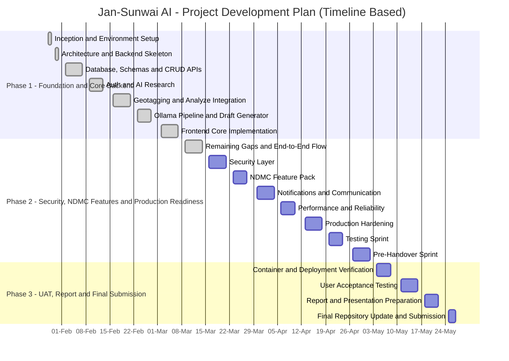

# Project Synopsis

## Title

**Jan-Sunwai AI: Automated Visual Classification and Routing of Civic Grievances Using Local Vision-Language Models**

---

## 1. Introduction

Jan-Sunwai AI is a full-stack civic grievance management platform designed to simplify the reporting of public infrastructure and civic service problems such as potholes, garbage accumulation, waterlogging, broken street lights, unsafe electrical wiring, drainage blockage, traffic obstructions, and other public safety issues. In many real-world situations, citizens notice these problems immediately, but the complaint process itself is not equally simple. A person may know that a problem exists, yet may not know which department is responsible, how to describe the issue in formal language, or how to provide structured information that government offices can act upon quickly.

Traditional grievance systems are generally form-driven. They depend heavily on manual input from the citizen and assume that the user understands administrative boundaries such as whether the issue belongs to municipal sanitation, road maintenance, electricity distribution, transport authorities, or law enforcement. Because of this, many complaints are either incomplete or routed to the wrong authority. Such delays reduce the effectiveness of grievance redressal and discourage public participation in civic reporting.

The proposed system addresses this challenge by allowing a citizen to upload a photograph of the civic issue through a web-based interface. The uploaded image is analyzed using locally running vision-language models that generate a structured understanding of the scene. The system then applies rule-based category mapping and, if required, a lightweight reasoning step to identify the most appropriate civic department. After classification, the platform extracts geolocation details where possible, generates a formal complaint draft in the selected language, stores the complaint in the database, and routes it to the appropriate authority for review and action.

Jan-Sunwai AI is not only a software application but also a practical demonstration of how artificial intelligence can be integrated with e-governance workflows. It combines frontend usability, backend automation, database-driven tracking, and local AI inference into a unified civic service platform. The system is role-based and supports citizens, department heads, and administrators, thereby covering both complaint submission and complaint management in the same ecosystem.

An important characteristic of the project is that the complete AI pipeline is designed to run locally through Ollama rather than relying on remote cloud APIs. This reduces operational cost, improves privacy, and keeps citizen data under local administrative control. As a result, the project is especially relevant for academic research, prototype deployment, and future government-oriented implementations where affordability, transparency, and data sovereignty are important considerations.

---

## 2. Motivation

The primary motivation for this project comes from the everyday difficulty citizens face while trying to report civic problems in an effective manner. In many towns and cities, people observe damaged roads, overflowing drains, uncollected waste, power hazards, or traffic issues, but the reporting workflow is often slow and confusing. Even when online complaint systems are available, they usually require manual form filling, department selection, and well-structured written descriptions. This creates a gap between observing a problem and successfully registering a useful complaint.

Another key motivation is the frequent mismatch between citizen convenience and administrative process. For a common user, taking a photograph is easier than writing a detailed explanation. For an administrative office, however, an unstructured image alone is not enough; the complaint must be categorized, described clearly, and mapped to the proper authority. This project is motivated by the need to bridge that gap. By converting an image into a structured civic complaint workflow, the system reduces user effort while also improving the quality of information received by officials.

Accessibility is also a major reason for developing this system. Not every citizen is comfortable with formal drafting or technical interfaces. Some may not know government department names, and some may be more comfortable in regional languages than in English. A system that can understand a photo, suggest the likely issue category, generate a readable complaint draft, and help with location input can make civic participation more inclusive and practical.

The project is also motivated by the broader role of artificial intelligence in public-service applications. Much of the discussion around AI focuses on large cloud-based systems, but many real deployments require low-cost, privacy-conscious, and locally controlled solutions. Jan-Sunwai AI explores this direction by using small local vision-language models, a deterministic rule engine, and a lightweight web architecture. This makes the project technically meaningful as well as socially relevant.

Finally, this work is motivated by the academic value of combining multiple domains in one project. It brings together computer vision, natural language generation, rule-based decision systems, database design, API development, frontend engineering, and software deployment. Because of this interdisciplinary nature, the project is suitable not only as a functional application but also as a strong educational case study in applied AI for civic governance.

---

## 3. Problem Statement

The existing civic complaint process is often slow, manual, and difficult for ordinary users to navigate. Citizens are generally expected to identify the correct department on their own, enter the complaint details in text form, and submit supporting information in a structured format. In practice, this leads to incomplete submissions, vague descriptions, duplicate reporting, and frequent complaint misrouting. When a complaint is routed incorrectly, resolution time increases because the issue must be forwarded manually to the appropriate authority.

Most currently available systems focus on data entry rather than intelligent assistance. Even if image upload is supported, the uploaded image is usually treated as an attachment rather than as an input for automated understanding. These systems rarely provide visual classification, automatic complaint drafting, multilingual assistance, or smart authority mapping. As a result, the burden of identifying, describing, and routing the grievance remains with the citizen.

This project therefore addresses a practical public-service problem at the intersection of technology and governance: how to simplify complaint filing while improving the quality and routing accuracy of the complaint itself.

The problem addressed in this project is:

**How can a system automatically understand a civic issue from an uploaded image, map it to the correct government department, generate a formal complaint, and support efficient complaint registration and tracking using a locally deployable AI pipeline?**

### Objectives

1. To develop a web-based platform for civic grievance submission and tracking.
2. To classify civic issues automatically from uploaded images.
3. To route complaints to the correct civic authority with minimum manual effort.
4. To generate a formal complaint letter automatically in user-friendly language.
5. To extract or assist with geolocation for better complaint accuracy.
6. To provide dashboards for citizens, department heads, and administrators.
7. To design a privacy-aware solution using local AI inference instead of cloud-only services.

### Existing Methods

Common existing methods include paper-based complaint submission, city-specific grievance applications, centralized web portals, email-based reporting, and basic online forms. These methods typically depend on the citizen to identify the issue category, select the correct authority, enter the location manually, and draft the complaint in clear written language. While such systems are useful for maintaining records, they provide limited intelligent support during complaint creation.

### Pros of Existing Methods

1. They are officially recognized and already used by public departments.
2. They maintain digital records of complaints.
3. They are simple to implement because they mainly use form-based workflows.

### Cons of Existing Methods

1. They require manual department selection by the citizen.
2. They do not usually interpret the uploaded image automatically.
3. They provide limited help in drafting clear and formal complaints.
4. They may lead to complaint misrouting and slower resolution.
5. They often offer limited multilingual or intelligent guidance.

### Proposed Solution

Jan-Sunwai AI introduces an AI-assisted complaint workflow in which a citizen uploads a photo, the system performs visual understanding of the issue, applies deterministic rule-based civic category mapping, invokes lightweight reasoning only for ambiguous cases, generates a formal complaint draft, and routes the complaint to the appropriate authority. The system also supports geolocation assistance, user roles, complaint tracking, and administrative triage for uncertain classifications. This hybrid approach improves usability, reduces routing errors, and remains practical for deployment on local infrastructure with limited hardware resources.

---

## 4. Methodology / Planning of Work

The project follows an iterative and incremental development methodology. This approach was selected because the system includes multiple dependent modules such as AI classification, complaint generation, geotagging, authentication, dashboards, and notification workflows. Building the complete system in one step would make debugging and validation difficult. Therefore, each module is designed, implemented, tested, and integrated gradually so that the system remains stable while the AI pipeline and user workflows are improved over time.

The methodology also reflects the practical nature of the project. Some components, especially the AI pipeline, required experimentation before the final design could be confirmed. Model choice, confidence handling, fallback logic, routing categories, and frontend interaction flow were refined based on performance, hardware limits, and usability needs. An incremental method made it possible to modify these parts without disrupting the rest of the application.

### Methodology

1. **Requirement Analysis**
   Study the civic grievance process, identify user roles, define complaint categories, and list functional and non-functional requirements. At this stage, the core system expectations are established, including complaint submission, classification, routing, tracking, and administrative review.

2. **System Design**
   Design the architecture of the frontend, backend, database, authentication, AI pipeline, and complaint-routing workflow. Separate responsibilities are assigned to each subsystem so that the solution remains modular, maintainable, and easy to extend.

3. **Dataset and Category Preparation**
   Organize civic issue categories and prepare evaluation datasets for roads, sanitation, lighting, transport, police, and utility complaints. This stage helps in defining the target categories for classification and in assessing whether the AI system can distinguish civic issues reliably.

4. **AI Pipeline Development**
   Build the hybrid pipeline consisting of image understanding, rule-based classification, optional reasoning for ambiguous cases, and complaint text generation. The focus is on balancing accuracy, low hardware usage, determinism, and practical deployment.

5. **Backend Development**
   Implement FastAPI services for authentication, complaint submission, AI analysis, notifications, analytics, and triage. The backend acts as the core orchestration layer between the frontend, database, file storage, and AI runtime.

6. **Frontend Development**
   Create React-based pages for login, complaint upload, map-based location support, status tracking, dashboards, and administration. The frontend is designed to be simple, role-aware, and suitable for users with varying levels of technical familiarity.

7. **Database Integration**
   Connect the application to MongoDB for storing users, complaints, routing data, notifications, and status history. A document-based structure is used to handle flexible complaint records and nested metadata efficiently.

8. **Testing and Validation**
   Perform integration testing, schema validation, and dataset-based evaluation of AI routing quality. This stage verifies that the application works correctly across modules and that the AI-assisted output is suitable for practical use.

9. **Documentation and Final Review**
   Prepare architecture notes, report documents, usage instructions, and final academic submission material. This ensures the project can be understood, reproduced, presented, and evaluated properly.

### Planning of Work

The planning of work is organized phase by phase so that each major activity contributes to the next. The early period focuses on project setup, requirement understanding, architecture design, and backend foundation. Once the core structure is ready, the work expands into AI model integration, complaint generation, geotagging, frontend workflow design, and user management. After the core prototype becomes functional, attention shifts to security, production readiness, analytics, notifications, testing, and handover-oriented improvements.

The schedule also includes user acceptance testing, report preparation, documentation, and final submission tasks. This reflects a realistic academic software development cycle in which implementation is only one part of the project; validation, reporting, and presentation are equally important. The following Gantt chart summarizes the major phases and the expected progression of work during the project duration.

#### Gantt Chart

#### Work Plan Summary

| Phase | Main Work |
|---|---|
| Phase 1: Foundation and Core Backend | Project setup, requirement study, architecture planning, database design, backend API development, authentication, AI pipeline integration, geotagging, and core frontend implementation |
| Phase 2: Security, NDMC Features and Production Readiness | Security enhancement, advanced complaint features, notifications, performance optimization, production hardening, testing sprint, and pre-handover preparation |
| Phase 3: UAT, Report and Final Submission | Container and deployment verification, user acceptance testing, report writing, presentation preparation, repository finalization, and final project submission |

---

## 5. Facilities Required for Proposed Work

The successful development and execution of this project requires both hardware and software facilities. Since the project includes AI inference, web development, backend services, database storage, and local deployment tools, the working environment must support all of these components in a stable manner. The listed facilities are intended for development, testing, and demonstration of the proposed system.

### Hardware Requirements

1. Laptop/Desktop computer
2. Multi-core CPU
3. Minimum 8 GB RAM; recommended 16 GB RAM
4. Minimum 20 GB free storage
5. NVIDIA GPU for faster local model inference; 4 GB VRAM or above recommended
6. Internet connection for dependency installation and map tile access

The CPU is required to run the frontend, backend, database container, and supporting services. Adequate RAM is important because multiple processes may run simultaneously during development. Storage is needed for source code, virtual environments, node modules, uploaded images, logs, datasets, and local AI model files. Although the system can be adapted for CPU execution, an NVIDIA GPU significantly improves model response time and makes the local AI pipeline more practical for demonstrations and real-time analysis.

### Software Requirements

1. Operating System: Windows or Linux
2. Python 3.11+ / 3.13 used in project setup
3. Node.js 18+ for frontend development
4. FastAPI and Uvicorn for backend services
5. React and Vite for frontend development
6. MongoDB for complaint and user data storage
7. Docker / Docker Compose for containerized database setup
8. Ollama for local AI model execution
9. Git and GitHub for version control
10. VS Code or any suitable IDE/editor

These software tools collectively support the complete project lifecycle. Python and FastAPI are used for backend API development, database integration, and AI pipeline orchestration. React and Vite are used to create the user-facing interface. MongoDB stores complaint and user information in a flexible document format. Docker simplifies setup and deployment of backend dependencies such as the database. Ollama provides a local runtime for AI models, allowing the system to avoid dependence on external inference APIs.

### AI Models Used

1. `qwen2.5vl:3b` for primary image understanding
2. `granite3.2-vision:2b` as fallback vision model
3. `llama3.2:1b` for ambiguous-case reasoning and complaint generation

These models are selected to balance capability and hardware constraints. The primary vision model performs scene understanding, the fallback model improves reliability in low-resource conditions, and the small language model is used only when additional reasoning or complaint generation is needed. This staged design keeps the system lightweight while still providing intelligent assistance.

### Additional Facilities

1. Sample civic issue image dataset for testing and evaluation
2. Browser support for frontend access and map interaction
3. Documentation tools for report writing and presentation preparation
4. Local or Docker-based MongoDB instance for structured data storage
5. Test user accounts for citizen, department head, and admin roles

---

## 6. Bibliography / References

1. Jan-Sunwai AI project repository documentation, including README, system architecture, schema design, and project report files.
2. FastAPI Documentation. FastAPI framework reference and API development guides. Available at: https://fastapi.tiangolo.com/
3. React Documentation. Official React documentation for component-based frontend development. Available at: https://react.dev/
4. Vite Documentation. Build tool and frontend development documentation. Available at: https://vitejs.dev/
5. MongoDB Documentation. Official MongoDB manuals for document database design and operations. Available at: https://www.mongodb.com/docs/
6. Docker Documentation. Containerization and deployment reference for development environments. Available at: https://docs.docker.com/
7. Ollama Documentation. Local large language model runtime documentation. Available at: https://ollama.com/
8. Qwen2.5-VL technical resources and model documentation for vision-language understanding.
9. IBM Granite Vision model resources for fallback visual analysis.
10. Meta Llama 3.2 documentation and technical resources for lightweight reasoning and text generation.
11. OpenStreetMap and Nominatim public documentation for geolocation and reverse geocoding concepts.
12. Research articles and public information on digital grievance redressal systems such as CPGRAMS and related e-governance platforms in India.
13. Public literature on vision-language models, hybrid AI pipelines, and explainable decision systems used in practical applications.

---

## 7. Conclusion

Jan-Sunwai AI is a practical and socially relevant project that combines local artificial intelligence, web application development, and database-driven workflow management to improve the civic complaint process. The system is designed to reduce the effort required from citizens by transforming a simple image upload into a structured complaint workflow that includes issue identification, department routing, location support, and formal complaint generation.

The project demonstrates that meaningful AI assistance does not always require heavy cloud infrastructure. By using a hybrid pipeline of vision models, deterministic rule-based classification, and lightweight reasoning, the system remains cost-effective, explainable, and deployable on modest local hardware. This makes the solution particularly suitable for academic demonstration, prototype government usage, and environments where privacy and local control are important.

From an academic perspective, the project successfully integrates multiple technical domains such as computer vision, natural language generation, backend engineering, frontend development, authentication, geolocation handling, and database design. It therefore represents a complete software engineering project rather than an isolated AI experiment. The work also highlights how technology can be aligned with a real public-service need, making the project both technically strong and socially useful.

In conclusion, Jan-Sunwai AI provides a strong foundation for smarter civic grievance handling. It improves accessibility, supports better routing decisions, and encourages faster reporting of public issues. With further refinement, field testing, and production hardening, the system can be extended into a more robust deployment-ready platform for real civic administration.