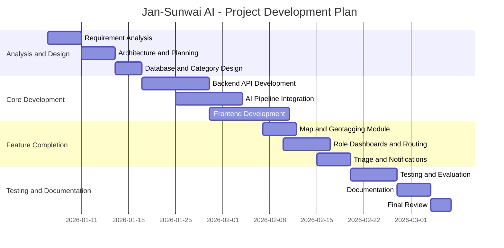

# Project Synopsis

## Title

**Jan-Sunwai AI: Automated Visual Classification and Routing of Civic Grievances Using Local Vision-Language Models**

---

## 1. Introduction

Jan-Sunwai AI is a full-stack civic grievance management platform designed to simplify how citizens report public infrastructure and civic service problems such as potholes, garbage dumping, broken street lights, drainage blockage, unsafe electrical wiring, and traffic-related issues. In the existing complaint process, many citizens are unable to identify the correct government department, describe the issue formally, or provide location details in a structured way. This often leads to complaint misrouting, delayed action, and poor grievance resolution.

The proposed system addresses this problem by allowing a citizen to upload a photograph of the issue through a web interface. The system analyzes the image using locally running vision-language models, identifies the type of complaint, maps it to the appropriate civic authority, extracts location information where available, and generates a formal complaint draft in the selected language. The complaint is then stored in the database and routed to the appropriate department for follow-up. The platform also supports complaint tracking, role-based access, and administrative review of uncertain AI classifications.

The project is designed as a privacy-conscious and cost-effective solution because the complete AI pipeline runs locally through Ollama, without depending on paid cloud APIs. This makes the system suitable for educational, research, and government-oriented deployments where data privacy, affordability, and operational control are important.

---

## 2. Motivation

Urban and semi-urban areas regularly face civic issues that affect public safety, sanitation, mobility, and quality of life. Although digital grievance portals exist, they generally require the user to manually choose a department and write the complaint in formal language. Many citizens do not know whether a complaint should go to municipal roads, sanitation, electricity, transport, or police authorities. In practice, this causes confusion, duplicate effort, and delayed redressal.

Another important challenge is accessibility. A large number of users are more comfortable taking a photograph than filling out long forms. If technology can identify the issue directly from an image and produce a readable complaint draft, complaint filing becomes much faster and easier. This is especially useful for first-time users, non-technical users, and citizens who are not fluent in English.

The motivation behind Jan-Sunwai AI is to build a practical citizen-centric system that reduces friction in reporting civic problems, improves routing accuracy, and enables local AI usage on modest hardware. The project also demonstrates how small vision-language models, deterministic rule engines, and web technologies can be combined to solve real-world governance problems in a scalable and explainable manner.

---

## 3. Problem Statement

The existing civic complaint process is often slow, manual, and confusing. Citizens must identify the correct authority on their own, enter issue details in text form, and frequently submit incomplete or incorrectly routed complaints. Most available systems do not analyze uploaded images intelligently, do not provide automatic complaint drafting, and do not support an AI-assisted route to the concerned department.

The problem addressed in this project is:

**How can a system automatically understand a civic issue from an uploaded image, map it to the correct government department, generate a formal complaint, and support efficient complaint registration and tracking using a locally deployable AI pipeline?**

### Objectives

1. To develop a web-based platform for civic grievance submission and tracking.
2. To classify civic issues automatically from uploaded images.
3. To route complaints to the correct civic authority with minimum manual effort.
4. To generate a formal complaint letter automatically in user-friendly language.
5. To extract or assist with geolocation for better complaint accuracy.
6. To provide dashboards for citizens, department heads, and administrators.
7. To design a privacy-aware solution using local AI inference instead of cloud-only services.

### Existing Methods

Common existing methods include manual complaint portals, city-specific grievance applications, paper-based submissions, and basic online forms. These systems generally depend on the citizen to choose the department and write the complaint manually.

### Pros of Existing Methods

1. They are officially recognized and already used by public departments.
2. They maintain digital records of complaints.
3. They are simple to implement because they mainly use form-based workflows.

### Cons of Existing Methods

1. They require manual department selection by the citizen.
2. They do not usually interpret the uploaded image automatically.
3. They provide limited help in drafting clear and formal complaints.
4. They may lead to complaint misrouting and slower resolution.
5. They often offer limited multilingual or intelligent guidance.

### Proposed Solution

Jan-Sunwai AI introduces an AI-assisted complaint workflow in which a citizen uploads a photo, the system performs visual understanding, applies a rule-based civic category mapping, uses reasoning only for ambiguous cases, generates a complaint draft, and routes the complaint to the appropriate authority. The solution improves usability, reduces routing errors, and remains deployable on local infrastructure.

---

## 4. Methodology / Planning of Work

The project follows an iterative and incremental development methodology. Each module is developed, tested, and integrated step by step so that the overall system remains stable while the AI pipeline and user workflows are improved over time.

### Methodology

1. **Requirement Analysis**
   Study the civic grievance process, identify user roles, define complaint categories, and list functional and non-functional requirements.

2. **System Design**
   Design the architecture of the frontend, backend, database, authentication, AI pipeline, and complaint-routing workflow.

3. **Dataset and Category Preparation**
   Organize civic issue categories and prepare evaluation datasets for roads, sanitation, lighting, transport, police, and utility complaints.

4. **AI Pipeline Development**
   Build the hybrid pipeline consisting of image understanding, rule-based classification, optional reasoning for ambiguous cases, and complaint text generation.

5. **Backend Development**
   Implement FastAPI services for authentication, complaint submission, AI analysis, notifications, analytics, and triage.

6. **Frontend Development**
   Create React-based pages for login, complaint upload, map-based location support, status tracking, dashboards, and administration.

7. **Database Integration**
   Connect the application to MongoDB for storing users, complaints, routing data, notifications, and status history.

8. **Testing and Validation**
   Perform integration testing, schema validation, and dataset-based evaluation of AI routing quality.

9. **Documentation and Final Review**
   Prepare architecture notes, report documents, usage instructions, and final academic submission material.

### Planning of Work

#### Gantt Chart

#### Work Plan Summary

| Phase | Main Work |
|---|---|
| Phase 1 | Requirement analysis, literature review, system planning |
| Phase 2 | Architecture design, database design, category mapping |
| Phase 3 | Backend API and AI pipeline development |
| Phase 4 | Frontend development and map integration |
| Phase 5 | Routing, dashboards, triage, and notifications |
| Phase 6 | Testing, evaluation, documentation, and final submission |

---

## 5. Facilities Required for Proposed Work

### Hardware Requirements

1. Laptop/Desktop computer
2. Multi-core CPU
3. Minimum 8 GB RAM; recommended 16 GB RAM
4. Minimum 20 GB free storage
5. NVIDIA GPU for faster local model inference; 4 GB VRAM or above recommended
6. Internet connection for dependency installation and map tile access

### Software Requirements

1. Operating System: Windows or Linux
2. Python 3.11+ / 3.13 used in project setup
3. Node.js 18+ for frontend development
4. FastAPI and Uvicorn for backend services
5. React and Vite for frontend development
6. MongoDB for complaint and user data storage
7. Docker / Docker Compose for containerized database setup
8. Ollama for local AI model execution
9. Git and GitHub for version control
10. VS Code or any suitable IDE/editor

### AI Models Used

1. `qwen2.5vl:3b` for primary image understanding
2. `granite3.2-vision:2b` as fallback vision model
3. `llama3.2:1b` for ambiguous-case reasoning and complaint generation

---

## 6. Bibliography / References

1. Project repository documentation: README and system design documents of Jan-Sunwai AI.
2. FastAPI Documentation. https://fastapi.tiangolo.com/
3. React Documentation. https://react.dev/
4. Vite Documentation. https://vitejs.dev/
5. MongoDB Documentation. https://www.mongodb.com/docs/
6. Ollama Documentation. https://ollama.com/
7. Qwen2.5-VL Model Documentation and Technical Resources.
8. Granite Vision Model Documentation by IBM.
9. Llama 3.2 Model Documentation by Meta.
10. Research and public resources on civic grievance systems such as CPGRAMS and related digital governance platforms.

---

## 7. Conclusion

Jan-Sunwai AI is a practical and socially relevant project that applies local AI, web development, and database technologies to improve the civic complaint process. It reduces the effort required from citizens, supports more accurate complaint routing, and demonstrates how AI can be used responsibly in public-service workflows. The system is cost-effective, privacy-aware, and suitable as both an academic project and a foundation for future real-world deployment.