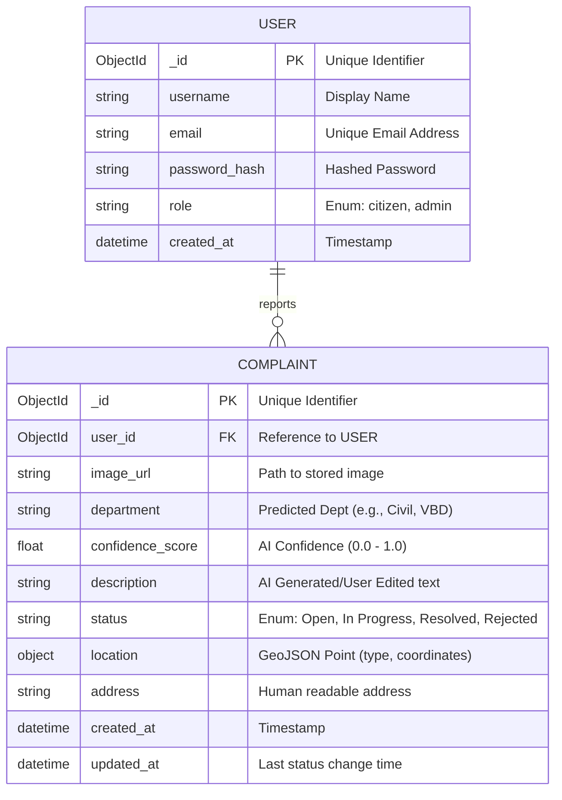

# Jan-Sunwai AI - System Architecture

## Entity Relationship Diagram (ERD)

The following diagram illustrates the relationship between the Users (Citizens/Admins) and the Complaints (Grievances) they report and manage.

## Schema Definitions

### 1. User Entity
Represents a registered user of the system.
*   **_id**: MongoDB ObjectId.
*   **full_name**: String, min 3 chars.
*   **email**: String, valid email format. Unique index.
*   **password**: String, hashed (bcrypt).
*   **role**: String, default "citizen". Options: ["citizen", "admin"].
*   **created_at**: DateTime, default `now()`.

### 2. Complaint Entity
Represents a civic grievance filed by a user.
*   **user_id**: Reference to User.
*   **image_url**: URL/Path to the uploaded evidence.
*   **ai_metadata**: Embedded Object.
    *   **model_used**: "CLIP-ViT-B/32"
    *   **confidence**: Float.
    *   **tags**: List[String].
*   **geo_location**: Embedded Object.
    *   **latitude**: Float.
    *   **longitude**: Float.
    *   **address**: String.
*   **status_history**: List[Object].
    *   **status**: String.
    *   **changed_by**: UserID.
    *   **timestamp**: DateTime.
