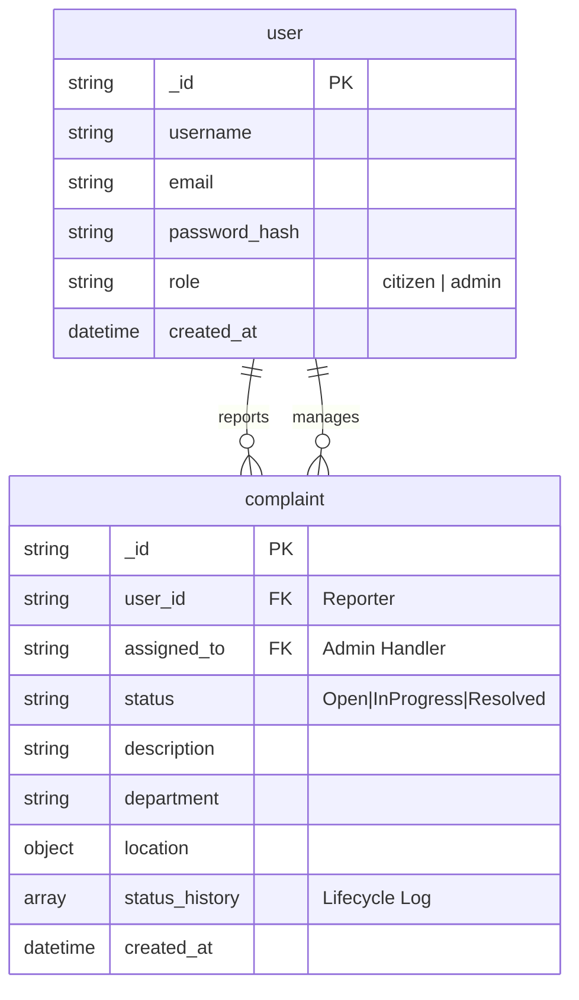

# Jan-Sunwai AI - System Architecture

## Entity Relationship Diagram (ERD)

The following diagram illustrates the relationship between the Users (Citizens/Admins) and the Complaints (Grievances) they report and manage.

## Entity Details

### 1. User Entity
*   **role**: `citizen` (Default) or `admin`.
    *   *Citizens* can only create and view their own complaints.
    *   *Admins* can view all complaints, change status, and be assigned to complaints.

### 2. Complaint Entity
Tracks individual grievances.
*   **assigned_to**: `ObjectId` reference to an Admin User. Nullable.
*   **status_history**: Array of objects tracking changes.
    *   `status`: New status.
    *   `changed_by`: User ID of who changed it.
    *   `note`: "Issue verified", "Work started", etc.
    *   `timestamp`: When it happened.
    *   **model_used**: "CLIP-ViT-B/32"
    *   **confidence**: Float.
    *   **tags**: List[String].
*   **geo_location**: Embedded Object.
    *   **latitude**: Float.
    *   **longitude**: Float.
    *   **address**: String.
*   **status_history**: List[Object].
    *   **status**: String.
    *   **changed_by**: UserID.
    *   **timestamp**: DateTime.
