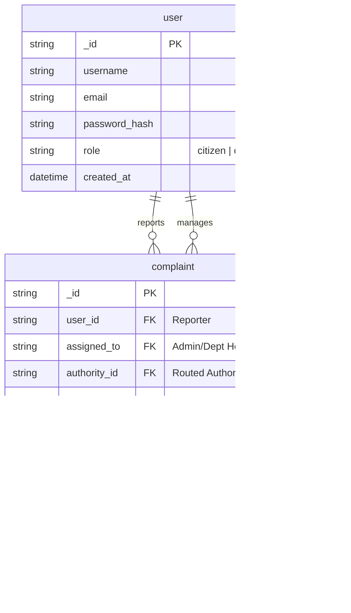

# Jan-Sunwai AI - System Architecture

## Entity Relationship Diagram (ERD)

The following diagram illustrates the relationship between the Users (Citizens/Admins) and the Complaints (Grievances) they report and manage.

```mermaid
erDiagram
    user ||--o{ complaint : reports
    user {
        string _id PK
        string username
        string email
        string password_hash
        string role "citizen | dept_head | admin"
        datetime created_at
    }
    complaint {
        string _id PK
        string user_id FK "Reporter"
        string assigned_to FK "Admin/Dept Head Handler"
        string authority_id FK "Routed Authority"
        string status "Open|InProgress|Resolved|Rejected"
        string description
        string department
        object location
        object ai_metadata
        array status_history "Lifecycle Log"
        datetime created_at
        datetime updated_at
    }
    user ||--o{ complaint : manages
```

## Entity Details

### 1. User Entity
*   **role**: `citizen` (Default), `dept_head`, or `admin`.
    *   *Citizens* can only create and view their own complaints.
    *   *Dept Heads* can view and update status for complaints in their department.
    *   *Admins* can view all complaints, change status, manage triage, and be assigned to complaints.

### 2. Complaint Entity
Tracks individual grievances.
*   **assigned_to**: `ObjectId` reference to an Admin/Dept Head User. Nullable.
*   **authority_id**: Reference to the routed Authority Organisation (from `authorities.py`).
*   **routing_confidence**: Float — confidence score from the authority routing logic.
*   **escalation_parent_authority_id**: Set if the complaint can be escalated to a higher authority.
*   **status**: `Open` | `In Progress` | `Resolved` | `Rejected`.
*   **ai_metadata**: Embedded object.
    *   `model_used`: String. e.g. `"ollama"`.
    *   `confidence_score`: Float.
    *   `detected_department`: String.
    *   `labels`: List of strings.
*   **location**: Embedded object.
    *   `lat`: Float.
    *   `lon`: Float.
    *   `address`: String.
    *   `source`: `exif` | `device` | `manual`.
*   **status_history**: List of objects tracking lifecycle changes.
    *   `status`: New status value.
    *   `changed_by_user_id`: ID of the user who made the change.
    *   `note`: e.g. "Complaint created", "Status updated via API".
    *   `timestamp`: DateTime.
