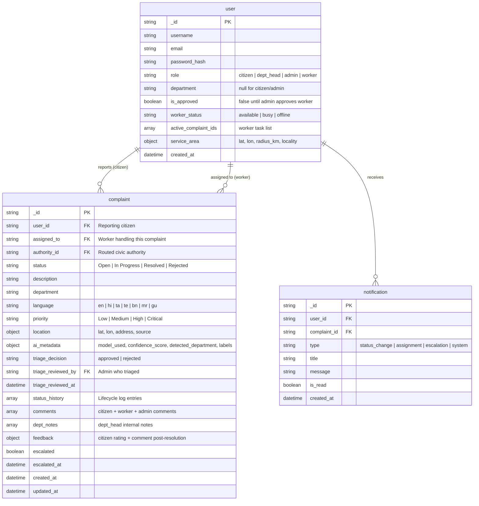

# Jan-Sunwai AI — Schema Design

> **Font:** Times New Roman throughout all printed / PDF versions of this document.
> **Last Updated:** 24 March 2026

---

## Entity Relationship Diagram (ERD)

The following diagram illustrates the relationships between Users, Complaints, Notifications, and the Worker assignment system.


```mermaid
erDiagram
    user ||--o{ complaint : "reports (citizen)"
    user ||--o{ complaint : "assigned to (worker)"
    user ||--o{ notification : receives
    user {
        string _id PK
        string username
        string email
        string password_hash
        string role "citizen | dept_head | admin | worker"
        string department "null for citizen/admin"
        boolean is_approved "false until admin approves worker"
        string worker_status "available | busy | offline"
        array active_complaint_ids "worker task list"
        object service_area "lat, lon, radius_km, locality"
        datetime created_at
    }
    complaint {
        string _id PK
        string user_id FK "Reporting citizen"
        string assigned_to FK "Worker handling this complaint"
        string authority_id FK "Routed civic authority"
        string status "Open | In Progress | Resolved | Rejected"
        string description
        string department
        string language "en | hi | ta | te | bn | mr | gu"
        string priority "Low | Medium | High | Critical"
        object location "lat, lon, address, source"
        object ai_metadata "model_used, confidence_score, detected_department, labels"
        string triage_decision "approved | rejected"
        string triage_reviewed_by FK "Admin who triaged"
        datetime triage_reviewed_at
        array status_history "Lifecycle log entries"
        array comments "citizen + worker + admin comments"
        array dept_notes "dept_head internal notes"
        object feedback "citizen rating + comment post-resolution"
        boolean escalated
        datetime escalated_at
        datetime created_at
        datetime updated_at
    }
    notification {
        string _id PK
        string user_id FK
        string complaint_id FK
        string type "status_change | assignment | escalation | system"
        string title
        string message
        boolean is_read
        datetime created_at
    }
```

---

## Entity Details

### 1. User Entity

The User entity covers all four roles of the platform.

| Field | Description |
|---|---|
| `role` | `citizen` (default), `dept_head`, `admin`, **`worker`** |
| `department` | Canonical civic department string — must match exactly for worker auto-assignment |
| `is_approved` | Workers start `false`; set `true` by admin via `PATCH /workers/{id}/approve` |
| `worker_status` | `available` — ready to receive tasks; `busy` — has active tasks; `offline` — excluded from assignment |
| `active_complaint_ids` | Array of complaint ObjectIds currently assigned to the worker |
| `service_area` | Geographic area: `{ lat, lon, radius_km, locality }` — used by Haversine geo-filter in auto-assignment |

### 2. Complaint Entity

| Field | Description |
|---|---|
| `assigned_to` | ObjectId of the field worker assigned to this complaint. Null if unassigned |
| `status` | `Open` → `In Progress` (set automatically when worker is assigned) → `Resolved` / `Rejected` |
| `priority` | `Low`, `Medium`, `High`, `Critical` — set by AI or admin |
| `location.source` | `exif` (GPS from photo), `device` (browser GPS), `manual` (user-pinned on map) |
| `ai_metadata.confidence_score` | Float 0–1. Complaints < 0.65 enter the Human Triage Queue |
| `status_history` | Array of `{ status, timestamp, changed_by_user_id, note }` — full lifecycle audit trail |
| `comments` | Shared thread visible to citizen, worker, dept_head, admin |
| `dept_notes` | Internal notes visible only to dept_head and admin |
| `feedback` | Citizen rating (1–5) + optional comment after resolution |

### 3. Notification Entity

In-app notifications for all user roles.

| Field | Description |
|---|---|
| `type` | `status_change`, `assignment` (worker gets notified on task assign), `escalation`, `system` |
| `is_read` | Set to `true` via `PATCH /notifications/{id}/read` or `POST /notifications/mark-all-read` |

---

## Worker Auto-Assignment Logic

```
POST /complaints  (new complaint submitted by citizen)
      │
      ▼
auto_assign(complaint_id, department, complaint_location)
      │
      ├─ Query: role=worker, is_approved=True, department=<match>, worker_status≠offline
      │
      ├─ Geo-filter: Haversine distance(worker.service_area, complaint.location) ≤ radius_km
      │  (If no service_area set → worker matches all complaints in their department)
      │
      ├─ Load balance: pick worker with fewest active_complaint_ids
      │
      └─ _do_assign():
           • Adds complaint_id to worker.active_complaint_ids
           • Sets worker.worker_status = "busy"
           • Sets complaint.assigned_to = worker_id
           • Sets complaint.status = "In Progress"   ← automatic on assignment
           • Appends to complaint.status_history
```

**Admin Bulk Re-assign:** `POST /workers/reassign-unassigned` — scans all `Open` + `In Progress` complaints with no `assigned_to` and runs `auto_assign` on each.

**Admin Manual Assign:** `POST /workers/{worker_id}/assign/{complaint_id}` — force-assigns any complaint to any approved worker.

---

## Triage Queue Logic

Complaints enter the Human Review queue when `ai_metadata.confidence_score < 0.65` and `triage_decision` does not exist.

```
GET /triage/review-queue
  └── { "ai_metadata.confidence_score": { "$lt": 0.65 },
         "triage_decision": { "$exists": false } }

POST /triage/review-queue/decision  { complaint_id, decision, department? }
  └── Stamps: triage_decision, triage_reviewed_by, triage_reviewed_at
  └── Optionally overrides: department
  └── Appends to: triage_output/ CSV audit trail
```

---

## SLA Badge Logic

The `SLABadge` component shows per-department SLA deadlines:

- **Active complaint:** countdown to deadline based on `created_at` and department SLA window
- **Resolved / Rejected:** shows actual resolution date from `updated_at`
- **Overdue:** badge turns red with "Overdue by N days" text

---

## API Diagnostic Endpoints (Added March 2026)

| Endpoint | Purpose |
|---|---|
| `GET /workers/assignment-debug` | Shows all unassigned complaints and all workers — diagnose why assignment is not running |
| `POST /workers/reassign-unassigned` | Bulk re-assign all Open + In Progress unassigned complaints |
| `GET /health/live` | Backend heartbeat |
| `GET /health/ready` | MongoDB connectivity check |
| `GET /health/models` | Ollama model availability |
