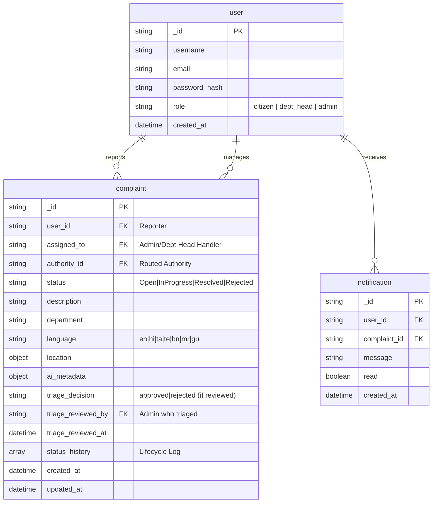

# Jan-Sunwai AI — Schema Design

## Entity Relationship Diagram (ERD)

The following diagram illustrates the relationship between the Users (Citizens/Admins) and the Complaints (Grievances) they report and manage.


```mermaid
erDiagram
    user ||--o{ complaint : reports
    user ||--o{ notification : receives
    user {
        string _id PK
        string username
        string email
        string password_hash
        string role "citizen | dept_head | admin"
        datetime created_at
    }
    complaint {
        string _id PK
        string user_id FK "Reporter"
        string assigned_to FK "Admin/Dept Head Handler"
        string authority_id FK "Routed Authority"
        string status "Open|InProgress|Resolved|Rejected"
        string description
        string department
        string language "en|hi|ta|te|bn|mr|gu"
        object location
        object ai_metadata
        string triage_decision "approved|rejected (if reviewed)"
        string triage_reviewed_by FK "Admin who triaged"
        datetime triage_reviewed_at
        array status_history "Lifecycle Log"
        datetime created_at
        datetime updated_at
    }
    notification {
        string _id PK
        string user_id FK
        string complaint_id FK
        string message
        boolean read
        datetime created_at
    }
    user ||--o{ complaint : manages
```

## Entity Details

### 1. User Entity
*   **role**: `citizen` (Default), `dept_head`, or `admin`.
    *   *Citizens* can only create and view their own complaints.
    *   *Dept Heads* can view and update status for complaints in their department.
    *   *Admins* can view all complaints, change status, manage triage, and be assigned to complaints.

### 2. Complaint Entity
Tracks individual grievances.
*   **assigned_to**: `ObjectId` reference to an Admin/Dept Head User. Nullable.
*   **authority_id**: Reference to the routed Authority Organisation (from `authorities.py`).
*   **routing_confidence**: Float — confidence score from the authority routing logic.
*   **escalation_parent_authority_id**: Set if the complaint can be escalated to a higher authority.
*   **status**: `Open` | `In Progress` | `Resolved` | `Rejected`.
*   **language**: Language code for the AI-generated complaint text. Default `"en"`. Supported: `en`, `hi`, `ta`, `te`, `bn`, `mr`, `gu`.
*   **ai_metadata**: Embedded object.
    *   `model_used`: String. e.g. `"ollama"`.
    *   `confidence_score`: Float. Complaints with score < 0.65 appear in the Human Review (Triage) queue.
    *   `detected_department`: String.
    *   `labels`: List of strings.
*   **location**: Embedded object.
    *   `lat`: Float.
    *   `lon`: Float.
    *   `address`: String.
    *   `source`: `exif` | `device` | `manual`.
*   **triage_decision**: Set by an Admin after human review. Values: `"approved"` or `"rejected"`. Absent if not yet triaged.
*   **triage_reviewed_by**: `ObjectId` of the Admin who made the triage decision.
*   **triage_reviewed_at**: DateTime when triage decision was recorded.
*   **status_history**: List of objects tracking lifecycle changes.
    *   `status`: New status value.
    *   `changed_by_user_id`: ID of the user who made the change.
    *   `note`: e.g. "Complaint created", "Status updated via API".
    *   `timestamp`: DateTime.

### 3. Notification Entity
In-app notifications sent to users on complaint status changes.
*   **user_id**: The recipient citizen or dept_head.
*   **complaint_id**: Which complaint this notification is about.
*   **message**: Human-readable notification text.
*   **read**: `false` until marked read via `PATCH /notifications/{id}/read`.
*   **created_at**: When the notification was created.

---

## Triage Queue Logic

Complaints enter the Human Review queue automatically when `ai_metadata.confidence_score < 0.65` AND `triage_decision` does not exist on the document.

```
GET /triage/review-queue
  └── MongoDB query:
      { "ai_metadata.confidence_score": { "$lt": 0.65 },
        "triage_decision": { "$exists": false } }

POST /triage/review-queue/decision  { complaint_id, decision, department? }
  └── Stamps: triage_decision, triage_reviewed_by, triage_reviewed_at
  └── Optionally updates: department (if admin overrides AI classification)
  └── Appends row to: triage_output/ CSV audit trail
```

## SLA Badge Logic

The `SLABadge` component on complaint cards shows:
- **Active complaints**: countdown to SLA deadline based on `created_at` and department
- **Resolved / Rejected**: the resolution date derived from `updated_at` (not a duplicate of the status badge)

