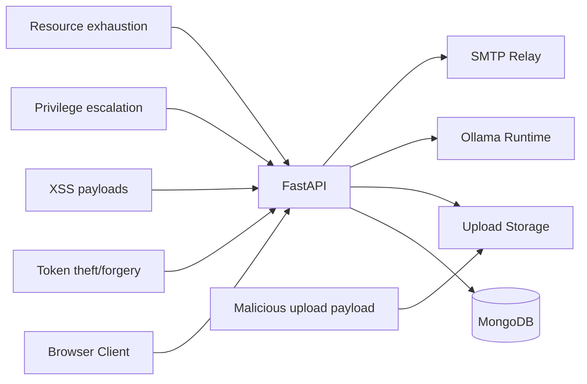
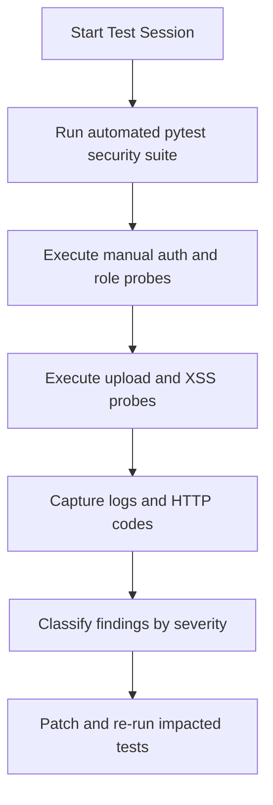

# Security Testing Guide

This guide reflects currently implemented controls and testable behaviors in the backend and frontend.

## Security Control Coverage

| Control Area | Current Implementation |
| --- | --- |
| Authentication | httpOnly cookie session (primary) + JWT bearer compatibility |
| Authorization | Role-gated dependencies (`citizen`, `worker`, `dept_head`, `admin`) |
| Password Storage | bcrypt hash via passlib |
| Reset Tokens | SHA-256 hashed token storage + TTL index |
| Upload Security | Extension allowlist + max size + magic number check |
| Input Sanitization | Text sanitization + frontend-safe rendering (no raw HTML execution) |
| Headers | CSP, X-Frame-Options, Referrer-Policy, HSTS (prod), etc. |
| CORS | Configurable allowlist from env |
| Rate Limiting | Optional slowapi integration (`RATE_LIMIT_ENABLED`) |
| Notification Safety | User-scoped read/update actions |

## Threat Surface Map



## Automated Tests

Run from `backend`:

```bash
pytest tests/test_resilience_security.py tests/test_notification_chain.py -q
```

Repository-level runners:

```bash
# Linux
bash scripts/run_security_test.sh
bash scripts/run_resilience_test.sh
bash scripts/run_cookie_smoke_test.sh

# Windows
scripts\run_security_test.bat
scripts\run_resilience_test.bat
scripts\run_cookie_smoke_test.bat
```

Covered checks include:

- Upload magic-number mismatch rejection.
- Graceful `/analyze` `503` behavior on classifier failure.
- `/health/ready` degraded response when DB ping fails.
- Sanitization of script payloads.
- Notification chain behavior for status updates.
- Mark-all-read unread-counter behavior.

## Manual Security Probes

## 1) Session and Token Validation

No auth cookie or token:

```bash
curl -i http://localhost:8000/api/v1/complaints
```

Expected: `401`

Invalid bearer token:

```bash
curl -i -H "Authorization: Bearer invalid.token.here" http://localhost:8000/api/v1/complaints
```

Expected: `401`

## 2) Role Access Enforcement

Try admin-only endpoint with non-admin session/token:

```bash
curl -i -H "Authorization: Bearer <citizen-token>" http://localhost:8000/api/v1/workers
```

Expected: `403`

## 3) Upload Magic Number Validation

Upload mismatched extension/content:

```bash
curl -X POST http://localhost:8000/analyze \
  -H "Authorization: Bearer <token>" \
  -F "file=@fake.jpg" \
  -F "language=en"
```

Expected: `400` with header mismatch message.

## 4) XSS Sanitization

Inject script payload in complaint note or comment body and verify script text is displayed as plain text (no JavaScript execution in UI).

## 5) Notification Ownership

Call `PATCH /notifications/{id}/read` with another user's notification ID.

Expected: `404` (not found for current user scope).

## 6) Rate Limit Behavior (if enabled)

Burst request to limited endpoints and verify `429` responses.

## Test Workflow



## Security Headers Checklist

Validate these response headers on API responses:

- `X-Content-Type-Options: nosniff`
- `X-Frame-Options: DENY`
- `Referrer-Policy: strict-origin-when-cross-origin`
- `Permissions-Policy: geolocation=(), microphone=(), camera=()`
- `Content-Security-Policy` present
- `Strict-Transport-Security` present in production mode

## Release Gate Recommendations

Before production handover:

1. Run this security checklist against the production URL.
2. Execute external scanner pass (OWASP ZAP or Burp suite).
3. Validate TLS policy, reverse-proxy hardening, and firewall rules.
4. Verify secrets management and non-default `JWT_SECRET_KEY`.
5. Confirm `ALLOWED_ORIGINS` is locked to deployment domains.
