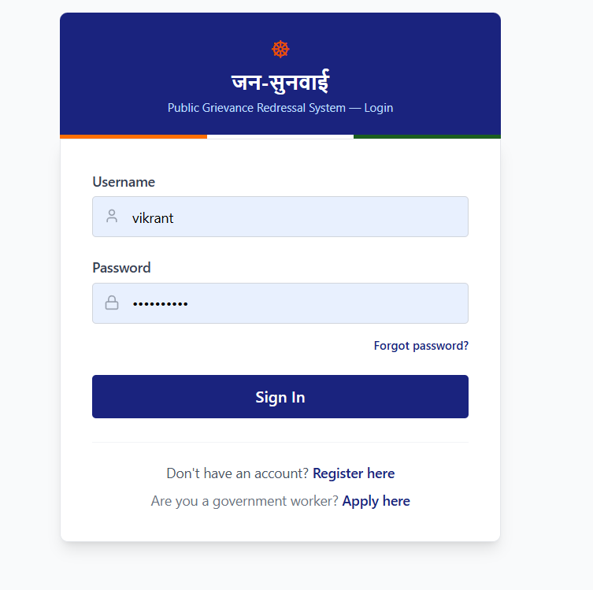
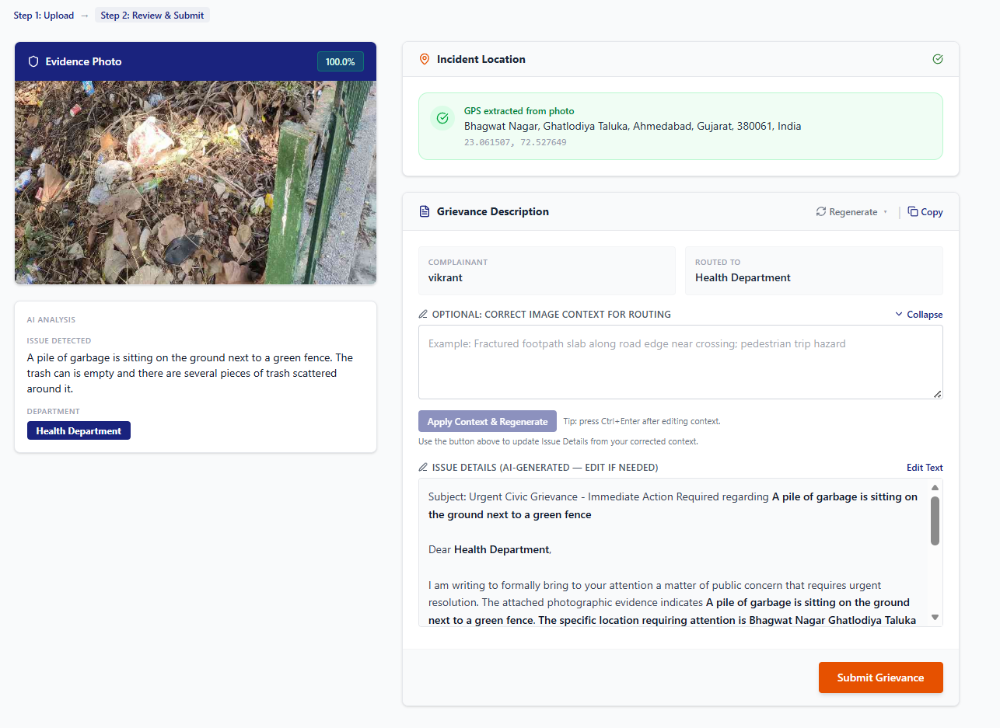
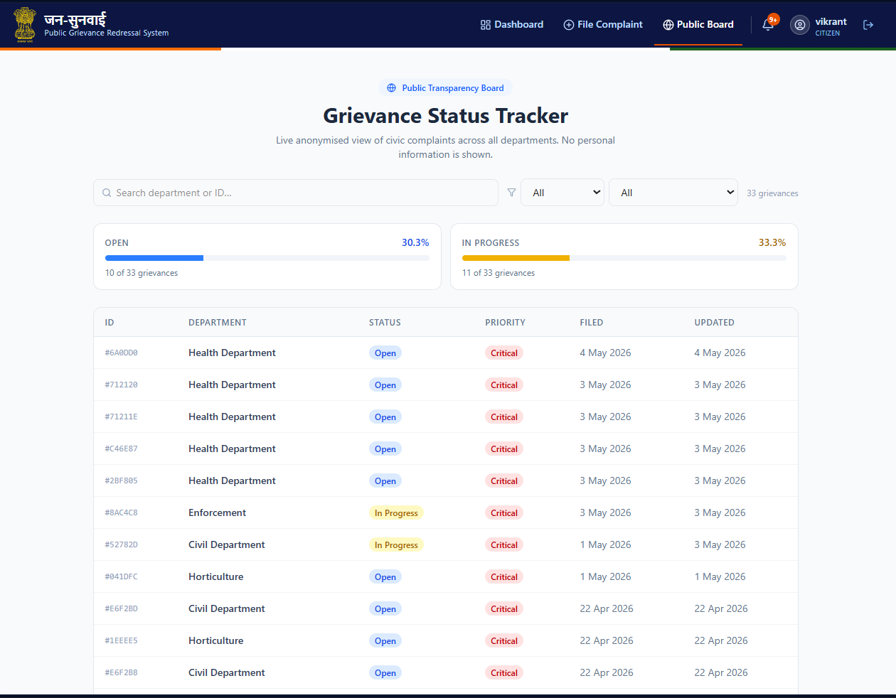
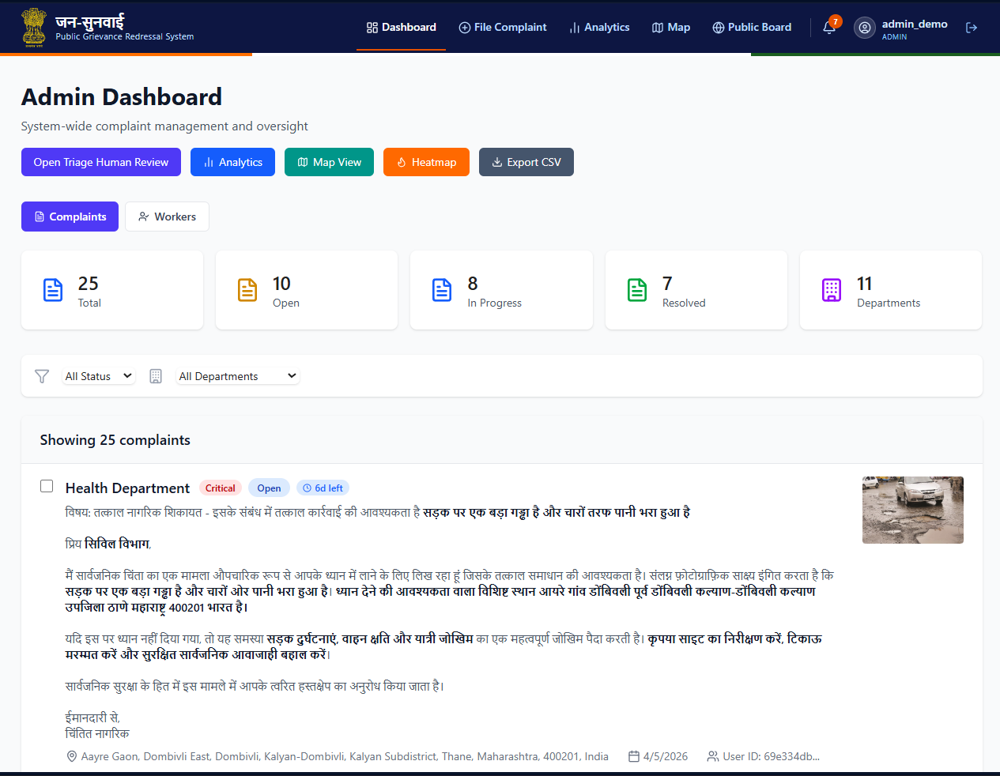
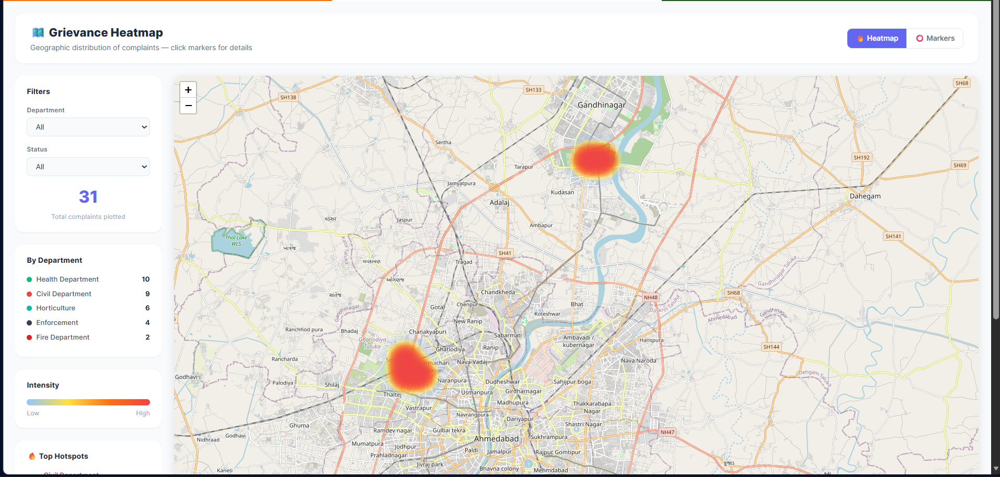

# Jan-Sunwai AI User Manual

## 1. Citizen Guide

### Register and Login

1. Open the home page.
2. Select **Register** and create an account (username, email, password).
3. Login with your credentials.
4. Forgot your password? Use **Forgot Password** on the login page — a reset token will be sent to your registered email.

### File a Complaint

1. Go to **File Complaint** (or click **Analyze** in the navbar).
2. Upload a JPG/PNG/WebP image (up to 5 MB). GPS-tagged photos auto-detect location.
3. Select preferred language for your complaint draft (English, Hindi, Marathi, Tamil, Telugu, Kannada, Bengali, Gujarati).
4. Optionally add a **grievance hint** — briefly describe what you see if the AI might misread the image.
5. Click **Analyze and Generate Complaint**.
6. On the results page:
   - Review the AI-detected *department* and *confidence score*.
   - If GPS was not in the photo, set location by:
     - Clicking **Use My Current Location** (GPS), or
     - Searching an address (autocomplete powered by OpenStreetMap), or
     - Clicking **Pin on Map** to drop a pin on the interactive map.
   - Review and edit the AI-generated complaint draft. Click **Regenerate** to create a new draft, or choose a different language from the dropdown.

7. Click **Submit Grievance**.

### Track Complaint

1. Open **Dashboard**.
2. View status badges: Open · In Progress · Resolved · Rejected.
3. Click a complaint to expand the status timeline and history.
4. Rate resolved complaints using the star feedback widget.
5. Read notifications via the 🔔 bell icon in the navbar.

## 2. Department Head Guide

1. Login as department head.
2. Open dashboard — complaints filtered to your department automatically.
3. Update complaint status with a note.
4. Transfer complaint to another department when required.
5. Review SLA badges (green = on time, orange = at risk, red = overdue).

## 3. Worker Guide

1. Register as **worker** and await admin approval.
2. Once approved, login and open the Worker Dashboard.
3. Set your availability status (Available / Offline).
4. Complaints are auto-assigned based on your service area.
5. Complete assigned complaints and submit work notes.

## 4. Admin Guide

### Admin Operations

1. Login as admin.
2. Approve/reject worker registrations from Admin Dashboard.
3. Reassign unassigned complaints using **Reassign Unassigned**.
4. Use bulk status/transfer operations from the complaints list.
5. Export complaint records to CSV.
6. Review the complaints heatmap (geographic distribution) and analytics overview.

7. Use the Triage Review queue for low-confidence AI classifications.

## 5. Password Reset

1. Click **Forgot Password** on the login page.
2. Enter your registered email address.
3. Check your email for a reset token (valid 30 minutes).
4. Enter the token on the Reset Password page and set a new password.

## 6. Troubleshooting

| Symptom | Fix |
|---------|-----|
| Analyze returns 503 | Ensure Ollama is running (`ollama serve`) and required models are pulled |
| Images not loading | Ensure backend `/uploads/` static mount is active; check `VITE_API_URL` in `frontend/.env` |
| Login fails | Verify `JWT_SECRET_KEY` is set and not the default placeholder in `backend/.env` |
| Notifications not updating | Ensure backend is reachable; check browser console for 401 errors |
| Map not loading | OpenStreetMap tiles require internet access; pin-on-map works offline if tiles are cached |
| Translated complaints not bold | Ensure `ENABLE_OLLAMA_TRANSLATION_FALLBACK=true` in `backend/.env` when internet is unavailable |
| Translation returns English | Translation APIs (Google/MyMemory) require internet; enable Ollama fallback for offline use |
