# Diagrams

This file consolidates the main project diagrams from the report and system architecture documentation into one Markdown reference.

## 4.1 Proposed End-to-End Workflow

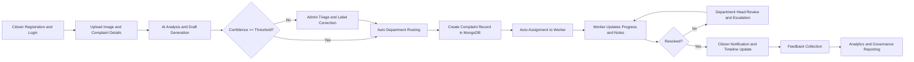

## 5.1 Overall System Context Diagram

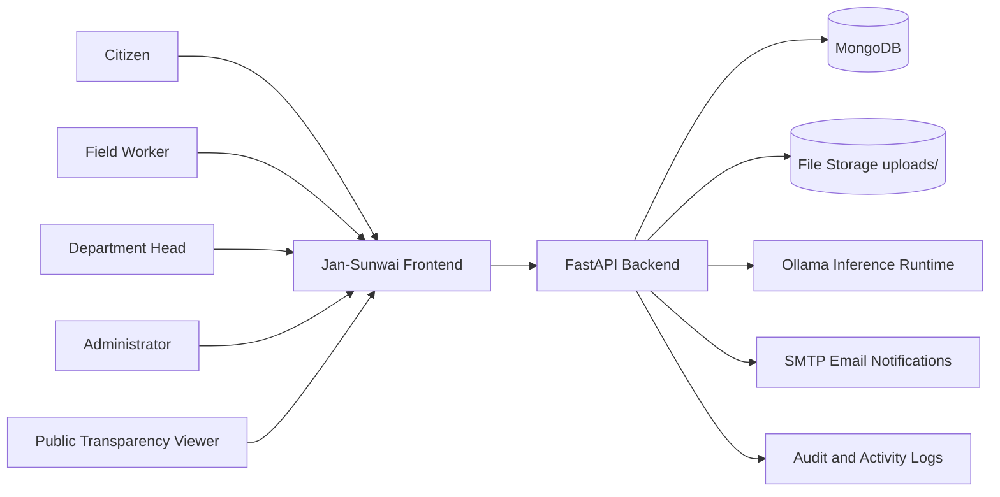

## 5.2 Component Architecture Diagram

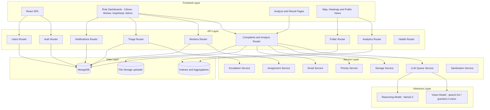

## 5.3 E-R Diagram

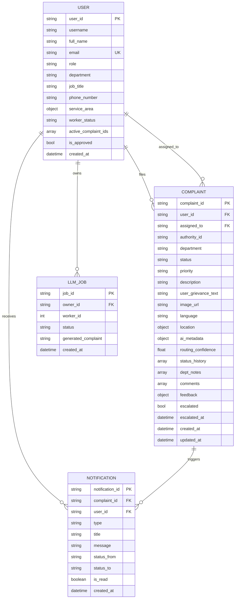

## 5.4 Use Case Diagram

```mermaid
flowchart TD
    subgraph Actors
        Citizen([Citizen])
        Worker([Worker])
        DeptHead([Department Head])
        Admin([Administrator])
        AI([AI Service])
        Notify([Notification Service])
    end

    subgraph Platform["Jan-Sunwai AI Platform"]
        UC1[Authenticate User]
        UC2[Submit Complaint with Evidence]
        UC3[Analyze Image and Generate Draft]
        UC4[Edit and Confirm Complaint]
        UC5[Track Complaint and SLA]
        UC6[View Assigned Queue]
        UC7[Update Status with Note]
        UC8[Resolve Complaint]
        UC9[Reassign / Transfer Complaint]
        UC10[Escalate Complaint]
        UC11[Approve Worker Onboarding]
        UC12[Review Low-Confidence Triage]
        UC13[View Analytics and Public Dashboard]
        UC14[Send Email Notifications]
        UC15[Reset Password]
    end

    Citizen --> UC1
    Citizen --> UC2
    Citizen --> UC4
    Citizen --> UC5
    Citizen --> UC15

    Worker --> UC1
    Worker --> UC6
    Worker --> UC7
    Worker --> UC8

    DeptHead --> UC1
    DeptHead --> UC6
    DeptHead --> UC7
    DeptHead --> UC9
    DeptHead --> UC10

    Admin --> UC1
    Admin --> UC11
    Admin --> UC12
    Admin --> UC13
    Admin --> UC9

    UC2 -->|includes| UC3
    UC4 -->|includes| UC3
    UC7 -->|includes| UC14
    UC8 -->|includes| UC14
    UC9 -->|includes| UC14
    UC10 -->|includes| UC14

    AI --> UC3
    Notify --> UC14
```

## 5.5 Class Diagram

```mermaid
classDiagram
    class User {
        +user_id: string
        +username: string
        +full_name: string
        +email: string
        +role: UserRole
        +department: string
        +job_title: string
        +phone_number: string
        +service_area: ServiceArea
        +worker_status: WorkerStatus
        +active_complaint_ids: list
        +is_approved: bool
        +login()
        +updateProfile()
    }

    class Complaint {
        +complaint_id: string
        +description: string
        +user_grievance_text: string
        +department: string
        +status: ComplaintStatus
        +priority: PriorityLevel
        +image_url: string
        +language: string
        +routing_confidence: float
        +escalated: bool
        +escalated_at: datetime
        +dept_notes: list
        +comments: list
        +feedback: dict
        +created_at: datetime
        +updated_at: datetime
        +assignWorker()
        +updateStatus()
        +escalate()
    }

    class Notification {
        +notification_id: string
        +type: NotificationType
        +title: string
        +message: string
        +is_read: boolean
        +created_at: datetime
        +markRead()
        +send()
    }

    class AIMetadata {
        +model_used: string
        +confidence_score: float
        +detected_department: string
        +labels: list
    }

    class GeoLocation {
        +lat: float
        +lon: float
        +address: string
        +source: LocationSource
    }

    class ServiceArea {
        +lat: float
        +lon: float
        +radius_km: float
        +locality: string
    }

    class StatusHistoryItem {
        +status: ComplaintStatus
        +timestamp: datetime
        +changed_by_user_id: string
        +note: string
    }

    class AssignmentService {
        +auto_assign(complaint)
        +free_worker_slot(worker, complaint)
    }

    class LLMQueueService {
        +enqueue(image_path, classification, user_details, location_details, language)
        +get_result(job_id)
        +get_result_async(job_id)
    }

    class PriorityService {
        +compute_priority(description, department)
    }

    class EscalationService {
        +escalation_loop()
    }

    class EmailService {
        +send_status_update_email(to_email, complaint_id, department, status_to, message)
        +send_password_reset_email(to_email, reset_token)
    }

    class ComplaintStatus {
        <<enumeration>>
        OPEN
        IN_PROGRESS
        RESOLVED
        REJECTED
    }

    class UserRole {
        <<enumeration>>
        CITIZEN
        WORKER
        DEPT_HEAD
        ADMIN
    }

    class WorkerStatus {
        <<enumeration>>
        AVAILABLE
        BUSY
        OFFLINE
    }

    class NotificationType {
        <<enumeration>>
        STATUS_CHANGE
        ESCALATION
        ASSIGNMENT
        SYSTEM
    }

    class PriorityLevel {
        <<enumeration>>
        LOW
        MEDIUM
        HIGH
        CRITICAL
    }

    class LocationSource {
        <<enumeration>>
        EXIF
        DEVICE
        MANUAL
    }

    User "1" --> "0..*" Complaint : files
    User "0..1" --> "0..*" Complaint : assigned_to
    User "1" --> "0..*" Notification : receives
    Complaint "1" --> "0..*" Notification : triggers
    Complaint "1" *-- "1" AIMetadata : ai_metadata
    Complaint "1" *-- "1" GeoLocation : location
    Complaint "1" *-- "0..*" StatusHistoryItem : status_history
    User "1" *-- "0..1" ServiceArea : service_area
    AssignmentService ..> Complaint : manages
    LLMQueueService ..> Complaint : generates_draft_for
    PriorityService ..> Complaint : scores
    EscalationService ..> Complaint : escalates
    EmailService ..> Notification : delivers
    Complaint --> ComplaintStatus
    User --> UserRole
```

## 5.6 Sequence Diagram

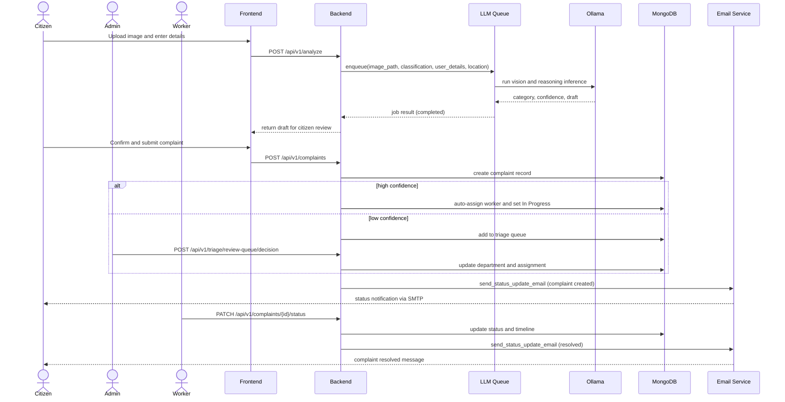

## 5.7 Activity Diagram

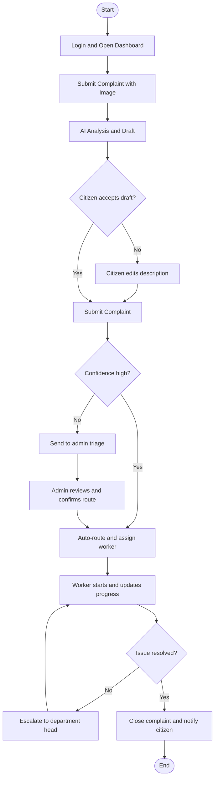

## 5.8 Data Flow Diagram

### 5.8.1 DFD Level 0 (Context)

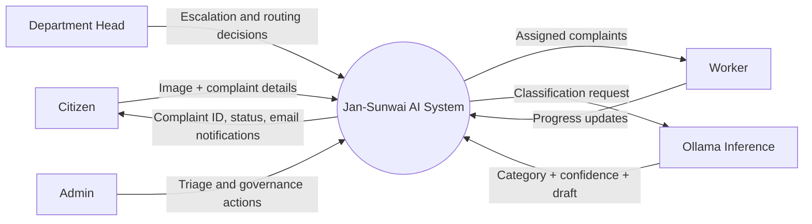

### 5.8.2 DFD Level 1

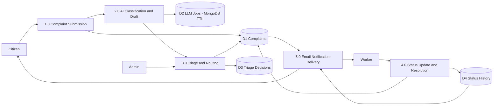

### 5.8.3 DFD Level 2 (Process 1.0 Complaint Submission)

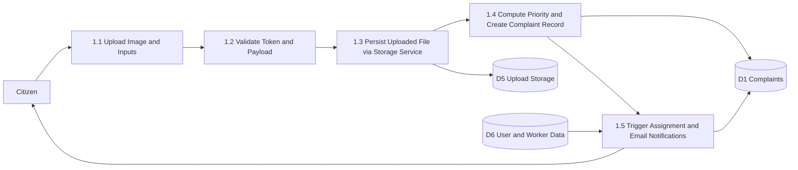

## 5.9 Deployment Diagram

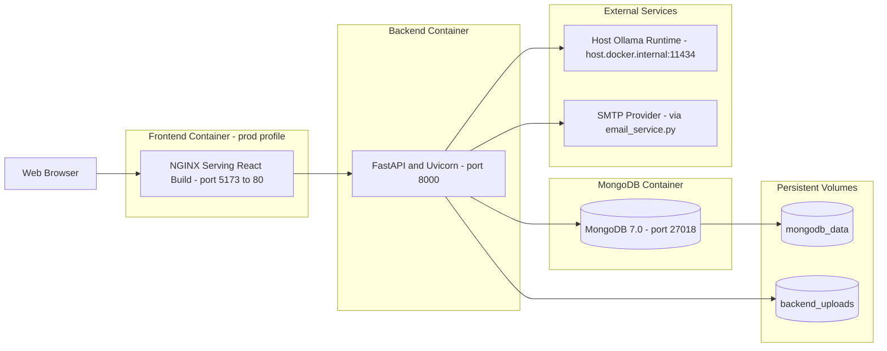