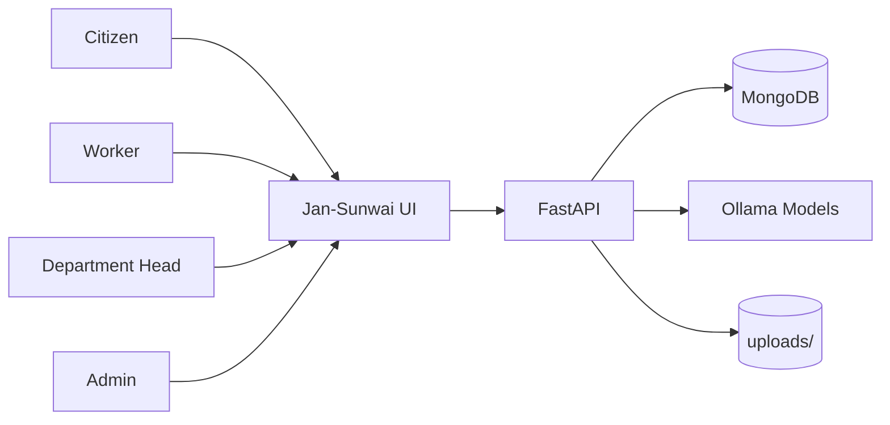
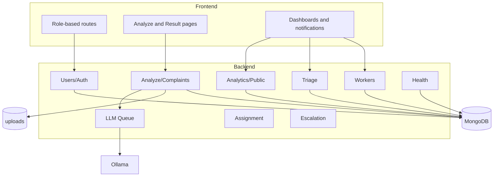
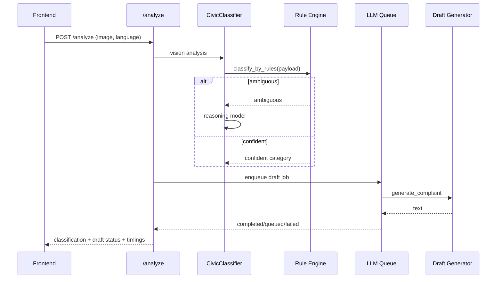
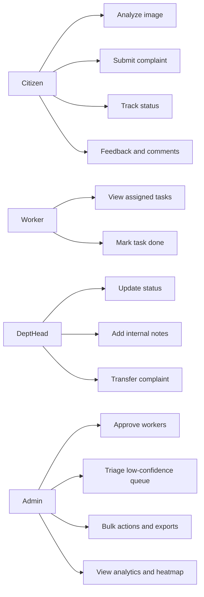
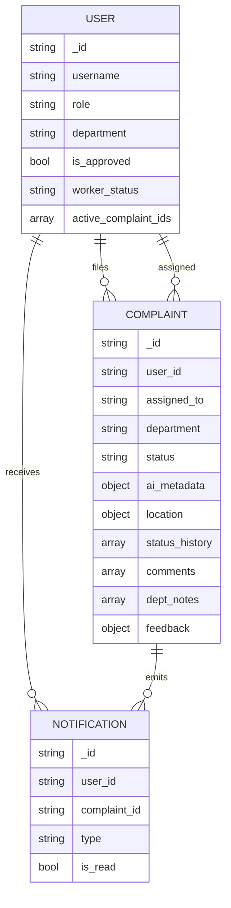
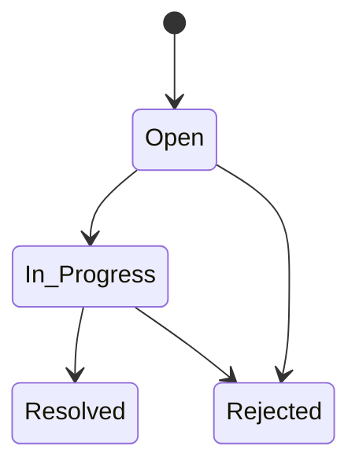
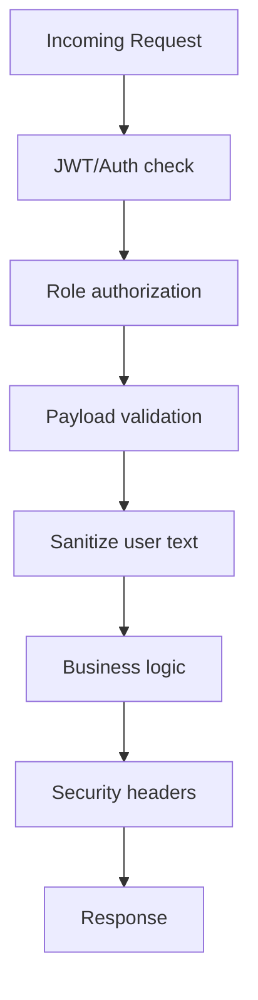
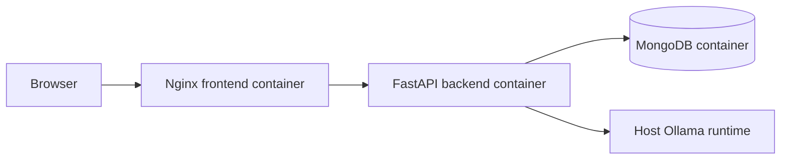
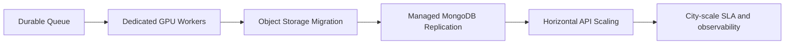

# Jan-Sunwai AI Project Report

Automated visual classification and routing of civic grievances using local vision-language models.

Last updated: 2026-04-06

## Table of Contents

1. Introduction
2. Problem and Motivation
3. System Scope
4. Architecture and Design
5. Data and Schema Design
6. API and Module Design
7. Security, Reliability, and Testing
8. Deployment and Operations
9. Outcomes and Limitations
10. Future Work

## 1. Introduction

Jan-Sunwai AI is a full-stack grievance platform that transforms image uploads into structured civic complaint workflows. The system combines frontend usability, backend orchestration, local AI inference, role-based operations, and lifecycle tracking.

## 2. Problem and Motivation

Existing complaint systems often require users to manually select departments and compose formal complaints. This leads to misrouting and inconsistent complaint quality.

Jan-Sunwai AI addresses this by automating:

- category classification,
- draft generation,
- routing metadata,
- and operational handoff.

## 3. System Scope

### User Roles

- Citizen
- Worker
- Department Head
- Admin

### Functional Scope

- Analyze uploaded image and generate draft.
- Create complaint record with AI metadata and location.
- Auto-assign to workers using department and geography.
- Track status and timeline.
- Admin triage for low-confidence AI cases.
- Notifications and analytics.

## 4. Architecture and Design

## 4.1 Context Diagram

## 4.2 Component Diagram

## 4.3 AI Pipeline Sequence

## 4.4 Use Case Diagram

## 5. Data and Schema Design

## 5.1 Core Entities

## 5.2 Complaint State Machine

## 6. API and Module Design

## 6.1 Router Groups

- Users: registration, login, profile, password reset.
- Analyze/Complaints: AI analyze, complaint CRUD, status/transfer/escalation, notes/comments/feedback.
- Workers: worker self-service and admin worker operations.
- Notifications: unread, list, mark read.
- Triage: low-confidence review queue and decisions.
- Analytics/Public/Health: reporting and service observability.

## 6.2 Versioning Strategy

All major routers are mounted with `/api/v1` aliases in `backend/main.py`.

## 7. Security, Reliability, and Testing

## 7.1 Security Controls

Implemented controls include:

- Upload validation by extension, size, and magic numbers.
- Role-gated endpoint access.
- Sanitization for user-provided text fields.
- Optional rate limiting.
- Health/readiness diagnostics.

## 7.2 Reliability Behaviors

- Graceful `503` response when AI pipeline is unavailable.
- Notification and email event on status updates.
- Escalation loop for SLA breach handling.
- Worker slot release and reassignment loop on task completion.

## 7.3 Testing Assets

- Integration smoke test (`test_api_integration.py`).
- Security/resilience tests (`test_resilience_security.py`).
- Notification chain tests (`test_notification_chain.py`).
- Load scenario (`locustfile.py`).

## 8. Deployment and Operations

## 8.1 Current Production Deployment

## 8.2 Operational Runbooks

- `docs/NDMC_DEPLOYMENT.md`
- `docs/LOAD_TESTING.md`
- `docs/SECURITY_TESTING.md`
- `docs/PRODUCTION_DEPLOYMENT_PLAN.md`

## 9. Outcomes and Limitations

### Outcomes

- End-to-end multi-role grievance lifecycle implemented.
- AI-assisted classification and drafting integrated into complaint workflow.
- Worker assignment and triage governance operational.
- Production-style compose deployment and runbooks established.

### Current Limitations

- LLM queue is in-memory (not durable across service restarts).
- Upload storage is local filesystem in baseline deployment.
- Inference path depends on local/host Ollama availability.

## 10. Future Work

Planned enhancements:

1. Replace in-memory queue with Redis/RabbitMQ.
2. Decouple API and inference worker nodes.
3. Move uploads to object storage.
4. Expand production observability and UAT automation.
