# Jan-Sunwai AI Project Report

Automated visual classification and routing of civic grievances using local vision-language models.

Last updated: 2026-04-06

## Table of Contents

1. [1. Executive Summary](#1-executive-summary)
2. [2. Background and Motivation](#2-background-and-motivation)
3. [3. Problem Statement and Objectives](#3-problem-statement-and-objectives)
4. [4. Scope and Stakeholder Model](#4-scope-and-stakeholder-model)
5. [5. System Architecture](#5-system-architecture)
6. [6. AI Pipeline and Decisioning](#6-ai-pipeline-and-decisioning)
7. [7. Data and Schema Design](#7-data-and-schema-design)
8. [8. API and Module Design](#8-api-and-module-design)
9. [9. Security, Reliability, and Quality Engineering](#9-security-reliability-and-quality-engineering)
10. [10. Performance and Load Engineering](#10-performance-and-load-engineering)
11. [11. Deployment and Operations](#11-deployment-and-operations)
12. [12. Timeline and Delivery Status](#12-timeline-and-delivery-status)
13. [13. Outcomes, Limitations, and Future Roadmap](#13-outcomes-limitations-and-future-roadmap)
14. [14. Conclusion](#14-conclusion)
15. [15. Appendices](#15-appendices)

## 1. Executive Summary

Jan-Sunwai AI is a multi-role civic grievance platform that converts citizen image uploads into department-routed, trackable complaints. The platform combines:

- React frontend workflows for citizen, worker, department head, and admin users.
- FastAPI backend services with role-based access control and JWT authentication.
- Local Ollama-based inference with a hybrid decision architecture.
- MongoDB document persistence for complaints, users, notifications, and audit metadata.

The system is built for local-first operation and supports a production-style Docker Compose deployment path.

## 2. Background and Motivation

Conventional civic complaint systems are often form-heavy and require users to manually determine the correct authority, draft formal text, and supply location context. This leads to:

- complaint misrouting,
- incomplete complaint descriptions,
- inconsistent processing quality,
- and delayed resolution cycles.

Jan-Sunwai AI addresses this by making image analysis the front door of complaint intake and automatically generating structured complaint artifacts required by operational teams.

## 3. Problem Statement and Objectives

### 3.1 Problem Statement

How can a civic platform transform unstructured image submissions into reliable, department-ready grievance records while maintaining role-aware operations, local deployment control, and production readiness?

### 3.2 Objectives

| Objective | Target Outcome |
| --- | --- |
| Reduce complaint filing complexity | Citizen flow centered on upload-analyze-submit |
| Improve routing quality | Canonical department classification and authority mapping |
| Improve operational turnaround | Worker assignment and lifecycle tracking |
| Preserve governance visibility | Triage, analytics, status history, and notes |
| Keep deployment practical | Local-first architecture with production compose support |

## 4. Scope and Stakeholder Model

### 4.1 Stakeholder Roles

| Role | Primary Capabilities |
| --- | --- |
| Citizen | Analyze image, submit complaint, track status, add feedback/comments |
| Worker | View assignments, update availability, mark complaints done |
| Department Head | Manage department queue, update status, add notes, transfer/escalate |
| Admin | Global oversight, worker approvals, triage decisions, bulk actions, exports, analytics |

### 4.2 Functional Scope

- AI-assisted complaint drafting from uploaded images.
- Complaint lifecycle from Open to Resolved/Rejected.
- Geographic and load-aware worker assignment.
- Notification workflows and unread state management.
- Triage governance for low-confidence AI outcomes.
- Analytics and public transparency feed.

## 5. System Architecture

### 5.1 Context Architecture

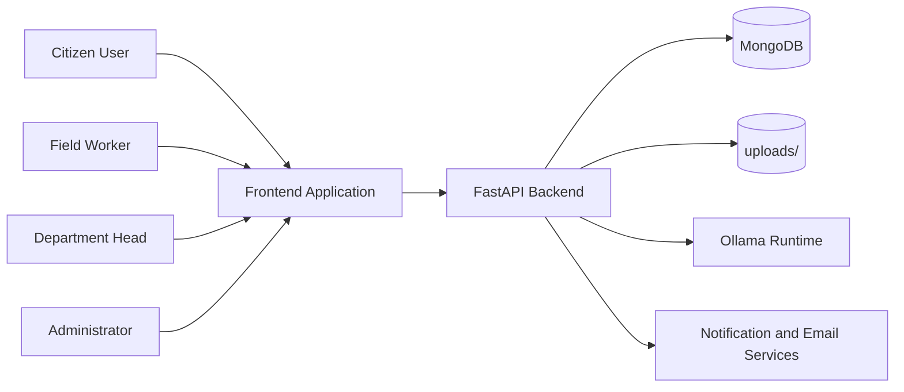

### 5.2 Logical Component Architecture

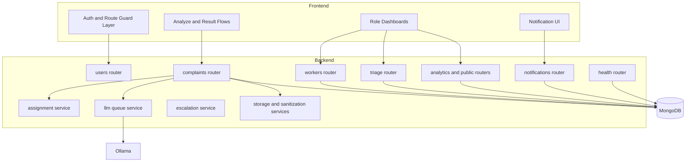

### 5.3 Complaint Lifecycle Sequence

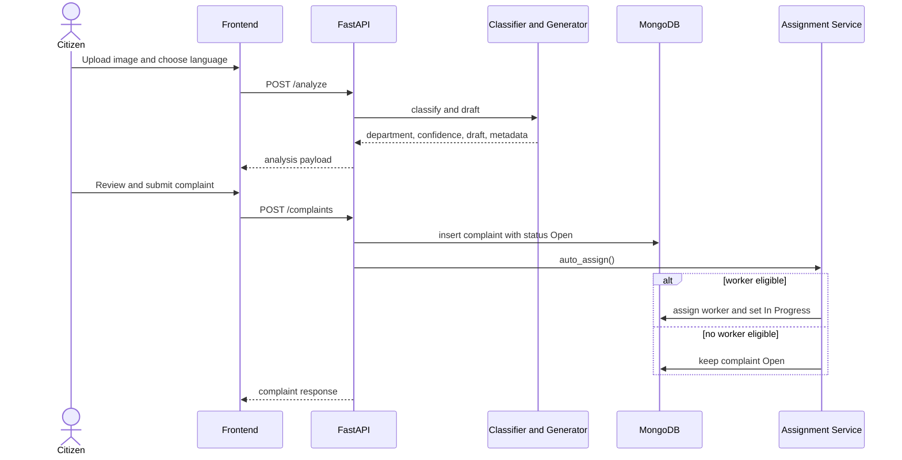

### 5.4 Worker Assignment Decision Flow

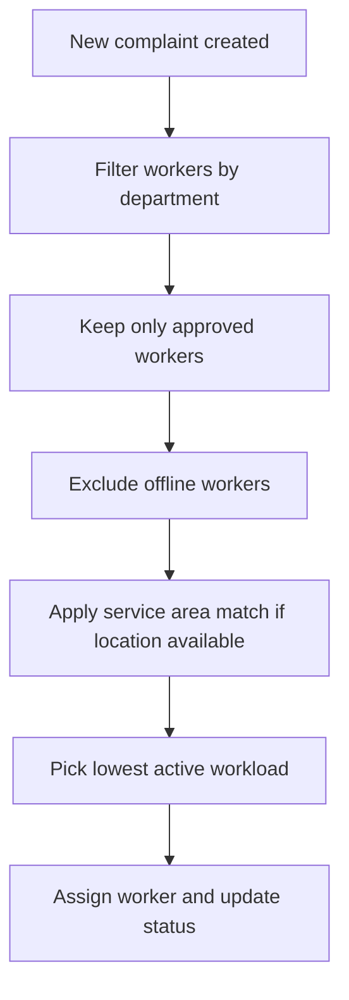

## 6. AI Pipeline and Decisioning

### 6.1 Hybrid Pipeline

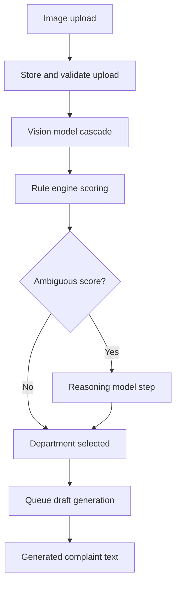

### 6.2 Model and Logic Responsibilities

| Stage | Component | Responsibility |
| --- | --- | --- |
| Vision | `VISION_MODEL` / cascade | Extract scene-level issue context |
| Deterministic classification | Rule engine | Fast category scoring and confidence gating |
| Ambiguous fallback | `REASONING_MODEL` | Resolve low-confidence edge cases |
| Draft generation | queue + generator | Produce formal complaint text in selected language |

### 6.3 Failure and Degradation Path

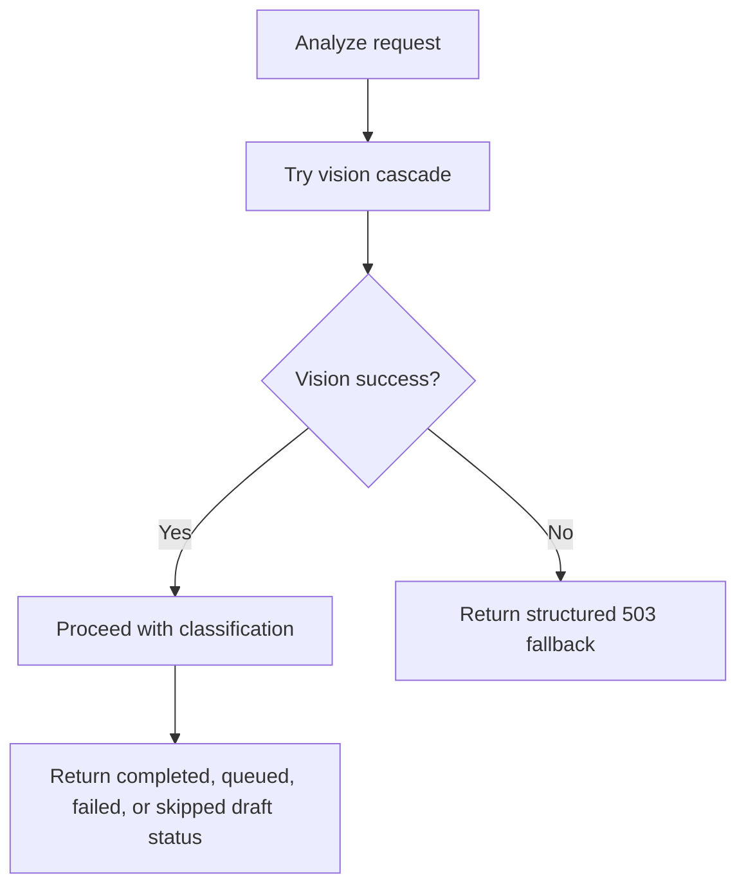

## 7. Data and Schema Design

### 7.1 Entity Relationships

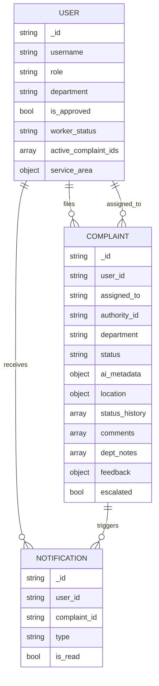

### 7.2 Complaint State Model

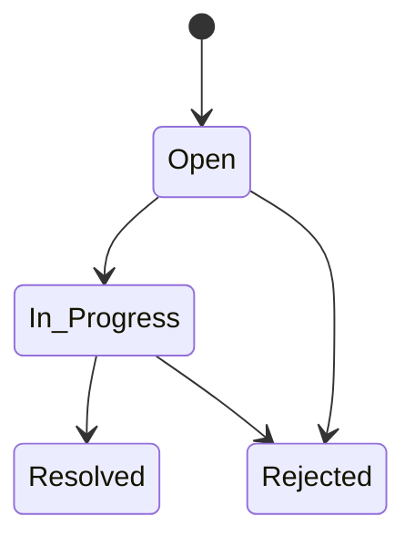

### 7.3 Index and Access Strategy

| Collection | Key Index Patterns |
| --- | --- |
| `users` | unique username, unique email |
| `complaints` | user+created_at, status+created_at, department+created_at |
| `notifications` | user+created_at, user+is_read |
| `password_resets` | token hash uniqueness, TTL expiry, user+used state |

## 8. API and Module Design

### 8.1 Domain Route Map

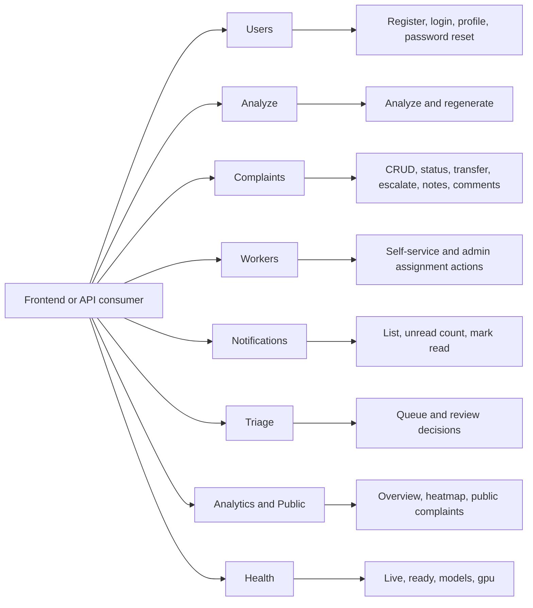

### 8.2 Endpoint Surface Summary

| Domain | Representative Endpoints |
| --- | --- |
| Users | `/users/register`, `/users/login`, `/users/me` |
| Analyze | `/analyze`, `/analyze/regenerate`, `/complaints/generation/{job_id}` |
| Complaints | `/complaints`, `/complaints/{complaint_id}/status`, bulk endpoints |
| Workers | `/workers/me`, `/workers/{worker_id}/assign/{complaint_id}` |
| Notifications | `/notifications`, `/notifications/unread-count` |
| Triage | `/triage/review-queue`, `/triage/review-queue/decision` |
| Analytics/Public | `/analytics/overview`, `/analytics/heatmap`, `/public/complaints` |
| Health | `/health/live`, `/health/ready`, `/health/models`, `/health/gpu` |

### 8.3 API Versioning

All major routers are mirrored under `/api/v1` aliases for stable integration contracts.

## 9. Security, Reliability, and Quality Engineering

### 9.1 Security Control Flow

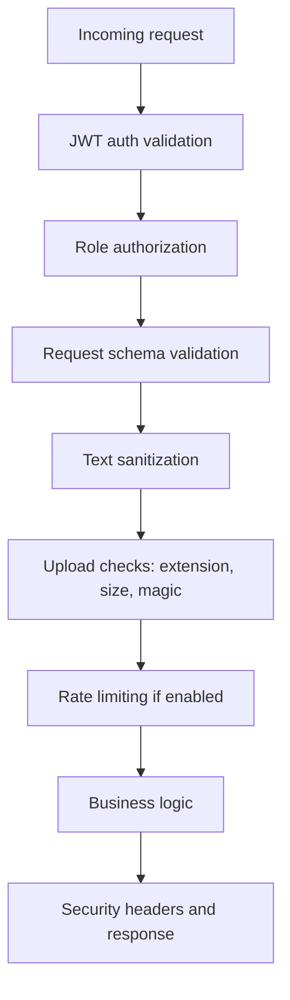

### 9.2 Security Control Matrix

| Area | Current Control |
| --- | --- |
| Authentication | OAuth2 password flow with JWT |
| Authorization | Role-gated endpoint dependencies |
| Secrets and token policy | Configurable JWT secret and expiry |
| Upload safety | Content checks and max size controls |
| Input safety | Sanitization for free-text fields |
| Browser security | CORS allowlist and security headers |
| Abuse mitigation | Optional slowapi-based rate limiting |

### 9.3 Reliability and Test Strategy

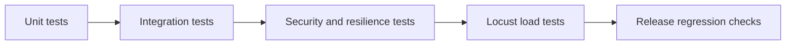

| Test Asset | Purpose |
| --- | --- |
| `test_schemas.py` | Schema validation correctness |
| `test_api_integration.py` | Endpoint-level role and response checks |
| `test_resilience_security.py` | Failure and security behavior checks |
| `test_notification_chain.py` | Notification workflow correctness |
| `locustfile.py` | Traffic profile and degradation characterization |

## 10. Performance and Load Engineering

### 10.1 Load Scenario Mix

| Endpoint | Typical Locust Weight | Expected Behavior |
| --- | --- | --- |
| `GET /public/complaints` | High | Stable read performance |
| `GET /health/live` | Medium | Fast heartbeat response |
| `GET /notifications/unread-count` | Medium | Token-scoped response correctness |
| `POST /analyze` | Lower, high-cost | Controlled degradation under pressure |

### 10.2 Degradation Handling

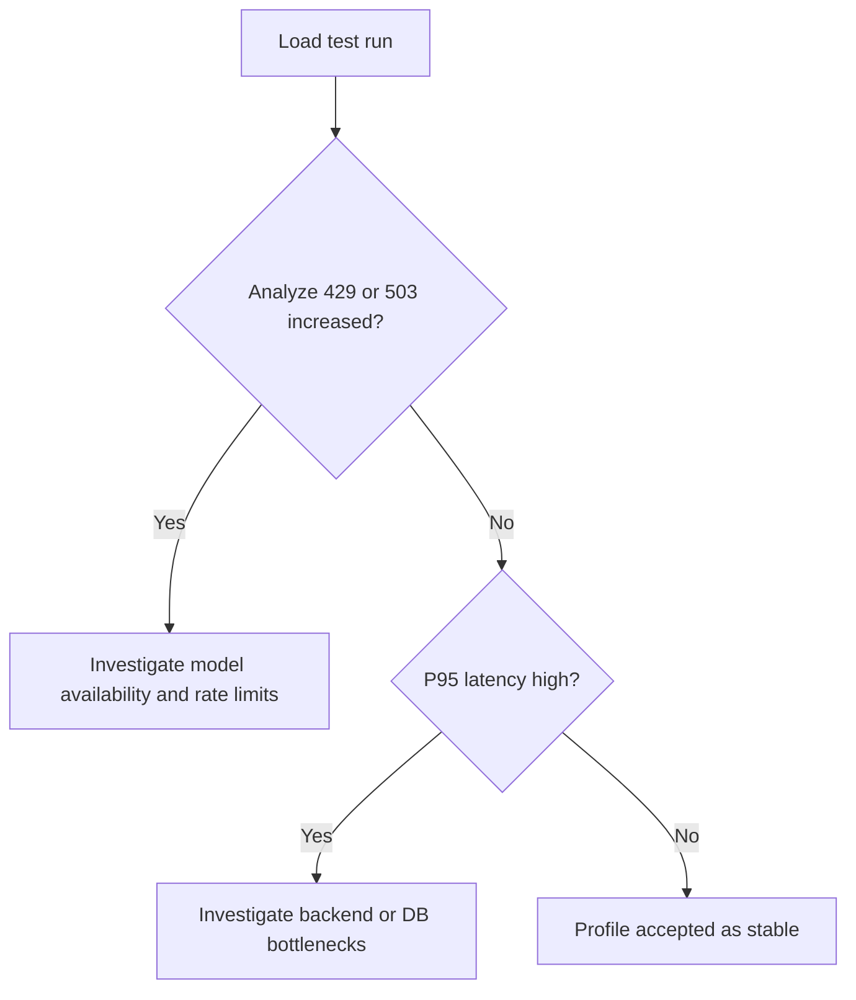

## 11. Deployment and Operations

### 11.1 Local Deployment Topology

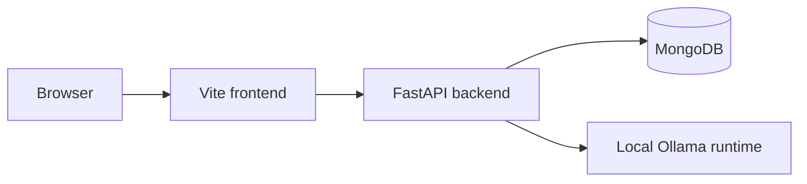

### 11.2 Production-Style Compose Topology

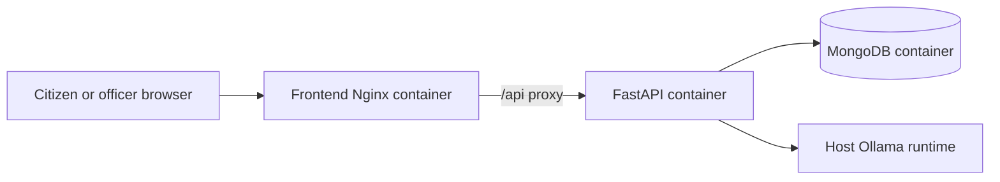

### 11.3 Operational Runbooks

- `docs/NDMC_DEPLOYMENT.md`
- `docs/LOAD_TESTING.md`
- `docs/SECURITY_TESTING.md`
- `docs/PRODUCTION_DEPLOYMENT_PLAN.md`

## 12. Timeline and Delivery Status

The complete daily planning and delivery timeline is maintained in:

- `docs/reports/PROJECT_TIMELINE.md`

That report includes:

- full week-by-week delivery records,
- dual status snapshots (24 Mar and 06 Apr),
- master and detailed Gantt views,
- and gate dependency mapping.

## 13. Outcomes, Limitations, and Future Roadmap

### 13.1 Outcomes

- Full grievance lifecycle implemented across citizen, worker, department head, and admin roles.
- AI-assisted classification and draft generation integrated into operational complaint workflows.
- Worker assignment and triage governance delivered.
- Production-style deployment and operational documentation established.

### 13.2 Current Limitations

| Limitation | Operational Impact |
| --- | --- |
| In-memory queue for generation | Queue state is not durable across backend restart |
| Local filesystem upload storage | Needs object storage for larger deployments |
| Ollama host dependency | Availability tied to local/host inference runtime |

### 13.3 Roadmap Diagram

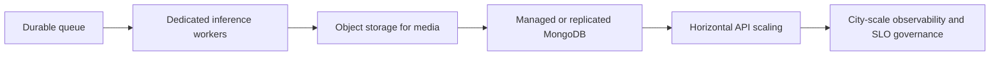

## 14. Conclusion

Jan-Sunwai AI demonstrates a practical civic technology pattern: image-first intake, deterministic-plus-LLM decisioning, role-governed operations, and deployment paths that can evolve from local operation to structured production environments. The current implementation is operationally meaningful and extensible for larger institutional rollout.

## 15. Appendices

### 15.1 Canonical Department Taxonomy

1. Health Department
2. Civil Department
3. Horticulture
4. Electrical Department
5. IT Department
6. Commercial
7. Enforcement
8. VBD Department
9. EBR Department
10. Fire Department
11. Uncategorized

### 15.2 Key Implementation References

- `README.md`
- `docs/API_REFERENCE.md`
- `docs/DEPARTMENT_HIERARCHY.md`
- `docs/reports/SYSTEM_ARCHITECTURE.md`
- `docs/reports/SCHEMA_DESIGN.md`
- `docs/reports/PROJECT_TIMELINE.md`
