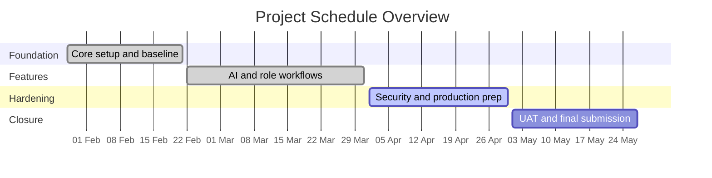
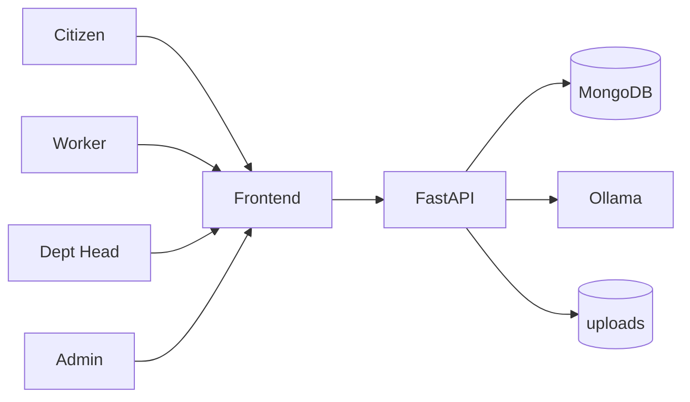
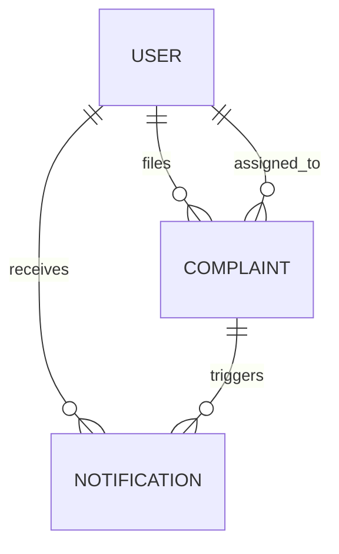
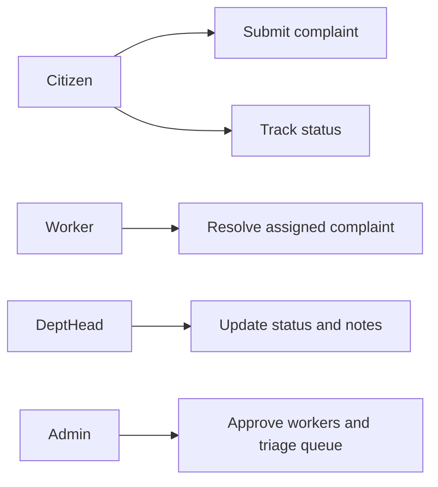
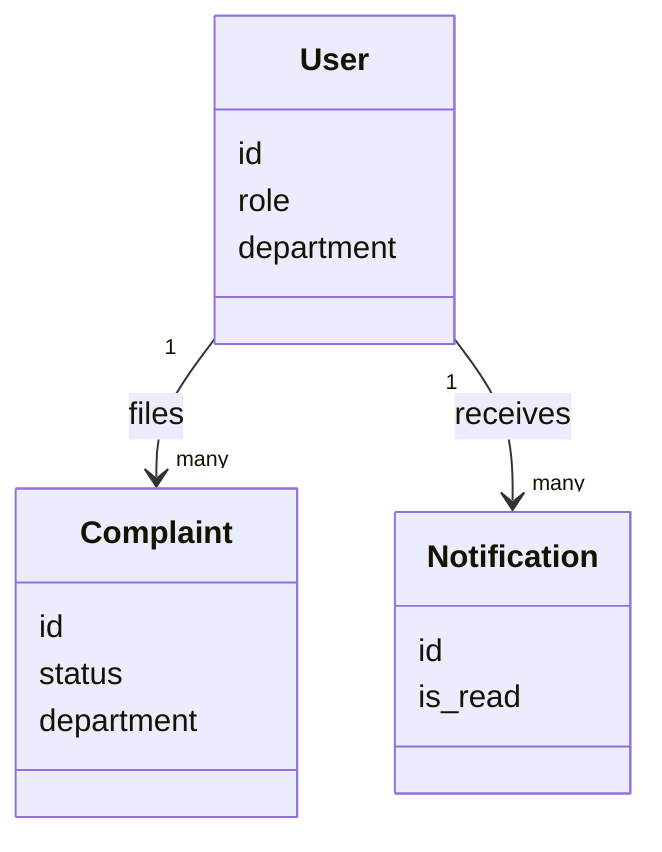
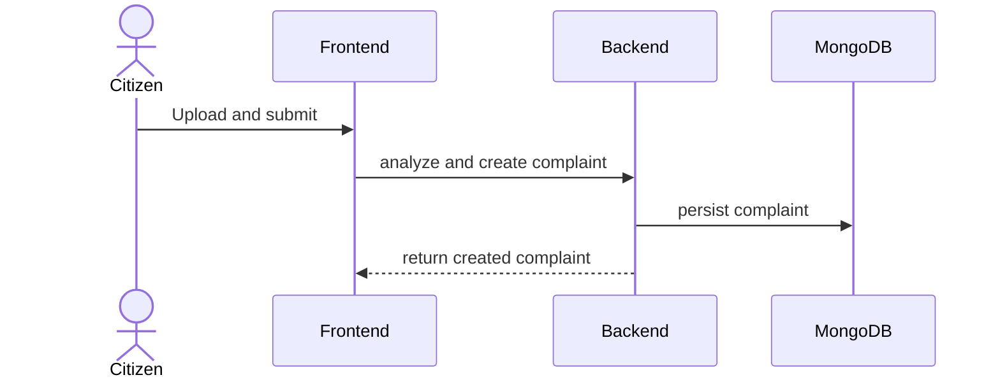
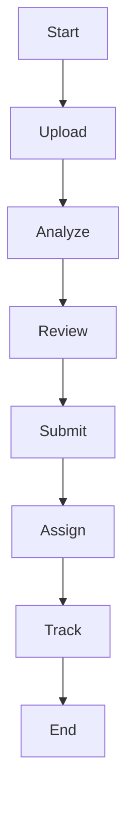
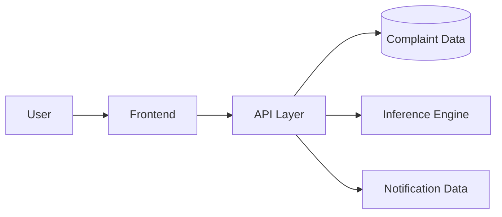
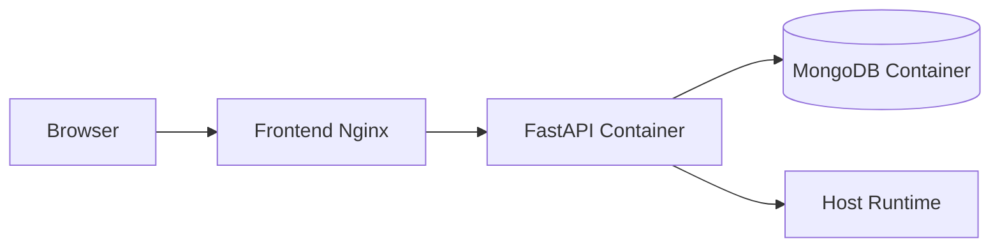

# Jan-Sunwai AI - Project Report

Automated visual classification and routing of civic grievances using local vision-language models.

Last updated: 2026-04-06

## Table of Contents (Hyperlinked)

1. [CONTENTS](#contents)
2. [List of Figures](#list-of-figures)
3. [List of Tables](#list-of-tables)
4. [List of Abbreviations](#list-of-abbreviations)
5. [List of Definitions](#list-of-definitions)
6. [List of Screenshots](#list-of-screenshots)
7. [1 Introduction](#1-introduction)
8. [2 Project Management](#2-project-management)
9. [3 System Requirement Study](#3-system-requirement-study)
10. [4 Proposed System Requirements](#4-proposed-system-requirements)
11. [5 System Design](#5-system-design)
12. [6 Implementation Planning](#6-implementation-planning)
13. [7 Testing](#7-testing)
14. [8 Limitations and Future Scope](#8-limitations-and-future-scope)
15. [9 Conclusion and References](#9-conclusion-and-references)
16. [10 Appendices](#10-appendices)
17. [11 Report Verification Procedure](#11-report-verification-procedure)

## CONTENTS

| Chapter No. | Description | Page No. |
| --- | --- | --- |
| - | List of Figures | I |
| - | List of Tables | II |
| - | List of Abbreviations | III |
| - | List of Definitions | IV |
| - | List of Screenshots | V |
| 1 | Introduction | 1 |
| 1.1 | Project Details | 2 |
| 1.2 | Purpose | 3 |
| 1.3 | Scope | 4 |
| 1.4 | Objectives | 5 |
| 1.5 | Technology Stack Used | 6 |
| 1.6 | Literature Review | 7 |
| 2 | Project Management | 8 |
| 2.1 | Feasibility Study | 9 |
| 2.1.1 | Technical Feasibility | 10 |
| 2.1.2 | Time Schedule Feasibility | 11 |
| 2.1.3 | Operational Feasibility | 12 |
| 2.1.4 | Implementation Feasibility | 13 |
| 2.2 | Project Planning | 14 |
| 2.2.1 | Development Approach and Justification | 15 |
| 2.2.2 | Milestones and Deliverables | 16 |
| 2.2.3 | Roles and Responsibilities | 17 |
| 2.2.4 | Group Dependencies | 18 |
| 2.3 | Project Scheduling (Gantt chart) | 19 |
| 3 | System Requirement Study | 21 |
| 3.1 | Existing System Overview | 22 |
| 3.2 | Limitations of the Existing System | 23 |
| 3.3 | User Characteristics | 24 |
| 3.4 | Functional Requirements | 25 |
| 3.5 | Non-Functional Requirements | 26 |
| 3.6 | Hardware and Software Requirements | 27 |
| 3.7 | Constraints | 28 |
| 3.7.1 | UI Constraints | 29 |
| 3.7.2 | Communication Interface | 30 |
| 3.7.3 | Hardware Interface | 31 |
| 3.7.4 | Criticality of Application | 33 |
| 3.7.5 | Safety and Security Considerations | 34 |
| 3.8 | Assumptions and Dependencies | 35 |
| 4 | Proposed System Requirements | 36 |
| 4.1 | Overview of Proposed System | 38 |
| 4.2 | Module Descriptions | 39 |
| 4.3 | System Features | 40 |
| 4.4 | Advantages of Proposed System | 42 |
| 5 | System Design | 43 |
| 5.1 | System Architecture Design | 44 |
| 5.2 | UML Diagrams | 46 |
| 5.2.1 | E-R Diagram | 47 |
| 5.2.2 | Use Case Diagram | 48 |
| 5.2.3 | Class Diagram | 49 |
| 5.2.4 | Sequence Diagram | 50 |
| 5.2.5 | Activity Diagram | 51 |
| 5.2.6 | DFD Diagram | 52 |
| 5.2.7 | Deployment Diagram | 55 |
| 5.3 | Database Design | 58 |
| 5.3.1 | Table Design and Relationships | 59 |
| 5.3.2 | Normalization | 60 |
| 5.3.3 | Data Dictionary | 62 |
| 5.4 | GUI Design | 63 |
| 5.5 | Screenshots | 64 |
| 6 | Implementation Planning | 66 |
| 6.1 | Implementation Environment | 68 |
| 6.2 | Tools and Technologies Used | 69 |
| 6.3 | Coding Standards Followed | 70 |
| 7 | Testing | 71 |
| 7.1 | Testing Plan | 72 |
| 7.2 | Types of Testing | 74 |
| 7.2.1 | Unit Testing | 75 |
| 7.2.2 | Integration Testing | 79 |
| 7.2.3 | System Testing | 82 |
| 7.2.4 | User Acceptance Testing (UAT) | 85 |
| 7.3 | Testing Techniques | 87 |
| 7.3.1 | Defect Logging | 90 |
| 8 | Limitations and Future Scope | 91 |
| 9 | Conclusion and References | 93 |
| 9.1 | Conclusion | 94 |
| 9.2 | References | 95 |
| 10 | Appendices | 96 |
| 11 | Report Verification Procedure | 97 |

## List of Figures

| Figure No. | Figure Description | Page No. |
| --- | --- | --- |
| Figure 1 | Overall System Context Diagram | 44 |
| Figure 2 | Component Architecture Diagram | 45 |
| Figure 3 | E-R Diagram | 47 |
| Figure 4 | Use Case Diagram | 48 |
| Figure 5 | Class Diagram | 49 |
| Figure 6 | Sequence Diagram | 50 |
| Figure 7 | Activity Diagram | 51 |
| Figure 8 | DFD Diagram | 52 |
| Figure 9 | Deployment Diagram | 55 |
| Figure 10 | Project Gantt View | 19 |

## List of Tables

| Table No. | Table Description | Page No. |
| --- | --- | --- |
| Table 1 | Objectives and Expected Outcomes | 5 |
| Table 2 | Technology Stack | 6 |
| Table 3 | Functional Requirements | 25 |
| Table 4 | Non-Functional Requirements | 26 |
| Table 5 | Module Mapping | 39 |
| Table 6 | Data Dictionary Summary | 62 |
| Table 7 | Testing Coverage Matrix | 72 |
| Table 8 | Defect Log Snapshot | 90 |

## List of Abbreviations

| Abbreviation | Full Form |
| --- | --- |
| AI | Artificial Intelligence |
| API | Application Programming Interface |
| JWT | JSON Web Token |
| LLM | Large Language Model |
| UAT | User Acceptance Testing |
| SLA | Service Level Agreement |
| RBAC | Role-Based Access Control |
| DFD | Data Flow Diagram |

## List of Definitions

| Term | Definition |
| --- | --- |
| Civic Complaint | Citizen-reported grievance related to public services/infrastructure |
| Triage Queue | Admin review queue for low-confidence AI classifications |
| Service Area | Worker-specific geographic eligibility radius for assignments |
| Status History | Audit trail of complaint lifecycle transitions |

## List of Screenshots

| Screenshot No. | Screenshot Description | Page No. |
| --- | --- | --- |
| S1 | Citizen Analyze Page | 64 |
| S2 | Result and Draft Review Page | 64 |
| S3 | Admin Dashboard | 64 |
| S4 | Worker Dashboard | 64 |
| S5 | Notifications Panel | 64 |

## 1 Introduction

Jan-Sunwai AI is a full-stack civic grievance platform that converts image uploads into structured complaint workflows and routes them to the correct operational stakeholders.

### 1.1 Project Details

- Project Name: Jan-Sunwai AI
- Domain: Civic technology and grievance redressal
- Deployment Model: Local-first with production-ready containerization

### 1.2 Purpose

The project reduces friction in civic complaint filing by automating classification, routing metadata, and formal complaint drafting from uploaded issue images.

### 1.3 Scope

The system covers citizen intake, complaint lifecycle tracking, worker assignment, triage governance, and operational analytics.

### 1.4 Objectives

| Objective | Outcome |
| --- | --- |
| Simplify complaint filing | Upload-analyze-submit flow |
| Improve routing quality | Canonical department assignment |
| Strengthen operations | Assignment, status history, and escalation support |
| Enable governance visibility | Dashboards, triage, exports, analytics |

### 1.5 Technology Stack Used

| Layer | Stack |
| --- | --- |
| Frontend | React + Vite |
| Backend | FastAPI + Python |
| Database | MongoDB |
| AI Runtime | Ollama (vision + reasoning) |
| Deployment | Docker Compose |

### 1.6 Literature Review

The system design aligns with practical trends in local inference deployment, deterministic-plus-LLM pipelines, and role-oriented public service workflow automation.

## 2 Project Management

### 2.1 Feasibility Study

#### 2.1.1 Technical Feasibility

The selected stack is already integrated and operational in the repository with validated route mappings and role controls.

#### 2.1.2 Time Schedule Feasibility

The project plan is organized by weekly milestones with explicit status tracking and completion markers.

#### 2.1.3 Operational Feasibility

The role model and dashboards align with real operational personas (citizen, worker, dept head, admin).

#### 2.1.4 Implementation Feasibility

The solution uses widely adopted frameworks and reproducible setup scripts for Windows/Linux and containerized deployment.

### 2.2 Project Planning

#### 2.2.1 Development Approach and Justification

An iterative delivery model was used, allowing security and operational hardening to be added progressively without blocking core functionality.

#### 2.2.2 Milestones and Deliverables

Milestones include core backend/frontend, AI integration, assignment and triage, production hardening, testing sprint, and handover pack.

#### 2.2.3 Roles and Responsibilities

- Product/feature implementation: backend and frontend engineering.
- AI pipeline and prompt logic: classifier and generation services.
- Operational governance: triage, analytics, and security controls.

#### 2.2.4 Group Dependencies

- Backend depends on MongoDB and Ollama availability.
- Frontend depends on backend route availability and auth flow.
- Production deployment depends on compose, env config, and host runtime access.

### 2.3 Project Scheduling (Gantt chart)

<!-- PERT/flowchart removed per request; retained Gantt above -->

## 3 System Requirement Study

### 3.1 Existing System Overview

Conventional grievance systems rely on manual categorization and text-heavy complaint authoring, producing routing delays and inconsistent submissions.

### 3.2 Limitations of the Existing System

- Manual authority selection.
- Inconsistent complaint quality.
- Limited operational traceability.

### 3.3 User Characteristics

| User Type | Expected Usage |
| --- | --- |
| Citizen | Report and track complaints |
| Worker | Resolve assigned work items |
| Dept Head | Manage queue and status transitions |
| Admin | Approvals, triage, analytics, governance |

### 3.4 Functional Requirements

- Image upload and AI-assisted analysis.
- Complaint creation and lifecycle state changes.
- Worker assignment and triage review workflows.
- Notifications, exports, and analytics.

### 3.5 Non-Functional Requirements

- Security: RBAC, cookie-session auth (with JWT compatibility), sanitization, upload checks.
- Reliability: graceful fallback and readiness probes.
- Performance: acceptable response behavior under load.

### 3.6 Hardware and Software Requirements

- GPU: 4 GB minimum for sequential model execution.
- RAM: 12 GB minimum, 16 GB recommended.
- OS: Windows/Linux supported.
- Software: Python, Node.js, Docker, MongoDB, Ollama.

### 3.7 Constraints

#### 3.7.1 UI Constraints

Role-gated routes and responsive layouts must remain consistent across dashboard views.

#### 3.7.2 Communication Interface

REST endpoints over HTTP(S), cookie-first auth with JWT compatibility, and proxied API routing in production.

#### 3.7.3 Hardware Interface

Inference depends on host resources and model runtime availability.

#### 3.7.4 Criticality of Application

The platform is governance-sensitive and requires accurate status tracking and auditability.

#### 3.7.5 Safety and Security Considerations

File safety checks, input sanitization, and role authorization are mandatory controls.

### 3.8 Assumptions and Dependencies

- MongoDB and Ollama are available.
- Environment variables are configured correctly.
- Production proxying and CORS are aligned with deployment domains.

## 4 Proposed System Requirements

### 4.1 Overview of Proposed System

A hybrid AI + deterministic routing platform with role-specific workflows and operational governance features.

### 4.2 Module Descriptions

- Auth and user management module.
- Analyze and complaint module.
- Worker and assignment module.
- Triage and notification module.
- Analytics and public transparency module.

### 4.3 System Features

- AI-assisted draft generation.
- Auto assignment with service-area filtering.
- Status history, notes, comments, and feedback.
- CSV exports and analytics.

### 4.4 Advantages of Proposed System

- Reduced user effort in complaint filing.
- Better authority routing quality.
- Stronger operational visibility and lifecycle control.

## 5 System Design

### 5.1 System Architecture Design

### 5.2 UML Diagrams

#### 5.2.1 E-R Diagram

#### 5.2.2 Use Case Diagram

#### 5.2.3 Class Diagram

#### 5.2.4 Sequence Diagram

#### 5.2.5 Activity Diagram

#### 5.2.6 DFD Diagram

#### 5.2.7 Deployment Diagram

### 5.3 Database Design

#### 5.3.1 Table Design and Relationships

Document model centers on users, complaints, notifications, and reset tokens with indexed lookup paths.

#### 5.3.2 Normalization

Controlled denormalization is used for operational speed while preserving clear ownership boundaries.

#### 5.3.3 Data Dictionary

| Field | Description |
| --- | --- |
| `complaint.status` | Lifecycle state |
| `complaint.department` | Canonical routing label |
| `complaint.ai_metadata` | AI decision metadata |
| `user.role` | Access-control role |

### 5.4 GUI Design

Role-specific dashboard patterns and analyze-result-submit flow with map-assisted location capture.

### 5.5 Screenshots

Screenshots are cataloged in the report artifact pack and linked in documentation assets.

## 6 Implementation Planning

### 6.1 Implementation Environment

- Local development with Python virtual environment and Node workspace.
- Production-style stack via Docker Compose.

### 6.2 Tools and Technologies Used

FastAPI, React, MongoDB, Ollama, Docker, pytest, locust, and markdown-based documentation tooling.

### 6.3 Coding Standards Followed

- Structured API route organization.
- Validation and sanitization-first request handling.
- Role-gated authorization patterns and explicit error semantics.

## 7 Testing

### 7.1 Testing Plan

| Layer | Method | Target |
| --- | --- | --- |
| Unit | pytest | schema and utility correctness |
| Integration | API tests | role and endpoint behavior |
| Resilience/Security | focused suites | degradation and control validation |
| Load | locust | throughput and latency profile |

### 7.2 Types of Testing

#### 7.2.1 Unit Testing

Validation of schemas, helper utilities, and isolated logic units.

#### 7.2.2 Integration Testing

Role-aware endpoint checks and versioned API path validation.

#### 7.2.3 System Testing

End-to-end flow testing from analyze to complaint lifecycle updates.

#### 7.2.4 User Acceptance Testing (UAT)

Persona-driven walkthroughs for citizen/admin workflows and operational checks.

### 7.3 Testing Techniques

- Positive and negative case matrices.
- Failure injection for dependency outage behavior.
- Regression checks after feature integration.

#### 7.3.1 Defect Logging

| Defect ID | Description | Status |
| --- | --- | --- |
| DEF-01 | Analyze fallback response consistency | Partial |
| DEF-02 | Notification chain full live validation | Partial |
| DEF-03 | Bundle optimization benchmark evidence | Partial |

## 8 Limitations and Future Scope

Current limitations include in-memory queue durability, filesystem-bound upload storage, and host-runtime dependency for inference. Future scope includes durable queueing, dedicated inference workers, managed storage, and stronger production observability.

## 9 Conclusion and References

### 9.1 Conclusion

Jan-Sunwai AI delivers a practical civic workflow platform with strong role governance, AI-assisted intake, and production-focused operational planning.

### 9.2 References

- `README.md`
- `docs/API_REFERENCE.md`
- `docs/NDMC_DEPLOYMENT.md`
- `docs/LOAD_TESTING.md`
- `docs/SECURITY_TESTING.md`
- `docs/reports/PROJECT_TIMELINE.md`
- `docs/reports/SYSTEM_ARCHITECTURE.md`
- `docs/reports/SCHEMA_DESIGN.md`

## 10 Appendices

- Appendix A: Canonical department taxonomy.
- Appendix B: Environment variable matrix.
- Appendix C: Operational runbook index.

## 11 Report Verification Procedure

1. Validate all route groups against backend routers.
2. Confirm timeline entries against code and docs commits.
3. Verify Mermaid diagrams render correctly in GitHub markdown view.
4. Run smoke diagnostics for markdown quality and consistency.
