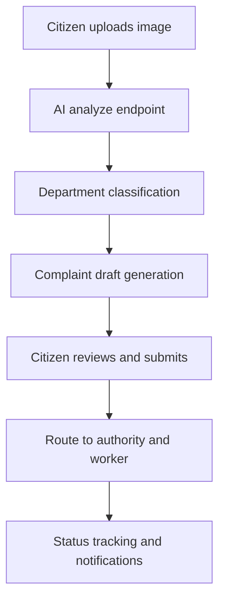
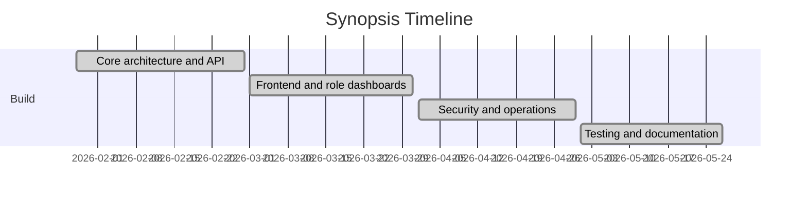

# Project Synopsis

## Title

Jan-Sunwai AI: Automated Visual Classification and Routing of Civic Grievances Using Local Vision-Language Models

## 1. Introduction

Jan-Sunwai AI is an image-first civic grievance platform that reduces manual effort in complaint filing. Citizens upload issue photos, the backend identifies the most suitable department, generates a formal complaint draft, captures location context, and routes the complaint into role-based departmental workflows.

The platform is designed for local inference using Ollama, making it suitable for privacy-conscious and cost-controlled deployments.

## 2. Problem Statement

Conventional grievance systems depend on users to:

- identify the responsible department,
- draft formal complaint text,
- provide precise location details,
- and repeatedly follow up for status.

This causes misrouting, incomplete data, and delayed resolution.

## 3. Proposed Solution

Jan-Sunwai AI combines:

1. Visual scene understanding from uploaded images,
2. Deterministic department classification with rule engine,
3. Optional reasoning for ambiguous cases,
4. Complaint draft generation,
5. Role-based routing and lifecycle management.

## 4. Objectives

- Reduce complaint filing effort and ambiguity.
- Improve department routing quality.
- Provide lifecycle transparency (`Open -> In Progress -> Resolved/Rejected`).
- Support worker assignment and departmental operational control.
- Maintain local-first inference and deployment capability.

## 5. Methodology

- Incremental module development.
- API-first backend with role-gated authorization.
- Dataset-assisted tuning for category mapping.
- Operational hardening through security, resilience, and load testing.

## 6. Facilities Required

### Hardware

- Minimum 4 GB VRAM GPU (recommended 6+ GB).
- Minimum 12 GB RAM (recommended 16 GB).

### Software

- Python 3.11+
- Node.js 18+
- FastAPI, React, MongoDB, Docker, Ollama

## 7. Deliverables

- Web application (frontend + backend).
- AI-assisted analysis and grievance drafting pipeline.
- Department, worker, and admin operational dashboards.
- Deployment runbooks and report documentation.

## 8. Timeline Snapshot

## 9. Conclusion

Jan-Sunwai AI demonstrates a practical civic-tech model where local AI, deterministic routing, and role-based operations are integrated into a deployable grievance platform. The project is suitable for institutional pilots and can evolve into a larger-scale production deployment with queue and storage decoupling.
