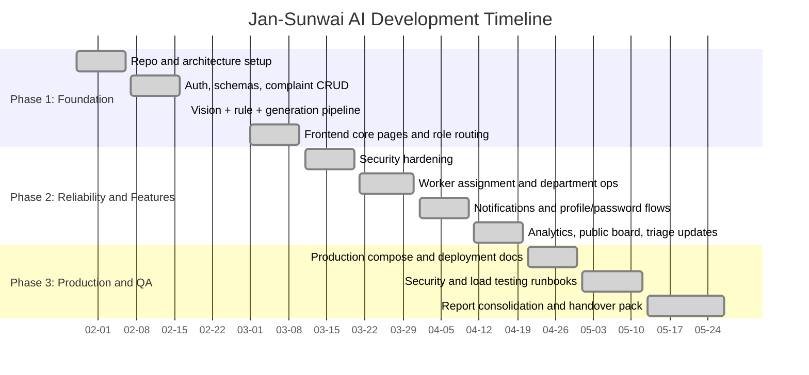
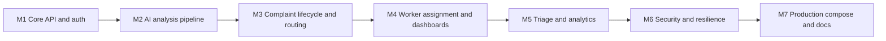

# Project Timeline

Project window: January 2026 to May 2026

This timeline reflects delivered architecture, security, worker assignment, analytics, and production-readiness features.

## Phase Overview

| Phase | Focus | Outcome |
| --- | --- | --- |
| Phase 1 | Foundation and core backend/frontend | End-to-end complaint flow established |
| Phase 2 | Security and operational capability | Role hardening, notifications, worker ops, triage, analytics |
| Phase 3 | Production readiness and handover prep | Compose production profile, docs, testing runbooks |

## Mermaid Gantt

## Milestone Map

## Current Status Summary

- Core delivery complete.
- Production-style deployment artifacts complete.
- Security and load test runbooks complete.
- Remaining work is primarily environment-specific UAT and operational rollout execution.
