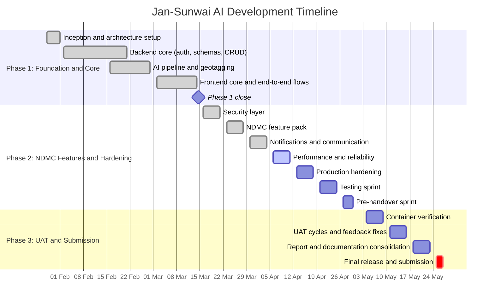

# Jan-Sunwai AI - Daily Project Report and Plan

> **Font:** Times New Roman throughout all printed / PDF versions of this document.
> **Last Updated:** 24 March 2026
> **Current Status:** Week 9 tasks ~70% complete. Worker panel, auto-assignment engine, heatmap, bulk admin ops, and SLA badges implemented ahead of schedule.
> **Last Updated:** 06 April 2026
> **Current Status:** Security/performance hardening, password reset/profile editing, API versioning, production compose artifacts, and deployment docs are implemented. Remaining work is full UAT/load/security audit and release operations.

**Project Duration:** January 28, 2026 - May 27, 2026
**Schedule Logic:** Monday to Saturday work weeks. Sundays are OFF. 2nd and 4th Saturdays are OFF.

## Status Legend

| Status | Meaning |
| --- | --- |
| Completed | Implemented and verified in codebase |
| Partial | Implemented in part; pending completion/validation |
| In Progress | Active workstream currently open |
| Planned | Scheduled but not yet started |
| OFF | Non-working day |

## Program Summary

| Phase | Focus | Current Position |
| --- | --- | --- |
| Phase 1 | Foundation + core backend/frontend | Completed |
| Phase 2 | Security, NDMC features, reliability, production prep | In Progress |
| Phase 3 | UAT, report consolidation, final submission | Planned |

## Master Gantt (Program View)



## NDMC Hardening Gantt (Detailed: Weeks 8-14)

```mermaid
gantt
    title NDMC Hardening Sprint Detail (Mar 16 - Apr 30)
    dateFormat YYYY-MM-DD
    axisFormat %d %b

    section Week 8 Security Layer
    File magic number validation                :active, s1, 2026-03-16, 1d
    Rate limiting on critical endpoints         :done, s2, 2026-03-17, 1d
    Input sanitization and XSS prevention       :done, s3, 2026-03-18, 1d
    CORS lockdown and security headers          :done, s4, 2026-03-19, 1d
    JWT security review                         :done, s5, 2026-03-20, 1d
    MongoDB production indexing                 :done, s6, 2026-03-21, 1d

    section Week 9 NDMC Feature Pack
    Complaint status audit trail                :done, n1, 2026-03-23, 1d
    Worker panel and assignment system          :done, n2, 2026-03-24, 1d
    Escalation timeline UI                      :done, n3, 2026-03-24, 1d
    Analytics and heatmap                       :done, n4, 2026-03-25, 1d
    SLA badges                                  :done, n5, 2026-03-26, 1d
    Bulk status update and CSV export           :done, n6, 2026-03-27, 1d

    section Week 10 Notifications and Communication
    Navbar notification wiring                  :done, c1, 2026-03-30, 1d
    Auto-notify on status changes               :done, c2, 2026-03-31, 1d
    Notification email stub                     :done, c3, 2026-04-01, 1d
    Password reset flow                         :done, c4, 2026-04-02, 1d
    Profile editing                             :done, c5, 2026-04-03, 1d
    Notification chain E2E test                 :active, c6, 2026-04-04, 1d

    section Week 11 Performance and Reliability
    Client-side image compression               :done, r1, 2026-04-06, 1d
    Frontend bundle optimization                :active, r2, 2026-04-07, 1d
    Ollama graceful degradation                 :done, r3, 2026-04-08, 1d
    Backend performance profiling               :active, r4, 2026-04-09, 1d
    Resilience test                             :active, r5, 2026-04-10, 1d

    section Week 12 Production Hardening
    Docker production config                    :p, h1, 2026-04-13, 1d
    Docker Compose production profile           :p, h2, 2026-04-14, 1d
    NDMC deployment environment config          :p, h3, 2026-04-15, 1d
    API versioning rollout                      :p, h4, 2026-04-16, 1d
    MongoDB backup strategy                     :p, h5, 2026-04-17, 1d
    UI and branding pass                        :p, h6, 2026-04-18, 1d

    section Week 13 Testing Sprint
    Backend unit test expansion                 :p, t1, 2026-04-20, 1d
    API integration matrix                      :p, t2, 2026-04-21, 1d
    Security penetration test pass              :p, t3, 2026-04-22, 1d
    Locust load benchmark                       :p, t4, 2026-04-23, 1d
    Mobile responsiveness fixes                 :p, t5, 2026-04-24, 1d

    section Week 14 Pre-Handover
    NDMC handover guide                         :p, u1, 2026-04-27, 1d
    Final API reference                         :p, u2, 2026-04-28, 1d
    Repository cleanup                          :p, u3, 2026-04-29, 1d
    Release candidate preparation               :p, u4, 2026-04-30, 1d
```

## Critical Path and Gate Dependencies

```mermaid
flowchart LR
    G1[Gate 1: Core foundation complete] --> G2[Gate 2: Security baseline]
    G2 --> G3[Gate 3: Worker ops and analytics]
    G3 --> G4[Gate 4: Notification and profile workflows]
    G4 --> G5[Gate 5: Reliability and resilience]
    G5 --> G6[Gate 6: Production hardening and tests]
    G6 --> G7[Gate 7: UAT completion]
    G7 --> G8[Gate 8: Final report and release submission]
```



## Status Reconciliation (24 Mar Snapshot -> 06 Apr Snapshot)

| Date | Work Item | 24 Mar View | 06 Apr View |
| --- | --- | --- | --- |
| Mar 17 | Rate limiting on critical endpoints | Pending | Completed |
| Mar 18 | Input sanitization and XSS prevention | Pending | Completed |
| Mar 19 | CORS lockdown and security headers | Partial | Completed |
| Mar 20 | JWT security review | Partial | Completed |
| Mar 21 | MongoDB indexing for production queries | Pending | Completed |
| Mar 24 | Escalation timeline UI | In Progress | Completed |
| Mar 27 | Bulk status update and CSV export | Partial | Completed |
| Mar 30 | Wire notifications to navbar | Planned | Completed |
| Mar 31 | Auto-notify on status change | Planned | Completed |
| Apr 01 | Notification email stub | Planned | Completed |
| Apr 02 | Password reset flow | Planned | Completed |
| Apr 03 | Profile editing | Planned | Completed |
| Apr 04 | Notification chain E2E test | Planned | Partial |
| Apr 07 | Frontend bundle optimization | Planned | Partial |
| Apr 09 | Backend performance profiling | Planned | Partial |
| Apr 10 | Resilience testing | Planned | Partial |
| Apr 13 | Docker production config | Planned | Completed |
| Apr 14 | Docker Compose production profile | Planned | Completed |
| Apr 15 | NDMC deployment environment config | Planned | Completed |
| Apr 16 | API versioning | Planned | Completed |
| Apr 17 | MongoDB backup strategy | Planned | Completed |
| Apr 18 | UI/UX audit and branding pass | Planned | Partial |
| Apr 20 | Backend unit tests | Planned | Partial |
| Apr 21 | API integration tests | Planned | Partial |
| Apr 22 | Security penetration test | Planned | Partial |
| Apr 23 | Load test | Planned | Partial |
| Apr 24 | Mobile responsiveness fixes | Planned | Completed |
| Apr 27 | NDMC handover guide | Planned | Completed |
| Apr 28 | Final API reference documentation | Planned | Completed |
| Apr 29 | Repository cleanup | Planned | Partial |
| Apr 30 | Release candidate v1.0-rc1 | Planned | Partial |

## Detailed Daily Timeline (Full)

### Week 1: Jan 28 (Wed) - Jan 31 (Sat)

| Date | Work Focus | Status | Notes |
| --- | --- | --- | --- |
| Jan 28 | Project inception and repository setup | Completed | Master repo, folder structure, gitignore, roadmap draft |
| Jan 29 | Development environment configuration | Completed | Python/Node toolchain, venv, VS Code setup |
| Jan 30 | System architecture and requirement study | Completed | DFD/ER planning and SRS baseline |
| Jan 31 | Backend skeleton implementation | Completed | FastAPI base app, middleware shell, smoke tests |
| Feb 01 | OFF | OFF | Sunday |

### Week 2: Feb 02 (Mon) - Feb 07 (Sat)

| Date | Work Focus | Status | Notes |
| --- | --- | --- | --- |
| Feb 02 | Database connectivity and setup | Completed | MongoDB bootstrap and Motor connection handler |
| Feb 03 | User auth schema design | Completed | Pydantic models and JWT flow planning |
| Feb 04 | Grievance data modeling | Completed | Complaint/location metadata schema coverage |
| Feb 05 | CRUD API implementation | Completed | Core complaint create and retrieval endpoints |
| Feb 06 | File handling and storage system | Completed | Secure upload and storage helper |
| Feb 07 | Router organization and refactor | Completed | Split routes by APIRouter modules |
| Feb 08 | OFF | OFF | Sunday |

### Week 3: Feb 09 (Mon) - Feb 14 (Sat)

| Date | Work Focus | Status | Notes |
| --- | --- | --- | --- |
| Feb 09 | AI model research | Completed | CLIP exploration later replaced by Ollama pipeline |
| Feb 10 | AI dependency integration | Completed | Initial stack tested and later streamlined |
| Feb 11 | JWT authentication implementation | Completed | Token generation, validation, protected routes |
| Feb 12 | Classifier prototype implementation | Completed | Initial baseline then replaced with hybrid approach |
| Feb 13 | Classification accuracy testing | Completed | Benchmarks informed model strategy change |
| Feb 14 | OFF | OFF | 2nd Saturday |
| Feb 15 | OFF | OFF | Sunday |

### Week 4: Feb 16 (Mon) - Feb 21 (Sat)

| Date | Work Focus | Status | Notes |
| --- | --- | --- | --- |
| Feb 16 | EXIF metadata and GPS research | Completed | Device metadata behavior verified |
| Feb 17 | GPS parsing and conversion logic | Completed | DMS to decimal conversion utilities |
| Feb 18 | Reverse geocoding integration | Completed | Geopy/Nominatim integration with safeguards |
| Feb 19 | Geotagging module integration | Completed | Unified location extraction service |
| Feb 20 | Edge case handling | Completed | Missing/corrupt EXIF fallbacks |
| Feb 21 | AI pipeline integration into analyze endpoint | Completed | End-to-end classify + location flow |
| Feb 22 | OFF | OFF | Sunday |

### Week 5: Feb 23 (Mon) - Feb 28 (Sat)

| Date | Work Focus | Status | Notes |
| --- | --- | --- | --- |
| Feb 23 | Ollama runtime and model setup | Completed | qwen2.5vl + granite + llama configuration |
| Feb 24 | Prompt engineering and pipeline tuning | Completed | Vision + rules + optional reasoning logic |
| Feb 25 | Complaint generator service | Completed | Draft generation and post-processing |
| Feb 26 | Draft generation API exposure | Completed | Endpoint flow and timeout controls |
| Feb 27 | Generated text quality QA | Completed | Prompt iteration and style normalization |
| Feb 28 | OFF | OFF | 4th Saturday |
| Mar 01 | OFF | OFF | Sunday |

### Week 6: Mar 02 (Mon) - Mar 07 (Sat)

| Date | Work Focus | Status | Notes |
| --- | --- | --- | --- |
| Mar 02 | Frontend initialization and dependencies | Completed | React/Vite/Tailwind and base libraries |
| Mar 03 | Routing and layout | Completed | Route scaffolding and responsive shell |
| Mar 04 | Image upload component | Completed | Drag/drop, previews, validation |
| Mar 05 | Analyze API hook integration | Completed | Loading/error states and API binding |
| Mar 06 | Result page implementation | Completed | Classification, map, draft editing |
| Mar 07 | End-to-end frontend to backend walkthrough | Completed | Analyze and submit flow validated |
| Mar 08 | OFF | OFF | Sunday |

### Week 7: Mar 09 (Mon) - Mar 14 (Sat)

| Date | Work Focus | Status | Notes |
| --- | --- | --- | --- |
| Mar 09 | Map integration | Completed | Interactive map support wired |
| Mar 10 | Draggable marker and browser GPS fallback | Completed | Location correction controls added |
| Mar 11 | Local draft backup behavior | Completed | Local persistence and reset support |
| Mar 12 | Error boundary and 404 page | Completed | App-level resilience screens |
| Mar 13 | Full role-wise walkthrough | Completed | Citizen/dept_head/admin journeys validated |
| Mar 14 | Phase closure and cleanup | Completed | Beta closure and known-issue notes |
| Mar 15 | OFF | OFF | Sunday |

### Week 8: Mar 16 (Mon) - Mar 21 (Sat) [Security Layer]

| Date | Work Focus | Status | Notes |
| --- | --- | --- | --- |
| Mar 16 | File magic number validation | Partial | 5 MB size limit done; magic-byte verification pending |
| Mar 17 | Rate limiting on critical endpoints | Completed | Limiter integrated with local-safe fallback |
| Mar 18 | Input sanitization and XSS prevention | Completed | Sanitization service applied to free-text fields |
| Mar 19 | CORS lockdown and security headers | Completed | CORS allowlist + header middleware delivered |
| Mar 20 | JWT security review | Completed | Production default token TTL updated to 8 hours |
| Mar 21 | MongoDB indexing for production queries | Completed | create_indexes helper + reset-token indexes |
| Mar 22 | OFF | OFF | Sunday |

### Week 9: Mar 23 (Mon) - Mar 28 (Sat) [NDMC Feature Pack]

| Date | Work Focus | Status | Notes |
| --- | --- | --- | --- |
| Mar 23 | Complaint status audit trail | Completed | status_history flow added |
| Mar 24 | Worker panel and assignment system | Completed | Assignment debug and bulk reassignment endpoints |
| Mar 24 | Escalation timeline UI | Completed | Citizen dashboard timeline wired |
| Mar 25 | Analytics and heatmap | Completed | Dashboard metrics + map heat layers |
| Mar 26 | SLA badges | Completed | Per-department SLA indicators on complaint cards |
| Mar 27 | Bulk status update and CSV export | Completed | Backend and admin UI integrated |
| Mar 28 | OFF | OFF | 4th Saturday |
| Mar 29 | OFF | OFF | Sunday |

### Week 10: Mar 30 (Mon) - Apr 04 (Sat) [Notification and Communication]

| Date | Work Focus | Status | Notes |
| --- | --- | --- | --- |
| Mar 30 | Wire notifications to navbar | Completed | Unread badge and refresh flow |
| Mar 31 | Auto-notify on status change | Completed | Status transitions trigger citizen notifications |
| Apr 01 | Notification email stub (NDMC-ready) | Completed | SMTP-ready service and env hooks |
| Apr 02 | Password reset flow | Completed | forgot/reset endpoints and token handling |
| Apr 03 | Profile editing | Completed | PATCH /users/me and frontend profile wiring |
| Apr 04 | Notification chain end-to-end test | Partial | Automated coverage added; live execution pending |
| Apr 05 | OFF | OFF | Sunday |

### Week 11: Apr 06 (Mon) - Apr 11 (Sat) [Performance and Reliability]

| Date | Work Focus | Status | Notes |
| --- | --- | --- | --- |
| Apr 06 | Client-side image compression | Completed | Upload payload reduced to <= 1 MB target |
| Apr 07 | Frontend bundle optimization | Partial | lazy/suspense done; Lighthouse run pending |
| Apr 08 | Ollama graceful degradation | Completed | User-friendly 503 fallback path |
| Apr 09 | Backend performance profiling | Partial | cProfile scaffolding and timing fields added |
| Apr 10 | Resilience testing | Partial | Automated checks added; browser-level pass pending |
| Apr 11 | OFF | OFF | 2nd Saturday |
| Apr 12 | OFF | OFF | Sunday |

### Week 12: Apr 13 (Mon) - Apr 18 (Sat) [NDMC Production Hardening]

| Date | Work Focus | Status | Notes |
| --- | --- | --- | --- |
| Apr 13 | Docker production config | Planned | Backend gunicorn profile + frontend multi-stage image |
| Apr 14 | Docker Compose production profile | Planned | Healthchecks, restart policies, log controls |
| Apr 15 | NDMC deployment environment config | Planned | env.production finalization and infra requirements |
| Apr 16 | API versioning | Planned | /api/v1 strategy and frontend base URL updates |
| Apr 17 | MongoDB backup strategy | Planned | backup script + retention/recovery documentation |
| Apr 18 | UI/UX audit and NDMC branding pass | Planned | Standardized visual quality and placeholders |
| Apr 19 | OFF | OFF | Sunday |

### Week 13: Apr 20 (Mon) - Apr 25 (Sat) [Testing Sprint]

| Date | Work Focus | Status | Notes |
| --- | --- | --- | --- |
| Apr 20 | Backend unit tests | Planned | Auth/CRUD/classifier/rules/rate-limit cases |
| Apr 21 | API integration tests | Planned | Role-wise endpoint matrix and schema checks |
| Apr 22 | Security penetration test | Planned | JWT bypass/upload/XSS probing and patch loop |
| Apr 23 | Load test | Planned | Locust benchmarks and p95 reporting |
| Apr 24 | Mobile responsiveness fixes | Planned | 375px layout and tap-target validation |
| Apr 25 | OFF | OFF | 4th Saturday |
| Apr 26 | OFF | OFF | Sunday |

### Week 14: Apr 27 (Mon) - Apr 30 (Thu) [Pre-Handover Sprint]

| Date | Work Focus | Status | Notes |
| --- | --- | --- | --- |
| Apr 27 | NDMC handover guide | Planned | End-to-end deployment runbook |
| Apr 28 | Final API reference documentation | Planned | OpenAPI examples and consumer notes |
| Apr 29 | Repository cleanup | Planned | Remove stale code/comments and format pass |
| Apr 30 | Release tag v1.0-rc1 | Planned | RC tagging + CI checks + release notes |
| May 01 | Phase 2 buffer/spillover | Planned | Buffer day |
| May 02 | Code freeze | Planned | Dependency lock and critical path review |
| May 03 | OFF | OFF | Sunday |

### Phase 3: UAT, Report and Final Submission (Weeks 15-18)

#### Week 15: May 04 (Mon) - May 09 (Sat)

| Date | Work Focus | Status | Notes |
| --- | --- | --- | --- |
| May 04 | Docker production verification | Planned | Clean-machine production compose validation |
| May 05 | Nginx SPA routing verification | Planned | Route fallback behavior checks |
| May 06 | NDMC network config | Planned | Container to Ollama connectivity checks |
| May 07 | Production stack stress test | Planned | Compose + Locust + persistence checks |
| May 08 | Deployment simulation on clean machine | Planned | Cold-start timing and guide verification |
| May 09 | OFF | OFF | 2nd Saturday |
| May 10 | OFF | OFF | Sunday |

#### Week 16: May 11 (Mon) - May 16 (Sat)

| Date | Work Focus | Status | Notes |
| --- | --- | --- | --- |
| May 11 | UAT setup | Planned | Staging dataset and test scripts |
| May 12 | UAT citizen persona | Planned | Upload/analyze/map/submit experience checks |
| May 13 | UAT admin persona | Planned | Queue operations and status workflow checks |
| May 14 | Feedback loop implementation | Planned | UX fixes from tester findings |
| May 15 | Resilience testing | Planned | Controlled AI and DB outage handling checks |
| May 16 | Final visual polish | Planned | Alignment/spacing/metadata polish |
| May 17 | OFF | OFF | Sunday |

#### Week 17: May 18 (Mon) - May 23 (Sat)

| Date | Work Focus | Status | Notes |
| --- | --- | --- | --- |
| May 18 | Report introduction and literature | Planned | Draft and references |
| May 19 | Report system design and architecture | Planned | Technical chapters and diagrams |
| May 20 | Documentation screenshots | Planned | Annotated UI captures |
| May 21 | User manual creation | Planned | Citizen/admin usage guide |
| May 22 | Project presentation | Planned | Demo story and rehearsal |
| May 23 | OFF | OFF | 4th Saturday |
| May 24 | OFF | OFF | Sunday |

#### Week 18: May 25 (Mon) - May 27 (Wed)

| Date | Work Focus | Status | Notes |
| --- | --- | --- | --- |
| May 25 | GitHub README and portfolio final pass | Planned | Submission polish and references |
| May 26 | Repository lifecycle management | Planned | Final tagging and commit history curation |
| May 27 | Final submission | Planned | Validate code/report/presentation bundle |

## Notes for Reviewers

- This file intentionally keeps the full daily timeline for audit and retrospective review.
- Weekly statuses are preserved as operational history, including partial/in-progress checkpoints.
- Gantt and dependency diagrams are designed for readability first, then status tracking.
