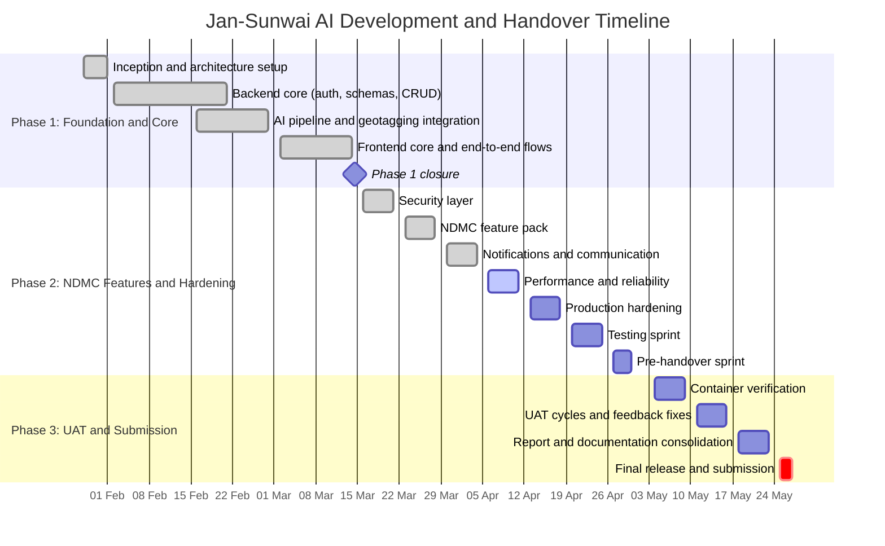

# Jan-Sunwai AI - Daily Project Report and Plan

> **Font:** Times New Roman throughout all printed or PDF versions of this document.
> **Last Updated:** 06 April 2026
> **Historical Snapshot (24 March 2026):** Week 9 tasks were approximately 70% complete.
> **Current Status:** Security and performance hardening, password reset/profile editing, API versioning, production compose artifacts, and deployment docs are implemented. Remaining work is full UAT, load and security audits, and release operations.

**Project Duration:** January 28, 2026 to May 27, 2026
**Schedule Logic:** Monday to Saturday work weeks. Sundays are off. 2nd and 4th Saturdays are off.

## Executive Gantt (Redrawn)

## Phase Summary

| Phase | Focus | Status |
| --- | --- | --- |
| Phase 1 | Foundation and core backend/frontend | Completed |
| Phase 2 | Security, NDMC features, reliability, and production prep | In progress |
| Phase 3 | UAT, report consolidation, and final submission | Planned |

## Detailed Progress Log (Restored)

### Week 8: Mar 16 to Mar 21 (Security Layer)

- Mar 16 (Mon): File magic number validation - **Partial**
  - 5 MB upload limit is enforced.
  - Magic-byte content validation remains pending.
- Mar 17 (Tue): Rate limiting on critical endpoints - **Completed**
  - Limiter integration added with safe fallback mode for local/offline runs.
- Mar 18 (Wed): Input sanitization and XSS prevention - **Completed**
  - Sanitization service added and applied to complaint and user free-text fields.
- Mar 19 (Thu): CORS lockdown and security headers - **Completed**
  - CORS allowlist plus security header middleware implemented.
- Mar 20 (Fri): JWT security review - **Completed**
  - Production defaults now use 8-hour token expiry (480 minutes).
- Mar 21 (Sat): MongoDB indexing for production queries - **Completed**
  - Added index creation helper script and password-reset indexes (including TTL expiry).

### Week 9: Mar 23 to Mar 28 (NDMC Feature Pack)

- Mar 23 (Mon): Complaint status audit trail - **Completed**
- Mar 24 (Tue): Worker panel and assignment system - **Completed (ahead of schedule)**
  - Added assignment debug and reassign-unassigned admin endpoints.
- Mar 24 (Tue): Escalation timeline UI - **Completed**
- Mar 25 (Wed): Analytics and heatmap - **Completed (ahead of schedule)**
- Mar 26 (Thu): SLA badges - **Completed (ahead of schedule)**
- Mar 27 (Fri): Bulk status update and CSV export - **Completed**
- Mar 28 (Sat): Off (4th Saturday)

### Week 10: Mar 30 to Apr 04 (Notification and Communication)

- Mar 30 (Mon): Wire notifications to navbar - **Completed**
- Mar 31 (Tue): Auto-notify on status change - **Completed**
- Apr 01 (Wed): Notification email stub (NDMC-ready) - **Completed**
- Apr 02 (Thu): Password reset flow - **Completed**
- Apr 03 (Fri): Profile editing - **Completed**
- Apr 04 (Sat): Notification chain end-to-end test - **Partial**
  - Automated tests were added.
  - Live environment execution remains pending.

### Week 11: Apr 06 to Apr 11 (Performance and Reliability)

- Apr 06 (Mon): Client-side image compression - **Completed**
- Apr 07 (Tue): Frontend bundle optimization - **Partial**
  - Lazy loading implemented.
  - Lighthouse benchmark run remains pending.
- Apr 08 (Wed): Ollama failure graceful degradation - **Completed**
- Apr 09 (Thu): Backend performance profiling - **Partial**
  - Timing fields added; real workload reporting still pending.
- Apr 10 (Fri): Resilience test - **Partial**
  - Automated resilience checks added; full browser-level validation remains.
- Apr 11 (Sat): Off (2nd Saturday)

### Week 12: Apr 13 to Apr 18 (NDMC Production Hardening)

- Apr 13 (Mon): Docker production config - **Completed**
- Apr 14 (Tue): Docker Compose production profile - **Completed**
- Apr 15 (Wed): NDMC deployment environment config - **Completed**
- Apr 16 (Thu): API versioning - **Completed**
- Apr 17 (Fri): MongoDB backup strategy - **Completed**
- Apr 18 (Sat): UI and branding pass - **Partial**

### Week 13: Apr 20 to Apr 25 (Testing Sprint)

- Apr 20 (Mon): Backend unit tests - **Partial**
- Apr 21 (Tue): API integration tests - **Partial**
- Apr 22 (Wed): Security penetration test - **Partial**
- Apr 23 (Thu): Load test - **Partial**
- Apr 24 (Fri): Mobile responsiveness fixes - **Completed**
- Apr 25 (Sat): Off (4th Saturday)

### Week 14: Apr 27 to Apr 30 (Pre-Handover Sprint)

- Apr 27 (Mon): NDMC handover guide - **Completed**
- Apr 28 (Tue): Final API reference documentation - **Completed**
- Apr 29 (Wed): Repository cleanup - **Partial**
- Apr 30 (Thu): Release tag `v1.0-rc1` - **Partial**

## Planned Work: Phase 3 (Weeks 15 to 18)

### Week 15: May 04 to May 09

- Docker production verification
- Nginx SPA routing verification
- NDMC network config validation for Ollama
- Production stack stress test
- Deployment simulation on a clean machine

### Week 16: May 11 to May 16

- UAT setup
- UAT citizen persona flow
- UAT admin persona flow
- Feedback fixes from UAT sessions
- Resilience testing and visual polish

### Week 17: May 18 to May 23

- Report authoring and architecture sections
- Documentation screenshots and user manual
- Presentation preparation and rehearsal

### Week 18: May 25 to May 27

- README and portfolio refinements
- Repository lifecycle and release tagging
- Final submission validation and handover

## Milestone Dependency Map

```mermaid
flowchart LR
        M1[Foundation complete] --> M2[Security baseline complete]
        M2 --> M3[Worker assignment and analytics complete]
        M3 --> M4[Notification and profile workflows complete]
        M4 --> M5[Performance and resilience sprint complete]
        M5 --> M6[Production hardening and test sprint complete]
        M6 --> M7[UAT complete]
        M7 --> M8[Final report and release submission]
```

