# Reports Pack

This folder contains the long-form documentation set aligned to the current codebase.

## Files

- `SYSTEM_ARCHITECTURE.md` - Runtime architecture, AI pipeline, role flows, deployment views.
- `SCHEMA_DESIGN.md` - Data model, entity relationships, indexes, and lifecycle metadata.
- `PROJECT_TIMELINE.md` - Project phase timeline and milestone schedule.
- `PROJECT_SYNOPSIS.md` - Compact synopsis for academic/management review.
- `PROJECT_REPORT.md` - Consolidated technical report with Mermaid diagrams.
- `LITERATURE_REVIEW.md` - Supporting literature section for final report drafting.
- `PRESENTATION_OUTLINE.md` - Slide-by-slide defense presentation structure.
- `SCREENSHOT_CHECKLIST.md` - Required screenshot inventory and naming convention.

## Diagram Coverage Map

```mermaid
flowchart TB
    IDX[Reports Pack] --> SA[SYSTEM_ARCHITECTURE.md]
    IDX --> SD[SCHEMA_DESIGN.md]
    IDX --> TL[PROJECT_TIMELINE.md]
    IDX --> SY[PROJECT_SYNOPSIS.md]
    IDX --> PR[PROJECT_REPORT.md]
    IDX --> LR[LITERATURE_REVIEW.md]
    IDX --> PO[PRESENTATION_OUTLINE.md]
    IDX --> SC[SCREENSHOT_CHECKLIST.md]

    SA --> SA1[Context and component diagrams]
    SA --> SA2[AI pipeline and lifecycle sequence]
    SA --> SA3[Deployment topology]

    SD --> SD1[ER diagram]
    SD --> SD2[State transition and index design]

    TL --> TL1[Master program gantt]
    TL --> TL2[Detailed hardening gantt]
    TL --> TL3[Critical dependency map]

    SY --> SY1[Problem-to-solution flow]
    SY --> SY2[Synopsis timeline gantt]

    PR --> PR1[Architecture and sequence diagrams]
    PR --> PR2[Use case and lifecycle diagrams]

    LR --> LR1[Civic AI references and rationale]
    PO --> PO1[Defense presentation structure]
    SC --> SC1[Screenshot capture checklist]
```

## Source-of-Truth Notes

- Canonical category labels are the ones defined in `backend/app/category_utils.py`.
- API paths and role behavior mirror `backend/main.py` and router modules under `backend/app/routers/`.
- Mermaid diagrams in this reports folder are canonical; static image wireframes are not required.

## Last Updated

- 2026-04-06
