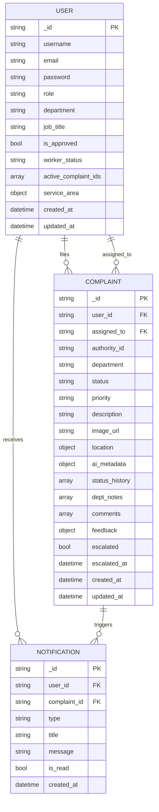
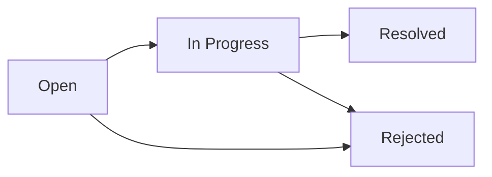
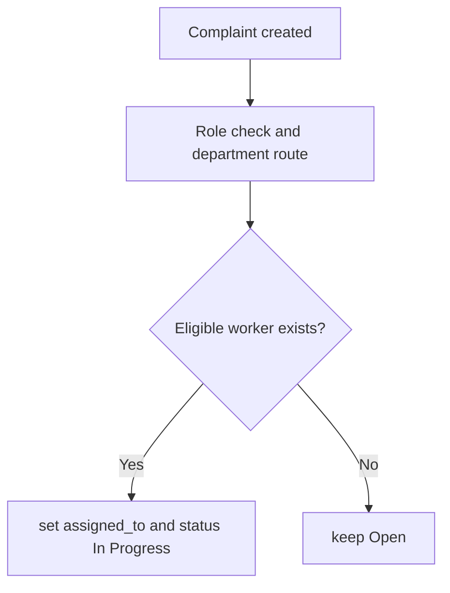
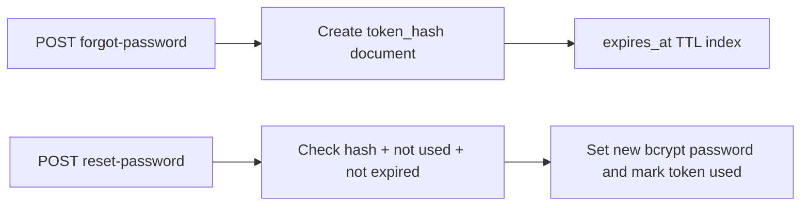

# Jan-Sunwai AI Schema Design

Last updated: 2026-04-06

## 1. Data Model Overview

The platform uses MongoDB document collections with role-driven relations:

- `users`
- `complaints`
- `notifications`
- `password_resets`

## 2. ER Diagram



## 3. Complaint Lifecycle Fields



Each transition appends an entry to `status_history`:

- `status`
- `timestamp`
- `changed_by_user_id`
- `note`

## 4. Important Embedded Objects

## `location`

```json
{
  "lat": 28.6139,
  "lon": 77.2090,
  "address": "Connaught Place, New Delhi",
  "source": "manual"
}
```

## `ai_metadata`

```json
{
  "model_used": "qwen2.5vl:3b",
  "confidence_score": 0.87,
  "detected_department": "Electrical Department",
  "labels": ["street light", "dark road"]
}
```

## `service_area` (worker users)

```json
{
  "lat": 28.6139,
  "lon": 77.2090,
  "radius_km": 5.0,
  "locality": "New Delhi"
}
```

## 5. Assignment and Ownership Rules



Ownership constraints:

- Citizen can only access own complaint records.
- Department head can operate only within assigned department.
- Worker actions are scoped to active assigned complaint IDs.
- Admin has full cross-department access.

## 6. Index Strategy

Indexes configured by `backend/app/database.py` and `backend/create_indexes.py`:

| Collection | Index |
| --- | --- |
| `users` | unique `username` |
| `users` | unique `email` |
| `complaints` | compound `(user_id, created_at)` |
| `complaints` | compound `(status, created_at)` |
| `complaints` | compound `(department, created_at)` |
| `complaints` | `authority_id` |
| `notifications` | compound `(user_id, created_at)` |
| `notifications` | compound `(user_id, is_read)` |
| `password_resets` | unique `token_hash` |
| `password_resets` | compound `(user_id, used)` |
| `password_resets` | TTL `expires_at` |

## 7. Password Reset Schema



## 8. Design Notes

- Complaints are document-rich by design to support lifecycle/audit features.
- `dept_notes`, `comments`, and `feedback` are embedded for request locality.
- Authority routing metadata (`authority_id`, escalation parent) is stored with each complaint for deterministic escalation.
