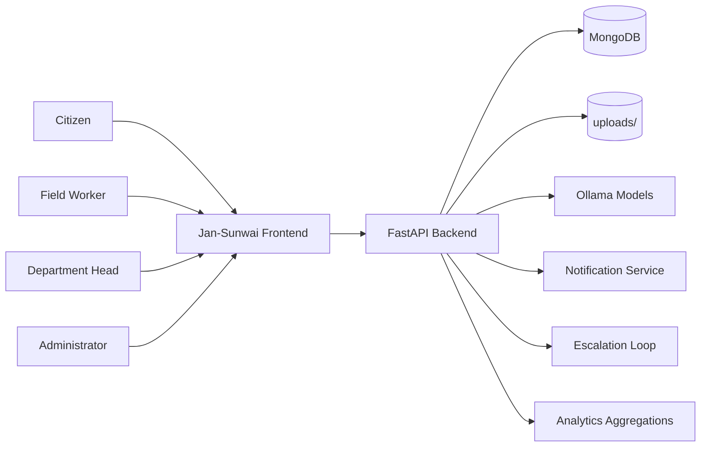
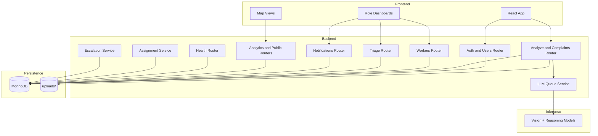
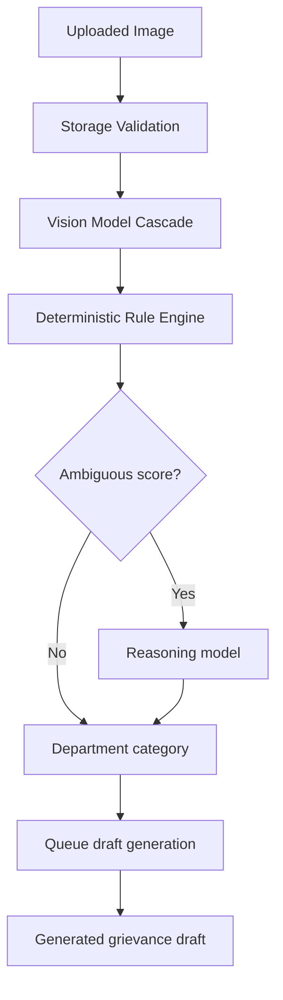
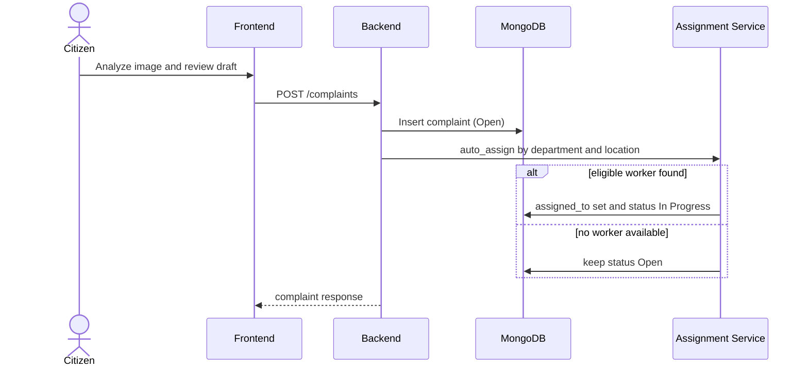
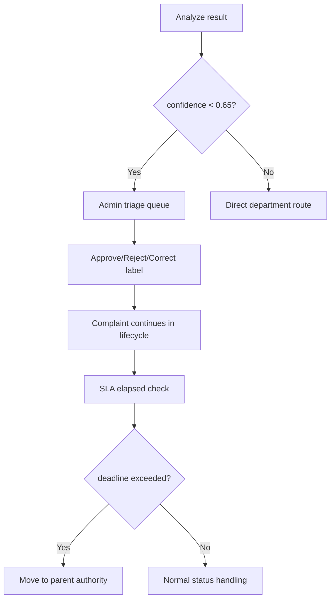
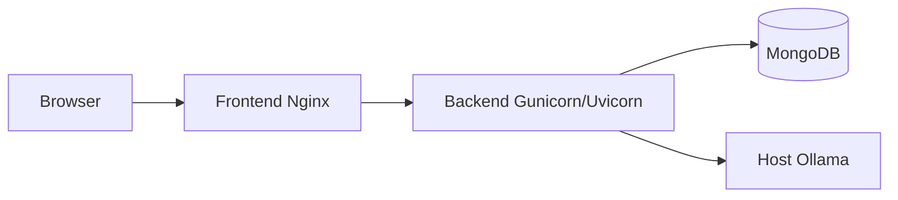

# Jan-Sunwai AI System Architecture

Last updated: 2026-04-06

## 1. System Context

Jan-Sunwai AI is a role-based civic grievance platform where image-first complaint submission is transformed into structured, routed grievance records with lifecycle tracking.

## 2. Runtime Components

## 3. AI Pipeline Architecture

### Key Design Points

- Vision model cascade supports primary/mid/fallback model configuration.
- Rule engine classifies most clear cases without reasoning model invocation.
- Reasoning model runs only for ambiguous cases.
- Draft generation is queued and pollable.

## 4. Complaint Lifecycle and Routing

## 5. Worker and Department Operational Flow

```mermaid
flowchart LR
    NewComplaint[New Complaint] --> WorkerFilter[Eligible worker filter]
    WorkerFilter --> GeoMatch[Service-area distance check]
    GeoMatch --> LoadPick[Least active worker]
    LoadPick --> Assigned[Assigned and In Progress]
    Assigned --> WorkerDone[Worker marks done]
    WorkerDone --> Resolved[Status Resolved]
    Resolved --> SlotFree[Worker slot freed]
    SlotFree --> Reassign[Reassign queued opens if possible]
```

## 6. Triage and Escalation

## 7. Deployment View

This is the currently supported production-style deployment in `docker-compose.prod.yml`.
